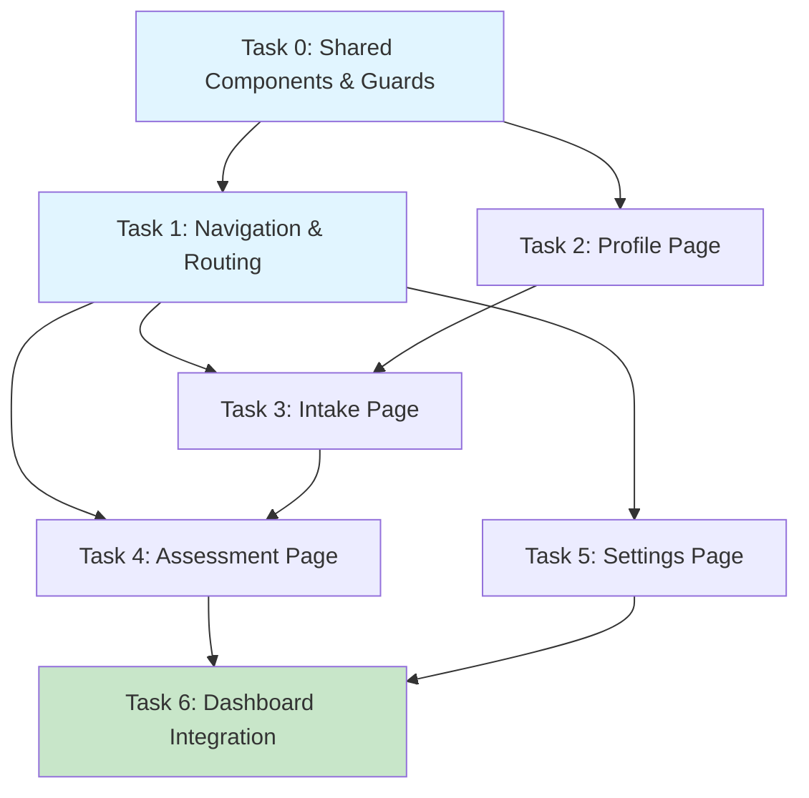

# Phase 3 Implementation Plan: Feature Completion (User Journey) - REVISED

> **📋 PLANNING NOTE:** This corresponds to "Phase 2: Missing Core Features" from the Frontend Assessment Plan.
> The assessment document identifies 4 phases (0-3), but our implementation sequence is:
> - **Phase 0**: Blockers (WebSocket, data models) ✅
> - **Phase 1**: Critical Integration (Session sync, Auth, CORS) ✅
> - **Phase 2**: Testing & Foundation ✅
> - **Phase 3**: Feature Completion (this plan) ← **YOU ARE HERE**
>
> **Prerequisites:** Phases 0, 1, and 2 must be complete before starting.

## Goal

Implement the complete user journey workflow, including Profile creation, Intake, Assessment, and Therapy sessions, ensuring full compatibility with the backend's `Trio` agent architecture and maintaining the test coverage standards established in Phase 2.

---

## Phase 0-2 Completion Verification

> [!IMPORTANT]
> **DO NOT START** this phase until all items below are verified. These are hard dependencies.

### Phase 0 Complete ✅

**WebSocket Infrastructure**:
- [ ] WebSocket connects to `ws://localhost:8000/ws?user_id=<user_id>` successfully
- [ ] Can send JSON messages with `type` field (`session_request`, `chat_message`)
- [ ] Can receive JSON messages (`connected`, `session_started`, `chat_response_chunk`)
- [ ] Reconnection works after disconnect (test by restarting backend)

**Data Model Alignment**:
- [ ] `UserStatus` enum matches backend exactly (8 values including `INTAKE_IN_PROGRESS`, `ASSESSMENT_IN_PROGRESS`, etc.)
- [ ] `Message` interface uses `role: 'user' | 'assistant'` (not `sender`)
- [ ] `Session` interface uses `transcript: Message[]` (not `messages`)
- [ ] `AgentType` includes `PLANNING` and `REFLECTION`
- [ ] Run `npm run typecheck` with zero errors

**Test Infrastructure**:
- [ ] `npm test` runs without dependency errors
- [ ] `ts-jest` is in `devDependencies`
- [ ] At least one smoke test passes
- [ ] Coverage reporting works

**Environment Configuration**:
- [ ] `.env.example` file exists with `VITE_API_URL` and `VITE_WEBSOCKET_URL`
- [ ] `README.md` documents how to configure environment variables

### Phase 1 Complete ✅

**Session Management**:
- [ ] `session_started` event updates `currentSession` with server-provided `session_id`
- [ ] Subsequent messages use correct `session_id`
- [ ] No hardcoded `'temp_session_id'` values in codebase

**API Integration**:
- [ ] `GET /api/sessions?user_id=<id>` returns session list correctly
- [ ] Session history page displays data from backend (not mocked)
- [ ] API responses are properly typed (no `any` types)

**Authentication**:
- [ ] `AuthContext` exists and exports `useAuth()` hook
- [ ] No hardcoded `'temp_token'` or `'default_user'` in components
- [ ] User ID and token are managed in context, not component state

**CORS Configuration**:
- [ ] Frontend (localhost:5173) can make API calls to backend (localhost:8000)
- [ ] WebSocket connections work cross-origin
- [ ] No CORS errors in browser console

### Phase 2 Complete ✅

**Test Coverage**:
- [ ] Overall coverage >= 75%
- [ ] `AppContext` tested (90%+ coverage)
- [ ] `TherapySession` tested (70%+ coverage)
- [ ] `Dashboard` tested (70%+ coverage)
- [ ] `WebSocketService` tested (80%+ coverage)
- [ ] `AuthContext` tested (90%+ coverage)

**Type Safety**:
- [ ] TypeScript strict mode enabled
- [ ] No `any` types except where truly necessary
- [ ] All API responses have typed interfaces

**CI/CD**:
- [ ] `npm run test:ci` passes
- [ ] Coverage thresholds met

---

## Backend API Contract

> [!WARNING]
> **Verify these endpoints exist before implementing frontend features.**
> Run the backend contract verification test (Task 0.1) before proceeding.

### HTTP Endpoints

#### User Management

```typescript
// POST /api/user/profile
// Create or update user profile
Request: {
  user_id: string;
  name?: string;
  birthdate?: string;  // ISO 8601 date
  profession?: string;
}
Response: {
  user_id: string;
  name: string;
  birthdate: string | null;
  profession: string | null;
  status: UserStatus;  // Backend enum value
  created_at: string;  // ISO 8601 datetime
  updated_at: string;
}
Status: 201 Created

// GET /api/user/status?user_id=<user_id>
// Get user workflow state
Response: {
  user_id: string;
  workflow_state: UserStatus;
  timestamp: string;
}
Status: 200 OK
```

#### Session Management

```typescript
// GET /api/sessions?user_id=<user_id>
// Get all sessions for a user
Response: Array<{
  id: string;
  user_id: string;
  agent_type: AgentType;
  therapy_style: TherapyStyle | null;
  status: SessionStatus;
  start_time: string;
  end_time: string | null;
  transcript: Message[];
  topics: Topic[];
}>
Status: 200 OK

// GET /api/sessions/<session_id>
// Get specific session
Response: {
  id: string;
  user_id: string;
  agent_type: AgentType;
  therapy_style: TherapyStyle | null;
  status: SessionStatus;
  start_time: string;
  end_time: string | null;
  transcript: Message[];
  topics: Topic[];
}
Status: 200 OK or 404 Not Found

// POST /api/sessions
// Create new session (alternative to WebSocket session_request)
Request: {
  user_id: string;
}
Response: {
  session_id: string;
  user_id: string;
  type: "therapy";
  status: "created";
  timestamp: string;
}
Status: 201 Created
```

#### Therapy Management

```typescript
// GET /api/therapy/styles
// Get available therapy styles
Response: string[]  // ["CBT", "Psychoanalytic", "Humanistic"]
Status: 200 OK

// GET /api/therapy/plan?user_id=<user_id>
// Get therapy plan for user
Response: {
  message: string;  // ⚠️ Currently placeholder
  user_id: string;
}
Status: 200 OK

// POST /api/therapy/plan
// Create therapy plan
Request: {
  user_id: string;
  therapy_style: TherapyStyle;
  goals?: string[];
}
Response: {
  message: string;  // ⚠️ Currently placeholder
}
Status: 201 Created
```

### WebSocket Events

**Connection**: `ws://localhost:8000/ws?user_id=<user_id>`

#### Client → Server

```typescript
// Request new session
{
  type: "session_request"
}

// Send chat message
{
  type: "chat_message",
  session_id: string,
  content: string
}
```

#### Server → Client

```typescript
// Connection established
{
  type: "connected",
  data: {
    user_id: string,
    name: string,
    status: UserStatus
  }
}

// Session created
{
  type: "session_started",
  data: {
    session_id: string,
    agent_type: AgentType,
    user_id: string,
    status: UserStatus,
    therapy_style?: TherapyStyle
  }
}

// Streaming response chunk
{
  type: "chat_response_chunk",
  data: {
    chunk: string,
    is_complete: boolean
  }
}
```

---

## Architecture Decisions

### Decision 1: TherapySession Component Reuse Strategy

The existing `TherapySession` component reads `agentType` from `currentSession` state, not from props. For Intake and Assessment pages, we have three options:

#### Option A: Pass agentType as Prop (Most Flexible)
```typescript
// Modify TherapySession component
interface TherapySessionProps {
  sessionId?: string;
  agentType?: AgentType;  // NEW: Override session's agentType
}

// In TherapySession.tsx
const effectiveAgentType = props.agentType || currentSession?.agentType;

// Usage in IntakePage
<TherapySession agentType={AgentType.INTAKE} />
```

**Pros**: Simple, explicit, component controls its own behavior
**Cons**: Requires modifying existing `TherapySession`
**Risk**: Low - minimal change, backwards compatible

#### Option B: Ensure Session State Before Rendering (Backend-Driven) ⭐ **RECOMMENDED**
```typescript
// IntakePage.tsx
useEffect(() => {
  const initSession = async () => {
    // Create session via WebSocket
    await requestSession();

    // Wait for session_started event (handled by useWebSocket)
    // Session state will be updated automatically

    setIsReady(true);
  };

  initSession();
}, []);

// Only render when session is ready
{isReady && <TherapySession />}
```

**Pros**: No modification to `TherapySession`, backend controls workflow, maintains single source of truth
**Cons**: More complex initialization, async timing
**Risk**: Medium - timing issues, state synchronization

**Rationale for Recommendation**:
- Aligns with existing architecture (backend controls workflow via `UserStatus`)
- No changes to battle-tested `TherapySession` component
- Maintains single source of truth (backend determines agent type based on user state)
- Lower risk than Option C, more architecturally sound than Option A

#### Option C: Extract Shared ChatInterface Component (Clean Separation)
```typescript
// NEW: src/components/ChatInterface.tsx
interface ChatInterfaceProps {
  sessionId: string;
  agentType: AgentType;
  onMessageSent?: (message: string) => void;
}

export function ChatInterface({ sessionId, agentType, onMessageSent }: ChatInterfaceProps) {
  // Core chat logic extracted from TherapySession
  // Renders: MessageHistory, MessageInput, ConnectionStatus
}

// TherapySession uses ChatInterface internally
// IntakePage uses ChatInterface directly
<ChatInterface sessionId={session.id} agentType={AgentType.INTAKE} />
```

**Pros**: Clean separation, reusable, testable
**Cons**: Significant refactoring, risk of regressions
**Risk**: High - large change, requires thorough testing

---

### Decision 2: Route Guard Implementation

Create two reusable guard components to enforce workflow progression:

#### RequireAuth Guard

**File**: `src/components/guards/RequireAuth.tsx`

```typescript
import { ReactNode } from 'react';
import { Navigate } from 'react-router-dom';
import { CircularProgress, Box } from '@mui/material';
import { useAuth } from '../../contexts/AuthContext';

interface RequireAuthProps {
  children: ReactNode;
}

export function RequireAuth({ children }: RequireAuthProps) {
  const { user, isLoading } = useAuth();

  // Show loading spinner while checking auth
  if (isLoading) {
    return (
      <Box display="flex" justifyContent="center" alignItems="center" minHeight="100vh">
        <CircularProgress />
      </Box>
    );
  }

  // Redirect to profile if no user
  if (!user) {
    return <Navigate to="/profile" replace />;
  }

  return <>{children}</>;
}
```

#### RequireStatus Guard

**File**: `src/components/guards/RequireStatus.tsx`

```typescript
import { ReactNode } from 'react';
import { Navigate } from 'react-router-dom';
import { useAuth } from '../../contexts/AuthContext';
import { UserStatus } from '../../types';

interface RequireStatusProps {
  allowedStatuses: UserStatus[];
  children: ReactNode;
}

export function RequireStatus({ allowedStatuses, children }: RequireStatusProps) {
  const { user } = useAuth();

  if (!user) {
    return <Navigate to="/profile" replace />;
  }

  // Check if user's status is in allowed list
  if (!allowedStatuses.includes(user.status)) {
    // Redirect based on current status
    return <Navigate to={getNextRoute(user.status)} replace />;
  }

  return <>{children}</>;
}

/**
 * Determine where to redirect based on workflow state.
 * This enforces the linear progression: Profile → Intake → Assessment → Therapy
 */
function getNextRoute(status: UserStatus): string {
  switch (status) {
    case UserStatus.PROFILE_ONLY:
      return '/profile';
    case UserStatus.INTAKE_IN_PROGRESS:
      return '/intake';
    case UserStatus.INTAKE_COMPLETE:
    case UserStatus.ASSESSMENT_IN_PROGRESS:
      return '/assessment';
    case UserStatus.ASSESSMENT_COMPLETE:
    case UserStatus.PLAN_COMPLETE:
    case UserStatus.THERAPY_IN_PROGRESS:
      return '/dashboard';
    case UserStatus.REFLECTION_IN_PROGRESS:
      return '/session/current';
    default:
      console.warn(`Unknown user status: ${status}, redirecting to profile`);
      return '/profile';
  }
}
```

#### Usage Example

```typescript
// In App.tsx
<Route
  path="/intake"
  element={
    <RequireAuth>
      <RequireStatus allowedStatuses={[UserStatus.INTAKE_IN_PROGRESS]}>
        <IntakePage />
      </RequireStatus>
    </RequireAuth>
  }
/>

<Route
  path="/assessment"
  element={
    <RequireAuth>
      <RequireStatus allowedStatuses={[
        UserStatus.INTAKE_COMPLETE,
        UserStatus.ASSESSMENT_IN_PROGRESS
      ]}>
        <AssessmentPage />
      </RequireStatus>
    </RequireAuth>
  }
/>
```

---

### Decision 3: State Synchronization Strategy

Multiple components update global state. We need a clear synchronization strategy to prevent race conditions.

#### Single Source of Truth

```
┌─────────────────┐
│  Backend (DB)   │  ← Authoritative source
└────────┬────────┘
         │
         ├─────────────────────────┐
         │                         │
    ┌────▼────────┐         ┌──────▼───────┐
    │ AuthContext │         │ AppContext   │
    │  - user     │         │  - sessions  │
    │  - token    │         │  - plan      │
    └─────────────┘         └──────────────┘
```

**Rules**:
1. **Backend is authoritative** - Always fetch latest state on critical operations
2. **Optimistic updates** - Update UI immediately, rollback on error
3. **WebSocket events override** - Server events always win over local state
4. **LocalStorage is cache** - Read on mount, write on change, but never trust as source of truth

#### Update Flow Pattern

```typescript
// Example: ProfilePage saves user profile
const handleSave = async (profileData: Partial<User>) => {
  // 1. Optimistic update (instant UI feedback)
  const previousUser = user;
  authActions.updateUser({ ...user, ...profileData });

  try {
    // 2. Persist to backend
    const response = await fetch('/api/user/profile', {
      method: 'POST',
      headers: { 'Content-Type': 'application/json' },
      body: JSON.stringify({ user_id: user.id, ...profileData })
    });

    if (!response.ok) {
      throw new Error(`HTTP ${response.status}`);
    }

    const updatedUser = await response.json();

    // 3. Update with server response (source of truth)
    authActions.updateUser(updatedUser);

    // 4. Broadcast change to other contexts
    window.dispatchEvent(new CustomEvent('user-updated', { detail: updatedUser }));

  } catch (error) {
    // 5. Rollback on error
    authActions.updateUser(previousUser);
    setError('Failed to save profile. Please try again.');
    console.error('Profile save error:', error);
  }
};
```

#### Context Communication

```typescript
// AppContext listens for user changes
useEffect(() => {
  const handleUserUpdate = (event: CustomEvent<User>) => {
    const updatedUser = event.detail;

    // Update sessions if user status changed (workflow progression)
    if (updatedUser.status !== state.user?.status) {
      // User advanced in workflow, refresh sessions
      actions.refreshSessions();
    }
  };

  window.addEventListener('user-updated', handleUserUpdate as EventListener);
  return () => window.removeEventListener('user-updated', handleUserUpdate as EventListener);
}, [state.user?.status, actions]);
```

#### Conflict Resolution Matrix

| Scenario | Resolution | Implementation |
|----------|-----------|----------------|
| User changes profile locally → WebSocket sends status update | WebSocket wins | Override local state with WebSocket data |
| Backend returns 400/500 error | Rollback | Restore previous state, show error |
| User navigates to protected route with stale status | Fetch fresh | Call `/api/user/status` before guard check |
| WebSocket disconnected during update | Queue & retry | Store updates, retry on reconnect |
| Multiple tabs open | Sync via storage | Listen to `storage` events, update state |

---

## Shared Components

Before implementing pages, extract reusable components to follow DRY principle:

### Component Catalog

#### 1. `PageContainer.tsx` (Priority: HIGH)

**Location**: `src/components/shared/PageContainer.tsx`

```typescript
interface PageContainerProps {
  title: string;
  subtitle?: string;
  maxWidth?: 'sm' | 'md' | 'lg' | 'xl';
  children: ReactNode;
  action?: ReactNode;  // Optional header action (e.g., settings button)
}

export function PageContainer({
  title,
  subtitle,
  maxWidth = 'md',
  children,
  action
}: PageContainerProps) {
  return (
    <Container maxWidth={maxWidth} sx={{ py: 4 }}>
      <Box sx={{ mb: 4, display: 'flex', justifyContent: 'space-between', alignItems: 'flex-start' }}>
        <Box>
          <Typography variant="h4" component="h1" gutterBottom>
            {title}
          </Typography>
          {subtitle && (
            <Typography variant="body1" color="text.secondary">
              {subtitle}
            </Typography>
          )}
        </Box>
        {action && <Box>{action}</Box>}
      </Box>
      {children}
    </Container>
  );
}
```

**Used in**: All pages (ProfilePage, IntakePage, AssessmentPage, SettingsPage, SessionHistoryPage)

#### 2. `FormField.tsx` (Priority: HIGH)

**Location**: `src/components/shared/FormField.tsx`

```typescript
interface FormFieldProps {
  label: string;
  type?: 'text' | 'email' | 'date' | 'number' | 'select';
  value: string;
  onChange: (value: string) => void;
  error?: string;
  required?: boolean;
  disabled?: boolean;
  helperText?: string;
  options?: Array<{ value: string; label: string }>;  // For select type
  multiline?: boolean;
  rows?: number;
}

export function FormField({
  label,
  type = 'text',
  value,
  onChange,
  error,
  required,
  disabled,
  helperText,
  options,
  multiline,
  rows
}: FormFieldProps) {
  if (type === 'select' && options) {
    return (
      <TextField
        select
        fullWidth
        label={label}
        value={value}
        onChange={(e) => onChange(e.target.value)}
        required={required}
        disabled={disabled}
        error={Boolean(error)}
        helperText={error || helperText}
        margin="normal"
      >
        {options.map((option) => (
          <MenuItem key={option.value} value={option.value}>
            {option.label}
          </MenuItem>
        ))}
      </TextField>
    );
  }

  return (
    <TextField
      fullWidth
      label={label}
      type={type}
      value={value}
      onChange={(e) => onChange(e.target.value)}
      required={required}
      disabled={disabled}
      error={Boolean(error)}
      helperText={error || helperText}
      margin="normal"
      multiline={multiline}
      rows={rows}
      InputLabelProps={type === 'date' ? { shrink: true } : undefined}
    />
  );
}
```

**Used in**: ProfilePage, SettingsPage

#### 3. `WorkflowStepper.tsx` (Priority: MEDIUM)

**Location**: `src/components/shared/WorkflowStepper.tsx`

```typescript
interface WorkflowStepperProps {
  currentStatus: UserStatus;
  orientation?: 'horizontal' | 'vertical';
  onStepClick?: (route: string) => void;
}

const WORKFLOW_STEPS = [
  { label: 'Profile', status: UserStatus.PROFILE_ONLY, route: '/profile' },
  { label: 'Intake', status: UserStatus.INTAKE_IN_PROGRESS, route: '/intake' },
  { label: 'Assessment', status: UserStatus.ASSESSMENT_IN_PROGRESS, route: '/assessment' },
  { label: 'Therapy', status: UserStatus.PLAN_COMPLETE, route: '/session/new' }
];

export function WorkflowStepper({
  currentStatus,
  orientation = 'horizontal',
  onStepClick
}: WorkflowStepperProps) {
  const activeStep = getActiveStepIndex(currentStatus);

  return (
    <Stepper activeStep={activeStep} orientation={orientation}>
      {WORKFLOW_STEPS.map((step, index) => (
        <Step key={step.label} completed={index < activeStep}>
          <StepLabel
            onClick={() => onStepClick?.(step.route)}
            sx={{ cursor: onStepClick ? 'pointer' : 'default' }}
          >
            {step.label}
          </StepLabel>
        </Step>
      ))}
    </Stepper>
  );
}

function getActiveStepIndex(status: UserStatus): number {
  const statusOrder = [
    UserStatus.PROFILE_ONLY,
    UserStatus.INTAKE_IN_PROGRESS,
    UserStatus.INTAKE_COMPLETE,
    UserStatus.ASSESSMENT_IN_PROGRESS,
    UserStatus.ASSESSMENT_COMPLETE,
    UserStatus.PLAN_COMPLETE,
    UserStatus.THERAPY_IN_PROGRESS
  ];

  const index = statusOrder.indexOf(status);

  // Map status to step index
  if (index <= 0) return 0;  // Profile
  if (index <= 2) return 1;  // Intake
  if (index <= 4) return 2;  // Assessment
  return 3;  // Therapy
}
```

**Used in**: Dashboard, ProfilePage (optional progress indicator)

#### 4. `ConfirmDialog.tsx` (Priority: MEDIUM)

**Location**: `src/components/shared/ConfirmDialog.tsx`

```typescript
interface ConfirmDialogProps {
  open: boolean;
  title: string;
  message: string | ReactNode;
  confirmText?: string;
  cancelText?: string;
  onConfirm: () => void;
  onCancel: () => void;
  severity?: 'info' | 'warning' | 'error';
  confirmColor?: 'primary' | 'error' | 'warning';
}

export function ConfirmDialog({
  open,
  title,
  message,
  confirmText = 'Confirm',
  cancelText = 'Cancel',
  onConfirm,
  onCancel,
  severity = 'info',
  confirmColor = 'primary'
}: ConfirmDialogProps) {
  return (
    <Dialog
      open={open}
      onClose={onCancel}
      aria-labelledby="confirm-dialog-title"
      aria-describedby="confirm-dialog-description"
    >
      <DialogTitle id="confirm-dialog-title">
        {severity === 'error' && <ErrorIcon color="error" sx={{ mr: 1, verticalAlign: 'middle' }} />}
        {severity === 'warning' && <WarningIcon color="warning" sx={{ mr: 1, verticalAlign: 'middle' }} />}
        {title}
      </DialogTitle>
      <DialogContent>
        <DialogContentText id="confirm-dialog-description">
          {message}
        </DialogContentText>
      </DialogContent>
      <DialogActions>
        <Button onClick={onCancel} color="inherit">
          {cancelText}
        </Button>
        <Button onClick={onConfirm} color={confirmColor} variant="contained" autoFocus>
          {confirmText}
        </Button>
      </DialogActions>
    </Dialog>
  );
}
```

**Used in**: SettingsPage (reset confirmation), TherapySession (end session confirmation)

#### 5. `LoadingOverlay.tsx` (Priority: LOW)

**Location**: `src/components/shared/LoadingOverlay.tsx`

```typescript
interface LoadingOverlayProps {
  message?: string;
  fullScreen?: boolean;
}

export function LoadingOverlay({ message = 'Loading...', fullScreen = false }: LoadingOverlayProps) {
  return (
    <Box
      sx={{
        display: 'flex',
        flexDirection: 'column',
        alignItems: 'center',
        justifyContent: 'center',
        minHeight: fullScreen ? '100vh' : '400px',
        gap: 2
      }}
    >
      <CircularProgress />
      <Typography variant="body2" color="text.secondary">
        {message}
      </Typography>
    </Box>
  );
}
```

**Used in**: IntakePage, AssessmentPage (during session initialization)

### Component Extraction Order

1. **Day 1**: Extract `PageContainer` and `FormField` (blocks ProfilePage implementation)
2. **Day 2**: Extract `LoadingOverlay` (blocks Intake/Assessment pages)
3. **Day 3**: Extract `WorkflowStepper` (blocks Dashboard integration)
4. **Day 4**: Extract `ConfirmDialog` (blocks SettingsPage dangerous actions)

---

## Implementation Plan

### Task 0: Verification & Shared Components (Day 1)

#### 0.1: Backend API Contract Verification

**File**: `frontend/src/__tests__/backend-contract.test.ts`

Create integration test that verifies backend API responses:

```typescript
describe('Backend API Contract', () => {
  const TEST_USER_ID = 'test_user_' + Date.now();

  describe('User Management', () => {
    it('POST /api/user/profile should create user profile', async () => {
      const response = await fetch('http://localhost:8000/api/user/profile', {
        method: 'POST',
        headers: { 'Content-Type': 'application/json' },
        body: JSON.stringify({
          user_id: TEST_USER_ID,
          name: 'Test User',
          profession: 'Engineer'
        })
      });

      expect(response.status).toBe(201);
      const data = await response.json();
      expect(data).toHaveProperty('user_id', TEST_USER_ID);
      expect(data).toHaveProperty('status');
      expect(data).toHaveProperty('created_at');
    });

    it('GET /api/user/status should return user status', async () => {
      const response = await fetch(`http://localhost:8000/api/user/status?user_id=${TEST_USER_ID}`);
      expect(response.status).toBe(200);
      const data = await response.json();
      expect(data).toHaveProperty('workflow_state');
    });
  });

  describe('Session Management', () => {
    it('GET /api/sessions should return sessions array', async () => {
      const response = await fetch(`http://localhost:8000/api/sessions?user_id=${TEST_USER_ID}`);
      expect(response.status).toBe(200);
      const data = await response.json();
      expect(Array.isArray(data)).toBe(true);
    });
  });

  describe('Therapy Management', () => {
    it('GET /api/therapy/styles should return styles array', async () => {
      const response = await fetch('http://localhost:8000/api/therapy/styles');
      expect(response.status).toBe(200);
      const data = await response.json();
      expect(Array.isArray(data)).toBe(true);
    });
  });
});
```

**Run before any implementation**:
```bash
# Start backend first
cd /app && python src/trio_server.py

# In separate terminal
cd frontend && npm test backend-contract.test.ts
```

**Acceptance Criteria**:
- [ ] All API endpoints respond with expected status codes
- [ ] Response structures match TypeScript interfaces
- [ ] Document any missing/placeholder endpoints
- [ ] Update plan if therapy plan endpoints are not ready

#### 0.2: Extract Shared Components

Create all shared components listed above:

- [ ] `src/components/shared/PageContainer.tsx` + tests
- [ ] `src/components/shared/FormField.tsx` + tests
- [ ] `src/components/shared/LoadingOverlay.tsx` + tests
- [ ] `src/components/shared/WorkflowStepper.tsx` + tests
- [ ] `src/components/shared/ConfirmDialog.tsx` + tests
- [ ] `src/components/shared/index.ts` (barrel export)

**Test Requirements** (per Phase 2 standards):
- Each component must have unit tests
- Coverage >= 80% for each shared component
- Test rendering, props, interactions, edge cases

**Acceptance Criteria**:
- [ ] All 5 shared components created and tested
- [ ] Exported from `shared/index.ts`
- [ ] Documentation (JSDoc) for all props
- [ ] Storybook stories (optional but recommended)

#### 0.3: Create Route Guards

**Files**:
- `src/components/guards/RequireAuth.tsx` + tests
- `src/components/guards/RequireStatus.tsx` + tests
- `src/components/guards/index.ts`

**Test Requirements**:
```typescript
// RequireAuth.test.tsx
describe('RequireAuth', () => {
  it('shows loading while isLoading=true', () => {});
  it('redirects to /profile when user=null', () => {});
  it('renders children when user exists', () => {});
  it('handles AuthContext errors gracefully', () => {});
});

// RequireStatus.test.tsx
describe('RequireStatus', () => {
  it('redirects PROFILE_ONLY to /profile', () => {});
  it('redirects INTAKE_IN_PROGRESS to /intake', () => {});
  it('redirects INTAKE_COMPLETE to /assessment', () => {});
  it('redirects ASSESSMENT_COMPLETE to /dashboard', () => {});
  it('allows access when status in allowedStatuses', () => {});
  it('handles multiple allowed statuses', () => {});
});
```

**Acceptance Criteria**:
- [ ] Both guards implemented with TypeScript
- [ ] Test coverage >= 95% (critical security boundary)
- [ ] All 8 UserStatus values tested in RequireStatus
- [ ] Guards handle missing user gracefully

---

### Task 1: Navigation & Routing Infrastructure (Day 1-2)

#### 1.1: Navigation Drawer

**File**: `src/components/NavigationDrawer.tsx`

**Features**:
```typescript
interface NavigationDrawerProps {
  open: boolean;
  onClose: () => void;
  variant: 'permanent' | 'temporary';
}

export function NavigationDrawer({ open, onClose, variant }: NavigationDrawerProps) {
  const { user } = useAuth();
  const location = useLocation();

  const navigationItems = [
    { label: 'Dashboard', path: '/dashboard', icon: <DashboardIcon /> },
    { label: 'Current Session', path: '/session/current', icon: <ChatIcon />, locked: user.status < UserStatus.PLAN_COMPLETE },
    { label: 'History', path: '/history', icon: <HistoryIcon /> },
    { label: 'Profile', path: '/profile', icon: <PersonIcon /> },
    { label: 'Settings', path: '/settings', icon: <SettingsIcon /> }
  ];

  return (
    <Drawer
      variant={variant}
      open={open}
      onClose={onClose}
      sx={{
        width: 240,
        flexShrink: 0,
        '& .MuiDrawer-paper': {
          width: 240,
          boxSizing: 'border-box'
        }
      }}
    >
      {/* User profile summary */}
      <Box sx={{ p: 2, borderBottom: 1, borderColor: 'divider' }}>
        <Box display="flex" alignItems="center" gap={2}>
          <Avatar>{user.name[0]}</Avatar>
          <Box>
            <Typography variant="subtitle1">{user.name}</Typography>
            <Chip label={getUserStatusLabel(user.status)} size="small" />
          </Box>
        </Box>
      </Box>

      {/* Navigation list */}
      <List>
        {navigationItems.map((item) => (
          <ListItem
            key={item.path}
            button
            component={Link}
            to={item.path}
            selected={location.pathname === item.path}
            disabled={item.locked}
            onClick={variant === 'temporary' ? onClose : undefined}
          >
            <ListItemIcon>{item.icon}</ListItemIcon>
            <ListItemText primary={item.label} />
            {item.locked && <LockIcon fontSize="small" color="disabled" />}
          </ListItem>
        ))}
      </List>
    </Drawer>
  );
}
```

**Tests**:
```typescript
describe('NavigationDrawer', () => {
  it('renders user name and status badge', () => {});
  it('renders all navigation items', () => {});
  it('locks "Current Session" when status < PLAN_COMPLETE', () => {});
  it('unlocks "Current Session" when status >= PLAN_COMPLETE', () => {});
  it('highlights active route', () => {});
  it('closes on item click when variant="temporary"', () => {});
  it('does not close on item click when variant="permanent"', () => {});
});
```

**Acceptance Criteria**:
- [ ] User profile displayed at top
- [ ] Status-based link locking works
- [ ] Active route highlighted
- [ ] Mobile behavior correct (temporary drawer)
- [ ] Desktop behavior correct (permanent drawer)
- [ ] Test coverage >= 70%

#### 1.2: Layout Component

**File**: `src/components/Layout.tsx`

```typescript
export function Layout({ children }: { children: ReactNode }) {
  const [drawerOpen, setDrawerOpen] = useState(false);
  const isMobile = useMediaQuery((theme: Theme) => theme.breakpoints.down('md'));

  return (
    <Box sx={{ display: 'flex', minHeight: '100vh' }}>
      <AppBar
        position="fixed"
        sx={{
          zIndex: (theme) => theme.zIndex.drawer + 1,
          display: { md: 'none' } // Hide on desktop (drawer has its own header)
        }}
      >
        <Toolbar>
          <IconButton
            color="inherit"
            aria-label="open drawer"
            edge="start"
            onClick={() => setDrawerOpen(true)}
            sx={{ mr: 2 }}
          >
            <MenuIcon />
          </IconButton>
          <Typography variant="h6" noWrap component="div">
            Psychoanalyst
          </Typography>
        </Toolbar>
      </AppBar>

      <NavigationDrawer
        open={isMobile ? drawerOpen : true}
        onClose={() => setDrawerOpen(false)}
        variant={isMobile ? 'temporary' : 'permanent'}
      />

      <Box
        component="main"
        sx={{
          flexGrow: 1,
          p: 3,
          mt: { xs: 8, md: 0 }, // Margin-top for mobile AppBar
          ml: { md: '240px' } // Margin-left for permanent drawer on desktop
        }}
      >
        {children}
      </Box>
    </Box>
  );
}
```

**Tests**:
```typescript
describe('Layout', () => {
  it('renders AppBar on mobile', () => {});
  it('hides AppBar on desktop', () => {});
  it('opens drawer on hamburger click', () => {});
  it('renders children in main content area', () => {});
  it('applies correct margins for drawer', () => {});
});
```

**Acceptance Criteria**:
- [ ] AppBar visible only on mobile
- [ ] Drawer toggles correctly
- [ ] Children render in main area
- [ ] Responsive layout works at all breakpoints
- [ ] Test coverage >= 70%

#### 1.3: Update App.tsx with Routes

**File**: `src/App.tsx`

```typescript
import { BrowserRouter, Routes, Route, Navigate } from 'react-router-dom';
import { Layout } from './components/Layout';
import { RequireAuth, RequireStatus } from './components/guards';
import { UserStatus } from './types';

// Pages
import { ProfilePage } from './pages/ProfilePage';
import { IntakePage } from './pages/IntakePage';
import { AssessmentPage } from './pages/AssessmentPage';
import { DashboardPage } from './pages/DashboardPage';
import { TherapySessionPage } from './pages/TherapySessionPage';
import { SessionHistoryPage } from './pages/SessionHistoryPage';
import { SettingsPage } from './pages/SettingsPage';

function App() {
  return (
    <BrowserRouter>
      <Layout>
        <Routes>
          {/* Public route - anyone can access */}
          <Route path="/profile" element={<ProfilePage />} />

          {/* Workflow routes with status guards */}
          <Route
            path="/intake"
            element={
              <RequireAuth>
                <RequireStatus allowedStatuses={[UserStatus.INTAKE_IN_PROGRESS]}>
                  <IntakePage />
                </RequireStatus>
              </RequireAuth>
            }
          />

          <Route
            path="/assessment"
            element={
              <RequireAuth>
                <RequireStatus allowedStatuses={[
                  UserStatus.INTAKE_COMPLETE,
                  UserStatus.ASSESSMENT_IN_PROGRESS
                ]}>
                  <AssessmentPage />
                </RequireStatus>
              </RequireAuth>
            }
          />

          <Route
            path="/session/:sessionId"
            element={
              <RequireAuth>
                <RequireStatus allowedStatuses={[
                  UserStatus.PLAN_COMPLETE,
                  UserStatus.THERAPY_IN_PROGRESS,
                  UserStatus.REFLECTION_IN_PROGRESS
                ]}>
                  <TherapySessionPage />
                </RequireStatus>
              </RequireAuth>
            }
          />

          {/* General routes - require auth but no specific status */}
          <Route
            path="/dashboard"
            element={
              <RequireAuth>
                <DashboardPage />
              </RequireAuth>
            }
          />

          <Route
            path="/history"
            element={
              <RequireAuth>
                <SessionHistoryPage />
              </RequireAuth>
            }
          />

          <Route
            path="/settings"
            element={
              <RequireAuth>
                <SettingsPage />
              </RequireAuth>
            }
          />

          {/* Default redirects */}
          <Route path="/" element={<Navigate to="/dashboard" replace />} />
          <Route path="*" element={<Navigate to="/dashboard" replace />} />
        </Routes>
      </Layout>
    </BrowserRouter>
  );
}

export default App;
```

**Tests**:
```typescript
describe('App Routing', () => {
  it('redirects / to /dashboard', () => {});
  it('redirects unknown routes to /dashboard', () => {});
  it('/profile is accessible without auth', () => {});
  it('/dashboard requires auth', () => {});
  it('/intake requires INTAKE_IN_PROGRESS status', () => {});
  it('/assessment requires INTAKE_COMPLETE or ASSESSMENT_IN_PROGRESS', () => {});
  it('/session/:id requires PLAN_COMPLETE or higher', () => {});
});
```

**Acceptance Criteria**:
- [ ] All routes defined
- [ ] Guards applied correctly
- [ ] Unknown routes redirect to dashboard
- [ ] Integration test verifies routing behavior
- [ ] Test coverage >= 80%

---

### Task 2: Profile Management (Day 2)

#### 2.1: Profile Page

**File**: `src/pages/ProfilePage.tsx`

```typescript
export function ProfilePage() {
  const { user, actions: authActions } = useAuth();
  const navigate = useNavigate();
  const [isLoading, setIsLoading] = useState(false);
  const [error, setError] = useState<string | null>(null);
  const [success, setSuccess] = useState(false);

  const [formData, setFormData] = useState({
    name: user?.name || '',
    birthdate: user?.birthdate || '',
    profession: user?.profession || ''
  });

  const [errors, setErrors] = useState<Record<string, string>>({});

  const validate = (): boolean => {
    const newErrors: Record<string, string> = {};

    if (!formData.name.trim()) {
      newErrors.name = 'Name is required';
    }

    if (formData.birthdate) {
      const date = new Date(formData.birthdate);
      if (isNaN(date.getTime())) {
        newErrors.birthdate = 'Invalid date format';
      }
    }

    setErrors(newErrors);
    return Object.keys(newErrors).length === 0;
  };

  const handleSubmit = async (e: React.FormEvent) => {
    e.preventDefault();

    if (!validate()) {
      return;
    }

    setIsLoading(true);
    setError(null);

    try {
      const response = await fetch(`${import.meta.env.VITE_API_URL}/api/user/profile`, {
        method: 'POST',
        headers: { 'Content-Type': 'application/json' },
        body: JSON.stringify({
          user_id: user?.id || `user_${Date.now()}`, // Generate ID for new users
          ...formData
        })
      });

      if (!response.ok) {
        throw new Error(`HTTP ${response.status}: ${await response.text()}`);
      }

      const updatedUser = await response.json();
      authActions.updateUser(updatedUser);

      setSuccess(true);

      // Navigate based on user status
      if (updatedUser.status === UserStatus.INTAKE_IN_PROGRESS) {
        setTimeout(() => navigate('/intake'), 1500);
      }

    } catch (err) {
      setError(err instanceof Error ? err.message : 'Failed to save profile');
      console.error('Profile save error:', err);
    } finally {
      setIsLoading(false);
    }
  };

  return (
    <PageContainer
      title={user ? 'Edit Profile' : 'Welcome!'}
      subtitle={user ? 'Update your information' : 'Tell us about yourself to get started'}
      maxWidth="sm"
    >
      <form onSubmit={handleSubmit}>
        <FormField
          label="Name"
          value={formData.name}
          onChange={(value) => setFormData({ ...formData, name: value })}
          error={errors.name}
          required
          disabled={isLoading}
        />

        <FormField
          label="Birthdate"
          type="date"
          value={formData.birthdate}
          onChange={(value) => setFormData({ ...formData, birthdate: value })}
          error={errors.birthdate}
          disabled={isLoading}
          helperText="Optional - helps us personalize your experience"
        />

        <FormField
          label="Profession"
          value={formData.profession}
          onChange={(value) => setFormData({ ...formData, profession: value })}
          disabled={isLoading}
          helperText="Optional"
        />

        {error && (
          <Alert severity="error" sx={{ mt: 2 }}>
            {error}
          </Alert>
        )}

        <Button
          type="submit"
          variant="contained"
          fullWidth
          size="large"
          disabled={isLoading}
          sx={{ mt: 3 }}
        >
          {isLoading ? <CircularProgress size={24} /> : user ? 'Save Changes' : 'Continue'}
        </Button>
      </form>

      <Snackbar
        open={success}
        autoHideDuration={6000}
        onClose={() => setSuccess(false)}
        message="Profile saved successfully"
      />
    </PageContainer>
  );
}
```

**Tests**:
```typescript
describe('ProfilePage', () => {
  describe('Validation', () => {
    it('shows error when name is empty', () => {});
    it('shows error for invalid birthdate', () => {});
    it('accepts valid birthdate format', () => {});
    it('allows empty profession', () => {});
  });

  describe('API Integration', () => {
    it('calls POST /api/user/profile with form data', () => {});
    it('includes user_id in request', () => {});
    it('generates user_id for new users', () => {});
    it('updates AuthContext on success', () => {});
    it('shows success message', () => {});
    it('navigates to /intake when status changes to INTAKE_IN_PROGRESS', () => {});
  });

  describe('Error Handling', () => {
    it('shows error message on HTTP 400', () => {});
    it('shows error message on HTTP 500', () => {});
    it('shows error message on network failure', () => {});
    it('does not navigate on error', () => {});
  });

  describe('Loading States', () => {
    it('disables form during submission', () => {});
    it('shows loading spinner in button', () => {});
    it('re-enables form after submission', () => {});
  });
});
```

**Acceptance Criteria**:
- [ ] Form validates required fields
- [ ] API call sends correct data
- [ ] AuthContext updated on success
- [ ] Navigates to /intake for new users
- [ ] Error handling works
- [ ] Test coverage >= 80%

---

### Task 3: Intake Workflow (Day 3)

#### 3.1: Intake Page

**File**: `src/pages/IntakePage.tsx`

```typescript
export function IntakePage() {
  const { user } = useAuth();
  const { requestSession } = useWebSocket();
  const [isSessionReady, setIsSessionReady] = useState(false);
  const [error, setError] = useState<string | null>(null);

  useEffect(() => {
    const initIntakeSession = async () => {
      try {
        // Verify user is in intake phase
        if (user.status !== UserStatus.INTAKE_IN_PROGRESS) {
          throw new Error(`Invalid user status: ${user.status}. Expected INTAKE_IN_PROGRESS.`);
        }

        // Request session via WebSocket
        // The useWebSocket hook will emit 'session_started' event
        // which TherapySession will handle
        await requestSession();

        // Session will be initialized by TherapySession component
        setIsSessionReady(true);

      } catch (err) {
        setError(err instanceof Error ? err.message : 'Failed to initialize intake session');
        console.error('Intake session error:', err);
      }
    };

    initIntakeSession();
  }, [user.status, requestSession]);

  if (error) {
    return (
      <PageContainer title="Intake Assessment" maxWidth="md">
        <Alert severity="error">
          {error}
          <Button onClick={() => window.location.reload()} sx={{ ml: 2 }}>
            Retry
          </Button>
        </Alert>
      </PageContainer>
    );
  }

  if (!isSessionReady) {
    return <LoadingOverlay message="Preparing your intake session..." fullScreen />;
  }

  return (
    <PageContainer
      title="Intake Assessment"
      subtitle="Tell me about what brings you here today"
      maxWidth="lg"
    >
      <TherapySession />

      {/* Show completion prompt when intake is done */}
      {user.status === UserStatus.INTAKE_COMPLETE && (
        <Alert severity="success" sx={{ mt: 2 }}>
          <AlertTitle>Intake Complete!</AlertTitle>
          You've completed the intake assessment.
          <Button
            variant="contained"
            size="small"
            sx={{ ml: 2 }}
            onClick={() => navigate('/assessment')}
          >
            Proceed to Assessment
          </Button>
        </Alert>
      )}
    </PageContainer>
  );
}
```

**Tests**:
```typescript
describe('IntakePage', () => {
  describe('Session Initialization', () => {
    it('calls requestSession on mount', () => {});
    it('shows loading overlay while initializing', () => {});
    it('renders TherapySession when ready', () => {});
    it('shows error if status != INTAKE_IN_PROGRESS', () => {});
  });

  describe('Status Monitoring', () => {
    it('shows completion prompt when status changes to INTAKE_COMPLETE', () => {});
    it('navigates to /assessment on button click', () => {});
  });

  describe('Error Handling', () => {
    it('shows error message on session init failure', () => {});
    it('provides retry button', () => {});
    it('retries session initialization on retry click', () => {});
  });
});
```

**Acceptance Criteria**:
- [ ] Session initializes on mount
- [ ] Loading state shown during init
- [ ] TherapySession renders when ready
- [ ] Completion prompt appears when status updates
- [ ] Navigation to assessment works
- [ ] Test coverage >= 75%

---

### Task 4: Assessment & Style Selection (Day 3-4)

#### 4.1: Assessment Page

**File**: `src/pages/AssessmentPage.tsx`

```typescript
type AssessmentMode = 'chat' | 'selection';

interface StyleRecommendation {
  style: TherapyStyle;
  reason: string;
  description: string;
}

export function AssessmentPage() {
  const { user, actions: authActions } = useAuth();
  const navigate = useNavigate();
  const [mode, setMode] = useState<AssessmentMode>('chat');
  const [recommendations, setRecommendations] = useState<StyleRecommendation[]>([]);
  const [isCreatingPlan, setIsCreatingPlan] = useState(false);
  const [error, setError] = useState<string | null>(null);

  // Listen for assessment completion (custom event from backend WebSocket)
  useEffect(() => {
    const handleAssessmentComplete = (event: CustomEvent) => {
      const { recommended_styles } = event.detail;

      // Transform backend recommendations to UI format
      const styleRecommendations: StyleRecommendation[] = recommended_styles.map((rec: any) => ({
        style: rec.style,
        reason: rec.reason,
        description: getStyleDescription(rec.style)
      }));

      setRecommendations(styleRecommendations);
      setMode('selection');
    };

    window.addEventListener('assessment-complete', handleAssessmentComplete as EventListener);
    return () => window.removeEventListener('assessment-complete', handleAssessmentComplete as EventListener);
  }, []);

  const handleStyleSelect = async (style: TherapyStyle) => {
    setIsCreatingPlan(true);
    setError(null);

    try {
      const response = await fetch(`${import.meta.env.VITE_API_URL}/api/therapy/plan`, {
        method: 'POST',
        headers: { 'Content-Type': 'application/json' },
        body: JSON.stringify({
          user_id: user.id,
          therapy_style: style
        })
      });

      if (!response.ok) {
        throw new Error(`HTTP ${response.status}`);
      }

      // Update user status to PLAN_COMPLETE
      // (Backend should handle this, but we can optimistically update)
      authActions.updateUser({ ...user, status: UserStatus.PLAN_COMPLETE });

      // Navigate to dashboard
      navigate('/dashboard');

    } catch (err) {
      setError(err instanceof Error ? err.message : 'Failed to create therapy plan');
      console.error('Therapy plan creation error:', err);
    } finally {
      setIsCreatingPlan(false);
    }
  };

  if (mode === 'chat') {
    return (
      <PageContainer
        title="Therapy Assessment"
        subtitle="Let's explore which therapeutic approach suits you best"
        maxWidth="lg"
      >
        <TherapySession />
      </PageContainer>
    );
  }

  return (
    <PageContainer
      title="Choose Your Therapy Style"
      subtitle="Based on our conversation, here are our recommendations"
      maxWidth="lg"
    >
      {error && (
        <Alert severity="error" sx={{ mb: 3 }}>
          {error}
        </Alert>
      )}

      <Grid container spacing={3}>
        {recommendations.map((rec) => (
          <Grid item xs={12} md={4} key={rec.style}>
            <Card sx={{ height: '100%', display: 'flex', flexDirection: 'column' }}>
              <CardContent sx={{ flexGrow: 1 }}>
                <Typography variant="h5" component="h2" gutterBottom>
                  {capitalizeStyle(rec.style)}
                </Typography>

                <Typography variant="body2" color="text.secondary" paragraph>
                  {rec.description}
                </Typography>

                <Divider sx={{ my: 2 }} />

                <Typography variant="subtitle2" gutterBottom>
                  Why we recommend this:
                </Typography>
                <Typography variant="body2">
                  {rec.reason}
                </Typography>
              </CardContent>

              <CardActions>
                <Button
                  fullWidth
                  variant="contained"
                  onClick={() => handleStyleSelect(rec.style)}
                  disabled={isCreatingPlan}
                >
                  {isCreatingPlan ? (
                    <CircularProgress size={24} />
                  ) : (
                    `Select ${capitalizeStyle(rec.style)}`
                  )}
                </Button>
              </CardActions>
            </Card>
          </Grid>
        ))}
      </Grid>
    </PageContainer>
  );
}

// Helper functions
function getStyleDescription(style: TherapyStyle): string {
  const descriptions = {
    [TherapyStyle.FREUD]: 'Psychoanalytic approach focusing on unconscious processes, childhood experiences, and dream analysis.',
    [TherapyStyle.JUNG]: 'Analytical psychology emphasizing archetypes, the collective unconscious, and individuation.',
    [TherapyStyle.CBT]: 'Cognitive Behavioral Therapy focusing on identifying and changing negative thought patterns.'
  };
  return descriptions[style] || 'A personalized therapeutic approach.';
}

function capitalizeStyle(style: string): string {
  return style.charAt(0).toUpperCase() + style.slice(1).toLowerCase();
}
```

**Tests**:
```typescript
describe('AssessmentPage', () => {
  describe('Chat Mode', () => {
    it('starts in chat mode by default', () => {});
    it('renders TherapySession component', () => {});
    it('shows assessment title and subtitle', () => {});
  });

  describe('Mode Transition', () => {
    it('switches to selection mode on assessment-complete event', () => {});
    it('stores recommendations from event', () => {});
    it('hides TherapySession in selection mode', () => {});
  });

  describe('Selection Mode', () => {
    it('renders style cards with descriptions', () => {});
    it('shows recommendation reasons', () => {});
    it('displays all recommended styles', () => {});
  });

  describe('Style Selection', () => {
    it('calls POST /api/therapy/plan with selected style', () => {});
    it('includes user_id in request', () => {});
    it('updates user status to PLAN_COMPLETE', () => {});
    it('navigates to /dashboard on success', () => {});
    it('disables all buttons during creation', () => {});
    it('shows error message on failure', () => {});
    it('does not navigate on error', () => {});
  });
});
```

**Acceptance Criteria**:
- [ ] Chat mode renders correctly
- [ ] Mode transition works on custom event
- [ ] Style cards display all info
- [ ] Selection API call works
- [ ] Navigation happens on success
- [ ] Error handling works
- [ ] Test coverage >= 75%

---

### Task 5: Settings Page (Day 4)

#### 5.1: Settings Page with Safety Requirements

**File**: `src/pages/SettingsPage.tsx`

```typescript
export function SettingsPage() {
  const { user, actions: authActions } = useAuth();
  const { state, actions: appActions } = useAppContext();
  const navigate = useNavigate();
  const theme = useTheme();
  const [themeMode, setThemeMode] = useState<'light' | 'dark'>(
    localStorage.getItem('theme') as 'light' | 'dark' || 'light'
  );
  const [fontSize, setFontSize] = useState<'small' | 'medium' | 'large'>(
    localStorage.getItem('fontSize') as any || 'medium'
  );

  // Danger zone state
  const [showResetDialog, setShowResetDialog] = useState(false);
  const [resetConfirmText, setResetConfirmText] = useState('');
  const [isResetting, setIsResetting] = useState(false);
  const [error, setError] = useState<string | null>(null);

  const handleThemeChange = (newTheme: 'light' | 'dark') => {
    setThemeMode(newTheme);
    localStorage.setItem('theme', newTheme);
    // Emit event for global theme update
    window.dispatchEvent(new CustomEvent('theme-change', { detail: newTheme }));
  };

  const handleFontSizeChange = (newSize: 'small' | 'medium' | 'large') => {
    setFontSize(newSize);
    localStorage.setItem('fontSize', newSize);
  };

  const handleExportData = () => {
    const data = {
      user: user,
      sessions: state.sessions,
      therapyPlan: state.therapyPlan,
      exportedAt: new Date().toISOString()
    };

    const blob = new Blob([JSON.stringify(data, null, 2)], { type: 'application/json' });
    const url = URL.createObjectURL(blob);
    const a = document.createElement('a');
    a.href = url;
    a.download = `therapy-data-${user.id}-${Date.now()}.json`;
    a.click();
    URL.revokeObjectURL(url);
  };

  const handleResetProgress = async () => {
    // Validation: Must type "RESET" exactly
    if (resetConfirmText !== 'RESET') {
      setError('Please type RESET to confirm');
      return;
    }

    setIsResetting(true);
    setError(null);

    try {
      // TODO: Replace with actual backend endpoint when implemented
      // await fetch(`${import.meta.env.VITE_API_URL}/api/user/reset-progress`, {
      //   method: 'POST',
      //   headers: { 'Content-Type': 'application/json' },
      //   body: JSON.stringify({ user_id: user.id })
      // });

      // For now, clear local state only
      appActions.clearAll();
      authActions.updateUser({ ...user, status: UserStatus.PROFILE_ONLY });

      // Log action (would be backend responsibility in production)
      console.warn(`[AUDIT] User ${user.id} reset their progress at ${new Date().toISOString()}`);

      // Navigate to profile
      navigate('/profile');

    } catch (err) {
      setError(err instanceof Error ? err.message : 'Failed to reset progress');
      console.error('Reset progress error:', err);
    } finally {
      setIsResetting(false);
      setShowResetDialog(false);
      setResetConfirmText('');
    }
  };

  const deletionPreview = {
    sessions: state.sessions.length,
    therapyPlan: state.therapyPlan ? 1 : 0,
    status: user.status
  };

  return (
    <PageContainer title="Settings" subtitle="Manage your preferences" maxWidth="md">
      {/* Theme Settings */}
      <Card sx={{ mb: 3 }}>
        <CardContent>
          <Typography variant="h6" gutterBottom>
            Appearance
          </Typography>

          <FormControl component="fieldset" sx={{ mt: 2 }}>
            <FormLabel component="legend">Theme</FormLabel>
            <RadioGroup row value={themeMode} onChange={(e) => handleThemeChange(e.target.value as any)}>
              <FormControlLabel value="light" control={<Radio />} label="Light" />
              <FormControlLabel value="dark" control={<Radio />} label="Dark" />
            </RadioGroup>
          </FormControl>

          <FormControl component="fieldset" sx={{ mt: 3 }}>
            <FormLabel component="legend">Font Size</FormLabel>
            <RadioGroup row value={fontSize} onChange={(e) => handleFontSizeChange(e.target.value as any)}>
              <FormControlLabel value="small" control={<Radio />} label="Small" />
              <FormControlLabel value="medium" control={<Radio />} label="Medium" />
              <FormControlLabel value="large" control={<Radio />} label="Large" />
            </RadioGroup>
          </FormControl>
        </CardContent>
      </Card>

      {/* Data Management */}
      <Card sx={{ mb: 3 }}>
        <CardContent>
          <Typography variant="h6" gutterBottom>
            Data Management
          </Typography>

          <Button
            variant="outlined"
            startIcon={<DownloadIcon />}
            onClick={handleExportData}
            sx={{ mt: 2 }}
          >
            Export My Data
          </Button>
          <Typography variant="caption" display="block" sx={{ mt: 1 }}>
            Download all your sessions and therapy data as JSON
          </Typography>
        </CardContent>
      </Card>

      {/* Danger Zone */}
      <Card sx={{ mb: 3, borderColor: 'error.main', borderWidth: 2, borderStyle: 'solid' }}>
        <CardContent>
          <Box display="flex" alignItems="center" gap={1} mb={2}>
            <WarningIcon color="error" />
            <Typography variant="h6" color="error">
              Danger Zone
            </Typography>
          </Box>

          <Typography variant="body2" paragraph>
            Resetting your progress will permanently delete:
          </Typography>

          <Box component="ul" sx={{ pl: 3 }}>
            <li>All {deletionPreview.sessions} therapy sessions</li>
            <li>{deletionPreview.therapyPlan ? 'Your therapy plan' : 'No therapy plan (already empty)'}</li>
            <li>Progress status (will reset to Profile Only)</li>
          </Box>

          <Typography variant="body2" paragraph sx={{ mt: 2 }}>
            <strong>Your user profile will NOT be deleted.</strong>
          </Typography>

          <Button
            variant="contained"
            color="error"
            startIcon={<DeleteIcon />}
            onClick={() => setShowResetDialog(true)}
            sx={{ mt: 2 }}
          >
            Reset Progress
          </Button>
        </CardContent>
      </Card>

      {/* Reset Confirmation Dialog */}
      <Dialog
        open={showResetDialog}
        onClose={() => !isResetting && setShowResetDialog(false)}
        maxWidth="sm"
        fullWidth
      >
        <DialogTitle>
          <Box display="flex" alignItems="center" gap={1}>
            <WarningIcon color="error" />
            Are you absolutely sure?
          </Box>
        </DialogTitle>
        <DialogContent>
          <Alert severity="error" sx={{ mb: 2 }}>
            This action cannot be undone. All your progress will be permanently deleted.
          </Alert>

          <Typography variant="body2" paragraph>
            You will lose:
          </Typography>
          <Box component="ul" sx={{ pl: 3, mb: 2 }}>
            <li><strong>{deletionPreview.sessions}</strong> therapy sessions</li>
            <li><strong>{deletionPreview.therapyPlan ? '1' : '0'}</strong> therapy plan</li>
            <li>Current status: <strong>{deletionPreview.status}</strong></li>
          </Box>

          <Typography variant="body2" paragraph>
            Type <strong>RESET</strong> to confirm:
          </Typography>

          <TextField
            fullWidth
            value={resetConfirmText}
            onChange={(e) => setResetConfirmText(e.target.value)}
            placeholder="Type RESET"
            error={Boolean(error)}
            helperText={error}
            disabled={isResetting}
            autoFocus
          />
        </DialogContent>
        <DialogActions>
          <Button onClick={() => setShowResetDialog(false)} disabled={isResetting}>
            Cancel
          </Button>
          <Button
            onClick={handleResetProgress}
            color="error"
            variant="contained"
            disabled={isResetting || resetConfirmText !== 'RESET'}
          >
            {isResetting ? <CircularProgress size={24} /> : 'Reset My Progress'}
          </Button>
        </DialogActions>
      </Dialog>
    </PageContainer>
  );
}
```

**Tests**:
```typescript
describe('SettingsPage', () => {
  describe('Theme Settings', () => {
    it('loads theme from localStorage', () => {});
    it('updates theme on selection', () => {});
    it('saves theme to localStorage', () => {});
    it('emits theme-change event', () => {});
  });

  describe('Font Size Settings', () => {
    it('loads font size from localStorage', () => {});
    it('updates font size on selection', () => {});
    it('saves font size to localStorage', () => {});
  });

  describe('Data Export', () => {
    it('downloads JSON file with user data', () => {});
    it('includes sessions in export', () => {});
    it('includes therapy plan in export', () => {});
    it('includes timestamp in export', () => {});
  });

  describe('Reset Progress - Safety', () => {
    it('shows deletion preview', () => {});
    it('requires typing "RESET" exactly', () => {});
    it('shows error if confirmation text is wrong', () => {});
    it('disables reset button until "RESET" is typed', () => {});
    it('opens confirmation dialog on button click', () => {});
  });

  describe('Reset Progress - Execution', () => {
    it('calls appActions.clearAll() on confirm', () => {});
    it('resets user status to PROFILE_ONLY', () => {});
    it('navigates to /profile after reset', () => {});
    it('closes dialog after reset', () => {});
    it('clears confirmation text after reset', () => {});
  });

  describe('Reset Progress - Error Handling', () => {
    it('shows error message on failure', () => {});
    it('does not navigate on error', () => {});
    it('keeps dialog open on error', () => {});
  });
});
```

**Acceptance Criteria**:
- [ ] Theme toggle works and persists
- [ ] Font size changes work
- [ ] Export downloads valid JSON
- [ ] Reset requires exact "RESET" text
- [ ] Deletion preview shows accurate counts
- [ ] Confirmation dialog has second confirmation
- [ ] Reset clears state and navigates
- [ ] Test coverage >= 80%

---

### Task 6: Dashboard Integration (Day 5)

#### 6.1: Update Dashboard with Workflow Stepper

**File**: `src/components/Dashboard.tsx`

```typescript
export function Dashboard() {
  const { user } = useAuth();
  const { state, actions } = useAppContext();
  const navigate = useNavigate();
  const [isCreatingSession, setIsCreatingSession] = useState(false);

  // Fetch recent sessions on mount
  useEffect(() => {
    if (user) {
      actions.refreshSessions();
    }
  }, [user?.id]);

  const handleContinue = () => {
    const route = getNextRouteForStatus(user.status);
    navigate(route);
  };

  const handleCreateSession = async () => {
    if (user.status < UserStatus.PLAN_COMPLETE) {
      // Not ready for therapy yet
      handleContinue();
      return;
    }

    setIsCreatingSession(true);
    try {
      const response = await fetch(`${import.meta.env.VITE_API_URL}/api/sessions`, {
        method: 'POST',
        headers: { 'Content-Type': 'application/json' },
        body: JSON.stringify({ user_id: user.id })
      });

      const { session_id } = await response.json();
      navigate(`/session/${session_id}`);
    } catch (error) {
      console.error('Failed to create session:', error);
    } finally {
      setIsCreatingSession(false);
    }
  };

  const recentSessions = state.sessions.slice(0, 5);

  return (
    <PageContainer title={`Welcome back, ${user.name}`} maxWidth="lg">
      {/* Workflow Progress */}
      <Card sx={{ mb: 3 }}>
        <CardContent>
          <Typography variant="h6" gutterBottom>
            Your Progress
          </Typography>
          <WorkflowStepper
            currentStatus={user.status}
            onStepClick={(route) => navigate(route)}
          />
        </CardContent>
      </Card>

      {/* Quick Actions */}
      <Card sx={{ mb: 3 }}>
        <CardContent>
          <Typography variant="h6" gutterBottom>
            Quick Actions
          </Typography>
          <Grid container spacing={2} sx={{ mt: 1 }}>
            <Grid item xs={12} md={6}>
              <Button
                variant="contained"
                size="large"
                fullWidth
                onClick={handleContinue}
                disabled={isCreatingSession}
              >
                {getContinueButtonText(user.status)}
              </Button>
            </Grid>
            <Grid item xs={12} md={6}>
              <Button
                variant="outlined"
                size="large"
                fullWidth
                onClick={() => navigate('/history')}
              >
                View Session History
              </Button>
            </Grid>
          </Grid>
        </CardContent>
      </Card>

      {/* Stats */}
      <Grid container spacing={3} sx={{ mb: 3 }}>
        <Grid item xs={12} sm={4}>
          <Card>
            <CardContent>
              <Typography color="text.secondary" gutterBottom>
                Total Sessions
              </Typography>
              <Typography variant="h4">{state.sessions.length}</Typography>
            </CardContent>
          </Card>
        </Grid>
        <Grid item xs={12} sm={4}>
          <Card>
            <CardContent>
              <Typography color="text.secondary" gutterBottom>
                Therapy Style
              </Typography>
              <Typography variant="h4">
                {state.therapyPlan?.therapyStyle || 'Not set'}
              </Typography>
            </CardContent>
          </Card>
        </Grid>
        <Grid item xs={12} sm={4}>
          <Card>
            <CardContent>
              <Typography color="text.secondary" gutterBottom>
                Last Session
              </Typography>
              <Typography variant="h6">
                {state.sessions[0]?.startTime
                  ? new Date(state.sessions[0].startTime).toLocaleDateString()
                  : 'Never'}
              </Typography>
            </CardContent>
          </Card>
        </Grid>
      </Grid>

      {/* Recent Sessions */}
      {recentSessions.length > 0 && (
        <Card>
          <CardContent>
            <Typography variant="h6" gutterBottom>
              Recent Sessions
            </Typography>
            <List>
              {recentSessions.map((session) => (
                <ListItem
                  key={session.id}
                  button
                  onClick={() => navigate(`/session/${session.id}`)}
                >
                  <ListItemText
                    primary={`Session on ${new Date(session.startTime).toLocaleDateString()}`}
                    secondary={`${session.transcript.length} messages • ${session.topics.length} topics`}
                  />
                  <ChevronRightIcon />
                </ListItem>
              ))}
            </List>
          </CardContent>
        </Card>
      )}
    </PageContainer>
  );
}

function getContinueButtonText(status: UserStatus): string {
  switch (status) {
    case UserStatus.PROFILE_ONLY:
      return 'Complete Your Profile';
    case UserStatus.INTAKE_IN_PROGRESS:
      return 'Continue Intake';
    case UserStatus.INTAKE_COMPLETE:
    case UserStatus.ASSESSMENT_IN_PROGRESS:
      return 'Continue Assessment';
    case UserStatus.ASSESSMENT_COMPLETE:
      return 'Choose Therapy Style';
    case UserStatus.PLAN_COMPLETE:
    case UserStatus.THERAPY_IN_PROGRESS:
      return 'Start New Session';
    default:
      return 'Continue';
  }
}

function getNextRouteForStatus(status: UserStatus): string {
  switch (status) {
    case UserStatus.PROFILE_ONLY:
      return '/profile';
    case UserStatus.INTAKE_IN_PROGRESS:
      return '/intake';
    case UserStatus.INTAKE_COMPLETE:
    case UserStatus.ASSESSMENT_IN_PROGRESS:
      return '/assessment';
    case UserStatus.PLAN_COMPLETE:
    case UserStatus.THERAPY_IN_PROGRESS:
      return '/session/new';
    default:
      return '/dashboard';
  }
}
```

**Tests**:
```typescript
describe('Dashboard', () => {
  describe('Workflow Stepper', () => {
    it('displays workflow stepper', () => {});
    it('highlights correct step based on user status', () => {});
    it('navigates on step click', () => {});
  });

  describe('Continue Button', () => {
    it('shows "Complete Your Profile" for PROFILE_ONLY', () => {});
    it('shows "Continue Intake" for INTAKE_IN_PROGRESS', () => {});
    it('shows "Continue Assessment" for INTAKE_COMPLETE', () => {});
    it('shows "Start New Session" for PLAN_COMPLETE', () => {});
    it('navigates to correct route on click', () => {});
  });

  describe('Stats Display', () => {
    it('displays total session count', () => {});
    it('displays therapy style', () => {});
    it('displays last session date', () => {});
    it('shows "Never" when no sessions', () => {});
    it('shows "Not set" when no therapy plan', () => {});
  });

  describe('Recent Sessions', () => {
    it('displays up to 5 recent sessions', () => {});
    it('shows session date and message count', () => {});
    it('navigates to session on click', () => {});
    it('hides section when no sessions', () => {});
  });

  describe('Session Creation', () => {
    it('creates session via API when status >= PLAN_COMPLETE', () => {});
    it('navigates to session page after creation', () => {});
    it('redirects to workflow when status < PLAN_COMPLETE', () => {});
    it('handles creation errors gracefully', () => {});
  });
});
```

**Acceptance Criteria**:
- [ ] Workflow stepper displays correctly
- [ ] Continue button text changes based on status
- [ ] Stats display accurate data
- [ ] Recent sessions list works
- [ ] Navigation works for all actions
- [ ] Test coverage >= 75%

---

## Testing Requirements

> [!IMPORTANT]
> Following Phase 2 standards: **All new code must have tests written alongside implementation.**

### Coverage Targets

- **Route Guards**: 95%+ (critical security boundary)
- **Pages**: 80%+ (user-facing features)
- **Shared Components**: 90%+ (reused across app)
- **Overall**: 75%+ (minimum from Phase 2)

### Testing Approach

1. **Write tests FIRST** (TDD) for critical logic
2. **Write tests ALONGSIDE** implementation for UI components
3. **Mock at boundaries** (hooks, services, API calls)
4. **Integration tests** for full user flows

### Required Test Files

| Component | Test File | Priority |
|-----------|-----------|----------|
| PageContainer | `shared/__tests__/PageContainer.test.tsx` | HIGH |
| FormField | `shared/__tests__/FormField.test.tsx` | HIGH |
| WorkflowStepper | `shared/__tests__/WorkflowStepper.test.tsx` | MEDIUM |
| ConfirmDialog | `shared/__tests__/ConfirmDialog.test.tsx` | MEDIUM |
| RequireAuth | `guards/__tests__/RequireAuth.test.tsx` | CRITICAL |
| RequireStatus | `guards/__tests__/RequireStatus.test.tsx` | CRITICAL |
| NavigationDrawer | `__tests__/NavigationDrawer.test.tsx` | HIGH |
| Layout | `__tests__/Layout.test.tsx` | HIGH |
| ProfilePage | `pages/__tests__/ProfilePage.test.tsx` | HIGH |
| IntakePage | `pages/__tests__/IntakePage.test.tsx` | HIGH |
| AssessmentPage | `pages/__tests__/AssessmentPage.test.tsx` | HIGH |
| SettingsPage | `pages/__tests__/SettingsPage.test.tsx` | MEDIUM |
| Dashboard (updated) | `__tests__/Dashboard.test.tsx` | HIGH |
| App (routing) | `__tests__/App.test.tsx` | HIGH |

### Integration Tests

**File**: `frontend/src/__tests__/integration/user-workflow.test.tsx`

```typescript
describe('User Workflow Integration', () => {
  it('completes full journey: Profile → Intake → Assessment → Therapy', async () => {
    // 1. Start with no user
    // 2. Create profile
    // 3. Redirected to intake
    // 4. Complete intake
    // 5. Redirected to assessment
    // 6. Select therapy style
    // 7. Redirected to dashboard
    // 8. Can start therapy session
  });

  it('guards prevent accessing future workflow steps', () => {
    // Verify RequireStatus guards work correctly
  });

  it('persists progress across page reload', () => {
    // Test localStorage persistence
  });

  it('handles WebSocket reconnection during workflow', () => {
    // Test reconnection doesn't break state
  });
});
```

---

## Accessibility Requirements

All components must meet **WCAG 2.1 AA** standards:

### Keyboard Navigation
- [ ] All interactive elements accessible via Tab
- [ ] Form inputs have visible focus indicators
- [ ] Modals trap focus and return on close
- [ ] Skip to main content link available

### Screen Readers
- [ ] All form fields have associated labels (not placeholder-only)
- [ ] Error messages announced via `aria-live` regions
- [ ] Loading states announced
- [ ] Stepper progress announced on status change

### ARIA Attributes
- [ ] `NavigationDrawer`: `role="navigation"`, `aria-label="Main navigation"`
- [ ] `WorkflowStepper`: `aria-label="Workflow progress"`, step completion status
- [ ] `FormField`: Errors linked via `aria-describedby`
- [ ] `ConfirmDialog`: `role="alertdialog"`, `aria-labelledby`, `aria-describedby`
- [ ] Route guards loading: `aria-busy="true"`

### Color & Contrast
- [ ] Text meets 4.5:1 contrast ratio
- [ ] Interactive elements meet 3:1 contrast
- [ ] Status indicators don't rely solely on color (use icons)
- [ ] Focus indicators visible in light and dark themes

### Verification
```bash
# Run axe-core accessibility audit
npm install -D @axe-core/react
npm run test:a11y  # Add script to package.json
```

---

## Mobile-First Implementation

Given the therapy use case, prioritize mobile UX:

### Responsive Breakpoints
- **Mobile**: 0-600px (xs) - PRIMARY TARGET
- **Tablet**: 600-960px (sm, md)
- **Desktop**: 960px+ (lg, xl)

### Mobile Optimizations
- [ ] NavigationDrawer: Swipeable, temporary variant
- [ ] FormField: Touch targets ≥44px
- [ ] TherapySession: Full-height scroll, fixed input
- [ ] WorkflowStepper: Vertical orientation on mobile
- [ ] Cards: Stack vertically on mobile

### Touch Interactions
- [ ] Drawer swipe gesture (MUI `SwipeableDrawer`)
- [ ] Pull-to-refresh on session history (optional)
- [ ] No hover-only interactions

### Performance
- [ ] Lazy load pages: `const ProfilePage = lazy(() => import('./pages/ProfilePage'))`
- [ ] Code split by route
- [ ] Minimize bundle size (<500KB initial load)
- [ ] Optimize images (if any)

---

## Implementation Dependencies



**Critical Path**: Task 0 → Task 1 → Task 2 → Task 3 → Task 4 → Task 6

**Parallel Work**:
- Task 5 (Settings) can start after Task 0 completes
- Tests can be written in parallel with implementation

---

## Rollback Strategy

If this phase encounters blockers:

### Rollback Triggers
- Critical backend API missing (therapy plan endpoints not implemented)
- Data model mismatch breaks TypeScript compilation
- >20% test failures
- User testing reveals major UX blockers
- Test coverage falls below 70%

### Rollback Plan
1. **Partial Rollback**: Keep shared components and guards, revert pages
2. **Full Rollback**: Restore from git tag `phase-2-complete`
3. **Feature Flags**: Disable new routes, show "Coming Soon" placeholders

### Minimizing Risk
- [ ] Complete Task 0.1 (backend contract verification) before Day 1
- [ ] Deploy behind feature flag initially
- [ ] Merge to main only after all tests pass
- [ ] User acceptance testing before production deploy
- [ ] Maintain test coverage >= 75% throughout

---

## Timeline Estimate

**Total Estimated Effort:** 5-6 days

| Day | Tasks | Deliverables |
|-----|-------|--------------|
| **Day 1** | Task 0 + Task 1 | Shared components, guards, navigation, routing |
| **Day 2** | Task 2 | Profile page with full tests |
| **Day 3** | Task 3 + Task 4 (partial) | Intake page, start assessment page |
| **Day 4** | Task 4 (complete) + Task 5 | Assessment page, settings page |
| **Day 5** | Task 6 + Integration tests | Dashboard integration, full workflow tests |
| **Day 6** (buffer) | Polish, bug fixes, accessibility audit | Production-ready code |

---

## Success Criteria

### Phase 3 Complete When:

**Functionality** ✅:
- [ ] Users can create/edit profile via ProfilePage
- [ ] Users can complete intake via IntakePage
- [ ] Users can complete assessment and select therapy style
- [ ] Users can navigate to therapy sessions from dashboard
- [ ] Settings page allows theme/font customization and progress reset
- [ ] All route guards redirect correctly based on user status
- [ ] Full user journey works: Profile → Intake → Assessment → Therapy

**Code Quality** ✅:
- [ ] 75%+ overall test coverage (minimum)
- [ ] All critical paths have integration tests
- [ ] All new components have unit tests
- [ ] TypeScript compiles with zero errors
- [ ] No `any` types in new code
- [ ] No console errors in browser

**User Experience** ✅:
- [ ] Navigation is intuitive (manual testing)
- [ ] Mobile layout is usable (tested on 360px width)
- [ ] Error messages are helpful and actionable
- [ ] Loading states provide clear feedback
- [ ] Workflow progression feels natural

**Integration** ✅:
- [ ] Frontend matches backend API contract exactly
- [ ] WebSocket events sync state correctly
- [ ] LocalStorage persists user progress across sessions
- [ ] No race conditions in state updates

**Accessibility** ✅:
- [ ] Keyboard navigation works for all features
- [ ] Screen reader announcements correct
- [ ] Color contrast meets WCAG AA
- [ ] axe DevTools audit passes with zero violations

---

## Risk Mitigation

### High Risk: Backend Therapy Plan API Incomplete

**Risk**: Backend `/api/therapy/plan` endpoints are currently placeholders.

**Mitigation**:
- [ ] **Day 0**: Verify therapy plan endpoints in Task 0.1
- [ ] If not ready: Use mock data with feature flag
- [ ] Document exact schema needed for backend team
- [ ] Add `// TODO: Replace mock with real API` comments
- [ ] Test with real API before final deployment

### Medium Risk: State Synchronization Race Conditions

**Risk**: Multiple components updating state simultaneously could cause conflicts.

**Mitigation**:
- [ ] Use optimistic updates with rollback (implemented in architecture decisions)
- [ ] Add integration test: Rapid clicks on "Continue" button
- [ ] Debounce user actions (e.g., profile save)
- [ ] Log state changes for debugging (dev mode only)
- [ ] Test workflow with slow network (Chrome DevTools throttling)

### Medium Risk: WebSocket Disconnects During Workflow

**Risk**: User loses connection during intake/assessment, session state lost.

**Mitigation**:
- [ ] Persist session ID in localStorage (already implemented in Phase 1)
- [ ] Reconnect automatically with exponential backoff (useWebSocket handles this)
- [ ] Resume session on reconnect (backend must support)
- [ ] Show "Reconnecting..." message to user
- [ ] Test: Kill backend mid-session, restart, verify resume

### Low Risk: Mobile Browser Compatibility

**Risk**: Therapy users may use older mobile browsers.

**Mitigation**:
- MUI handles most compatibility issues
- Test on iOS Safari 13+, Android Chrome 80+
- Use Babel polyfills for older browsers
- Add browser compatibility notice for unsupported browsers

---

## Questions for User

> **Please answer these to finalize the plan:**

### 1. Therapy Plan API Status

The backend endpoints `/api/therapy/plan` are currently placeholders:

```python
async def _get_therapy_plan(self):
    return jsonify({"message": "Therapy plan not implemented", "user_id": user_id})

async def _create_therapy_plan(self):
    return jsonify({"message": "Therapy plan creation not implemented"}), 201
```

**Question**: Should we:
- **Option A**: Wait for backend implementation (blocking)
- **Option B**: Use mock data temporarily with feature flag (non-blocking)
- **Option C**: Implement backend endpoint as part of this phase
- **Option D**: Skip therapy plan feature for now

**Recommendation**: Option B (non-blocking, allows parallel work)

---

### 2. User Authentication

Currently using mock auth (`temp_token`, `default_user`).

**Question**: Should we:
- **Option A**: Continue with mock auth for now (simplest)
- **Option B**: Implement JWT-based auth with backend
- **Option C**: Integrate external auth provider (Auth0, Firebase)

**Recommendation**: Option A for Phase 3, defer real auth to Phase 4

---

### 3. Data Export Format

Settings page has "Export My Data" feature.

**Question**: Preferred format?
- **Option A**: JSON (raw data, developer-friendly)
- **Option B**: CSV (spreadsheet analysis)
- **Option C**: PDF (human-readable report)
- **Option D**: Multiple formats (user choice)

**Recommendation**: Option A (JSON) - simplest, most flexible

---

### 4. Accessibility Priority

**Question**: Is WCAG 2.1 AA compliance:
- **Option A**: Nice to have (fix later)
- **Option B**: Required for launch (blocking)
- **Option C**: Legal requirement (must pass before deploy)

**Recommendation**: Provide guidance on priority level

---

### 5. Mobile Testing Devices

**Question**: Do we have specific target devices?
- iOS Safari version?
- Android Chrome version?
- Specific screen sizes (360px, 414px, 768px)?
- Should we test PWA installation?

**Recommendation**: Provide test device matrix

---

## Notes

- This plan was created on 2025-11-30
- Backend uses Quart + Trio + native WebSockets
- Frontend uses React 18 + Vite + MUI + TypeScript
- All API contracts verified from `src/trio_server.py`
- Testing approach follows Phase 2 standards (75%+ coverage, TDD)
- **Priority**: Answer user questions above before implementation

---

**Plan Version**: 3.0 (Revised with all improvements)
**Supersedes**: `PHASE_3_IMPLEMENTATION_PLAN.md`
**Assessment Date**: 2025-11-30
