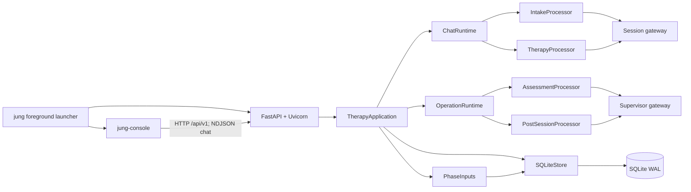

# Current implementation: evidence before redesign

## Scope and method

Baseline: `18d18898`, inspected on 2026-09-06. The working tree already contained an edit to `docs/README.md`, untracked `docs/assessments/`, and an untracked file named `-l`. These were left intact. The existing assessments were read as prior reasoning, not as constraints on this proposal. No patient database, `.env` secrets, raw patient trace, or simulation transcript was needed for the architecture review.

Inspection covered the six canonical documents, test/eval ownership, composition, workflow, application helpers, SQL/schema, phase processors and prompts, context packers, gateway/configuration, diagnostics, HTTP/console boundaries, test owners, simulation actor/runner/audit, and closed experiment outcomes. Important execution paths were traced across these boundaries. This is architectural inspection, not a claim of line-by-line security verification of every test or historical artifact.

A filesystem count of Python source, including comments and blank lines, found:

| Area | Files | Lines |
|---|---:|---:|
| Production `src/jung` | 75 | 14,486 |
| `tests` including manual smoke | 120 | 32,675 |
| `evals` | 18 | 9,927 |

Counts identify concentrations, not defects. A correctness test is not unnecessary merely because it is long.

## Runtime and ownership



The managed launcher runs API and console in one foreground invocation with an ephemeral loopback port. The standalone server is also available. The console still goes over HTTP; it does not import backend implementation types. The framework boundary is real and tested, not merely a diagram. See [local.py](../src/jung/local.py), [server.py](../src/jung/api/server.py), [composition.py](../src/jung/composition.py), and [dependency tests](../tests/unit/architecture/test_dependencies.py).

Composition always creates two SDK adapters, even when both use identical endpoint/model settings. Six source-defined tasks are injected into four processors. `ObservedLLMGateway` optionally wraps each adapter. The application has one mutation lock; chat has a separate generation reservation; retrospective work has one owned asyncio task. Connections are opened per whole synchronous store call, through `asyncio.to_thread`. Cancellation drains in-progress store work before releasing ownership. These mechanisms solve real acceptance/commit races.

## Durable state and workflow

The six tables in [schema.sql](../src/jung/persistence/schema.sql) are `profile`, `sessions`, `messages`, `plans`, `grounded_patient_turns`, and `operations`; schema version is **7** in [_sqlite_support.py](../src/jung/persistence/_sqlite_support.py).

- `messages` are the durable wording owner. A user/assistant pair shares `(session_id, client_message_id)`. SQL enforces role-specific uniqueness and session sequence uniqueness.
- `sessions.intake_record_json` contains the intake record; `sessions.review_json` contains the typed therapy-session interpretation, handoff, recommendation, and generation metadata.
- `plans` are immutable applied revisions. The profile points to the current one; each therapy session points to its starting plan.
- `grounded_patient_turns` stores message IDs only. It has no date, selection rationale, or selecting-review column; those require joins/reconstruction.
- `operations` stores assessment/post-session lifecycle. Assessment product output lives in its `result_json`; post-session result is only completion metadata.

Stage is derived in [workflow.py](../src/jung/workflow.py): `SETUP → INTAKE → ASSESSMENT → STYLE_SELECTION → READY ↔ THERAPY → POST_SESSION → READY`. Failed current operations still block progression. Only retryable failures expose retry; invalid model output is not classified retryable. Profile edits stop after intake; selected style cannot subsequently change.

SQLite enforces one open session and one current pending/running/failed operation. Store transactions enforce additional state and citation invariants. Application and store both check relevant preconditions; these are not entirely interchangeable: the store protects transactions even if called incorrectly.

## Flow A: accepted intake turn to initial plan

1. `POST /api/v1/chat` validates a `ChatRequest`. Request middleware establishes `request_id`; the API opens an NDJSON stream.
2. [ChatRuntime._accept_chat_command_locked](../src/jung/_application/chat.py) first checks existing message pairs. Complete identical pairs are replayed without a model call; conflicting content is rejected; an eligible unanswered user can be retried.
3. Under application mutation ownership, Jung reserves generation and commits the user message. A different unanswered user blocks a new turn.
4. [PhaseInputs.build_intake_turn_input](../src/jung/_application/inputs.py) loads profile, session record, transcript, latest user, previous assistant, and patient-turn count.
5. [IntakeProcessor.prepare_turn](../src/jung/phases/intake/processor.py) calls `intake_patch` for an `IntakeExtraction` candidate list. [extraction.py](../src/jung/phases/intake/extraction.py) maps candidates into nested evidence and injects source sequence/role and `direct_ask`.
6. `direct_ask` is derived from **the intended prompted item**, with the first patient turn treated as presenting problem. The previous assistant text is supplied to the model, but deterministic code does not prove that the generated assistant actually asked that question.
7. [merge.py](../src/jung/phases/intake/merge.py) checks normalized quote containment, drops invalid evidence, and merges scalar evidence by model confidence, then longer value on equal confidence. A later correction does not inherently win. A broad merge exception becomes `merge_failure` with the old record retained.
8. [completion.py](../src/jung/phases/intake/completion.py) distinguishes hard/soft items, informative/addressed answers, direct asks, and 3/12-turn thresholds. Twelve turns is not a universal hard limit: all hard items must be addressed, and extraction failure can block the max-turn path.
9. Only then does `intake_response` stream natural language. No record change is committed yet. If response generation fails, the already accepted user survives but the new intake projection does not.
10. On success, one store transaction writes the assistant and record. The final-intake variant also closes intake and inserts a pending assessment. Scheduling happens after commit.
11. [AssessmentProcessor](../src/jung/phases/assessment/processor.py) makes one supervisor structured call with the intake JSON, last 20 transcript turns, profile name/language, and every style's assessment instructions.
12. Actual output is **one score, rationale, topics, and complete initial plan per style**. Validation requires exact catalog coverage and normalizes order by score/catalog order. `select_style` chooses the corresponding already-generated plan, with no further call.

Documentation discrepancy: architecture/API prose describes style-neutral initial plan material, but [AssessmentResult](../src/jung/phases/assessment/models.py), its prompt, and [TherapyApplication.select_style](../src/jung/application.py) implement per-style plans. Some workflow transition prose also mentions profile revisions after post-session; the actual completion transaction does not update inferred profile facts. The migration must replace these descriptions coherently, not preserve the discrepancies.

## Flow B: live therapy and failure

The same acceptance/streaming path invokes [TherapyProcessor](../src/jung/phases/therapy/processor.py). It performs **one text call**. Input assembly loads the linked plan/style, active transcript, every session (including review documents), and every grounded message, then sorts/extracts prior reviews in Python.

The [therapy context builder](../src/jung/phases/therapy/context.py) packs a 12,000-character historical subtree, with a 2,000-character plan ceiling and at most 12 historical transcript-turn candidates. Current patient text and system instructions are outside that ceiling. Recent complete turns outrank richer briefing/plan content; grounded wording comes last. Grounded historical messages are rendered as content only, without date or source identifier.

The adapter streams ordinary `content`; it ignores `reasoning_content`. The application buffers the final text, rejects blank output, then commits the assistant. Tokens are tentative until `message_completed`. A disconnect can leave an unanswered user; reconnect reads state/history and retries the same ID. Shielded commit work can finish during cancellation, so the client must reconcile durable state rather than assume failure. See [chat tests](../tests/integration/application/test_application_chat.py) and [API resilience tests](../tests/integration/api/test_api_resilience.py).

Starting a therapy session only creates the session; it does not invoke the processor's opening-turn path. The opening capability in phase prompts/tests should not be mistaken for an automatic production opening.

## Flow C: completed session to later context

```mermaid
sequenceDiagram
    participant C as Console
    participant A as Application
    participant D as SQLite
    participant R as Supervisor
    participant T as Conversation model
    C->>A: end_session
    A->>D: Close therapy + create pending operation (one transaction)
    A-->>C: POST_SESSION snapshot
    A->>D: Mark operation running
    A->>R: Analysis JSON request with bounded transcript projection
    R-->>A: Analysis + sequence citations
    A->>A: Validate visible sequences, roles, chronology; resolve full turns
    A->>R: Update request with frozen analysis/evidence projection
    R-->>A: Briefing + plan patch
    A->>A: Validate merged plan; detect no-op
    A->>D: Review + grounded IDs + optional plan + operation complete (atomic)
    C->>A: Start next session, then send message
    A->>D: Read plan, latest prior briefing, grounded statements
    A->>T: Next-session conversation context
```

[PostSessionProcessor.process](../src/jung/phases/post_session/processor.py) has a useful deterministic zero-call path for empty, user-only, or assistant-only transcripts. Conversational sessions require two serial structured calls:

- Analysis: a 12,000-character **user-message** limit. It seeds a fitting user/assistant pair, packs additional whole turns, enriches plan, then tries historical context. The complete stored session may therefore not be analyzed. A visible-sequence allowlist prevents citations to omitted turns.
- Update: an 8,000-character user-message limit. [update_context.py](../src/jung/phases/post_session/update_context.py) constructs evidence atoms, resolves wording, freezes selected analysis, and progressively enriches other fields. The update prompt calls the validated analysis the authoritative account, although citation validation does not establish its semantic truth.

The [evidence validator](../src/jung/phases/post_session/evidence_validation.py) checks existence, role, visibility, uniqueness, and temporal ordering. A later cited patient turn does **not** prove that an intervention worked, or even that it was the semantic response to that intervention. Interpretive lists are not individually required to cite supporting text.

[SQLiteStore.complete_post_session](../src/jung/persistence/sqlite_store.py) resolves selected patient sequences again against source-session messages and commits review, references, optional plan, current-plan pointer, and operation completion together. An update failure loses the in-memory analysis; retry reruns the operation. The latest prior briefing is loaded even when that review created no new plan. Grounded selection is durable without a retention cap, but prompt inclusion is not guaranteed.

## LLM transport, configuration, and reliability

The actual boundary is [OpenAICompatibleLLM](../src/jung/llm/openai_compatible.py), using `AsyncOpenAI` with `max_retries=0`. It supports `json_schema`, `json_object`, and prompt JSON. [structured.py](../src/jung/llm/structured.py) transforms/validates the strict schema, removes a surrounding JSON fence, validates Pydantic output, and constructs a correction request. Structural or processor semantic errors get at most one correction. Transport failures do not.

Important limits of the implementation:

- `finish_reason` is recorded, but neither streaming nor structured code rejects `length`. Nonblank streaming text can be persisted after truncation; a parseable structured value with a length finish reason can be accepted.
- `timeout_seconds` is passed to the SDK request. It is not an explicit total deadline enclosing streaming and correction. A slowly progressing stream and two attempts are distinct time-budget concerns.
- Completion-token caps default to `None`.
- Schema instructions are explicitly appended only for `prompt` mode. `json_object` supplies a JSON-mode flag, not the output schema; phase prose does not enumerate the entire expected schema.
- `ModelPolicy` mixes task policy with model selection and structured mode. There is no configured total context window or runtime capability record.
- Supervisor URL/model/options/credentials independently inherit session fields. Pointing at another origin without clearing secrets can inherit credentials. The eval patient resolver already has more careful cross-origin handling.
- There is no provider discovery, inference-process manager, fallback router, embedding store, or model-switch scheduler. Their absence is appropriate for the current product.

## Diagnostics, evaluation, and tests

Ordinary logging and opt-in diagnostics are parallel systems. [_application/diagnostics.py](../src/jung/_application/diagnostics.py) sends command/transitions only to the optional recorder; it does not emit those events to ordinary logs. [tracing.py](../src/jung/llm/tracing.py) adds logical-call observation; the concrete adapter separately records provider attempts and exposes a metrics callback.

[DiagnosticRecorder](../src/jung/diagnostics.py) owns schema-v5 events, context variables, ordered writing, secret redaction, private permissions, and write-failure latching. [composition.py](../src/jung/composition.py) automatically takes a full SQLite backup after initialized debug runs, even if the failure concerns one call. `_safe_exception_message` is essentially `str(exc)` with a defensive catch; its name does not make arbitrary exceptions safe for ordinary logs. Some operation paths use `logger.exception`, so exception payload handling deserves explicit attention.

The four live surfaces are distinct and useful in intent:

| Surface | Actual implementation |
|---|---|
| Compatibility smoke | Processor-level local calls plus evidence checks under `tests/smoke` |
| Hard invariants | Canary non-disclosure, exact sentinel resistance, citation integrity, selected safety negation, intake clear-denial retention |
| Behavioral report | Human-review matrix; full workload documents about 57 requests; successful report generation is not clinical approval |
| Simulation | Real HTTP journey, isolated SQLite, synthetic patient, runtime trace, checkpoints, mechanical audit and narrative artifacts |

The [patient actor](../evals/simulation/patient.py) receives scenario and patient-visible dialogue, not plans/reviews/prompts. Preserve that separation. The [runner](../evals/simulation/runner.py) exercises the full intake → assessment → style → therapy → review flow. [audit.py](../evals/simulation/audit.py) is 2,212 lines; [intake_forensics.py](../evals/simulation/intake_forensics.py) is 1,370; [intake_risk_denial_evidence.py](../evals/intake_risk_denial_evidence.py) is 852. These reconstruct intermediate relationships from traces, digests, and snapshots, beyond checking final therapeutic state.

The deterministic suite has real strengths: rejection/idempotency, cancellation while persistence is in flight, operation retry handoff, schema invariants, API stream identity/order, prompt budgets, provenance, and eval-harness failure paths. `make check` runs format, lint, local doc links, unit/integration tests, and one console probe. Live tests are excluded.

Historical outcomes are informative but limited. [Phase 8B](../evals/phase8b/OUTCOME.md) did not measure interactive first-token latency; its selected concurrent report configuration had a modest fixture-specific advantage. [Phase 8C](../evals/phase8c/OUTCOME.md) was inconclusive after genuine failures. [Phase 8D](../evals/phase8d/OUTCOME.md) found cheaper synthetic-patient calls with thinking disabled but an older intake path still failed. None establishes success or failure of the current intake-v4 code or the proposed architecture.

## Safety behavior actually present

Safety screening is intake evidence/completion logic. Patient-facing prompts mention urgent safety/medical content; review/assessment schemas include boundary notes. There is no independently enforced runtime crisis classifier, external emergency action, human monitoring loop, or validated diagnosis engine. Packaged style text is not a substitute for a common safety policy. Existing [safety documentation](../docs/safety-and-data.md) correctly distinguishes narrow hard invariants from diagnostic clinical-style scenarios and unclaimed guarantees.

The architecture should preserve that honesty while improving data integrity and operational boundaries. It should not portray a populated intake safety slot as proof of safety, or an evaluation pass as clinical validation.
