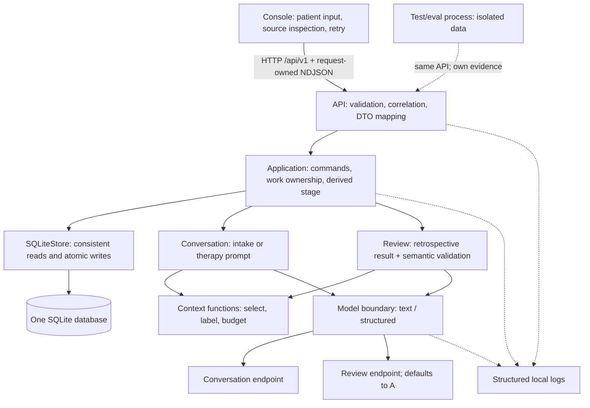
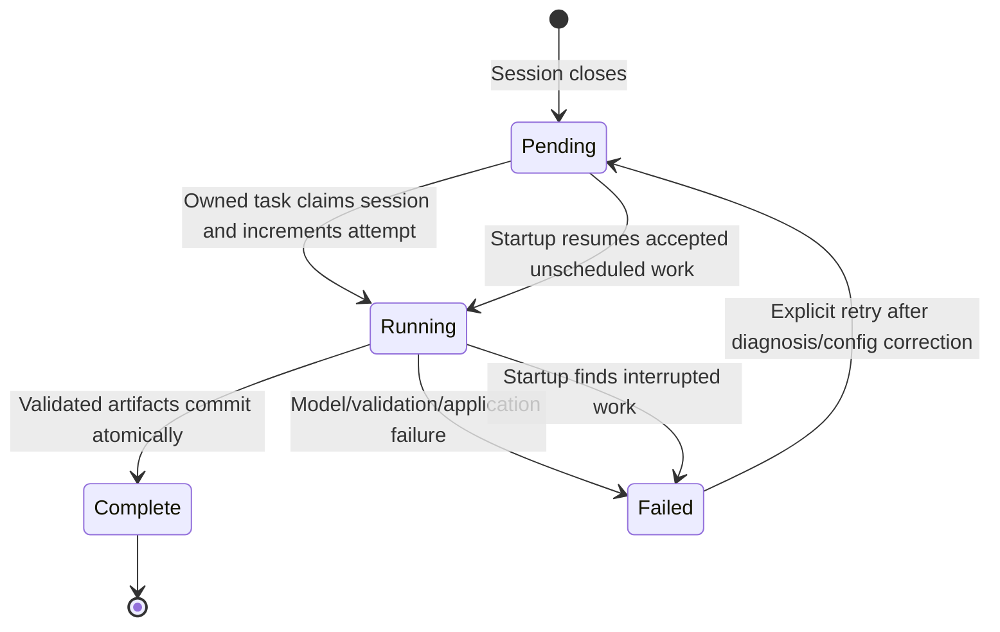

# Target runtime and workflows

## System structure



No actor gets tools to mutate the database, run commands, browse patient files, or invoke another actor. Models return text or a proposal. Jung validates and commits.

Suggested final layout, with names illustrative and ownership normative:

```text
src/jung/
  api/                 # existing adapter/contracts/server
  client/              # existing HTTP client and console
  domain/              # Profile, Session, Message, Plan, Review; typed errors
  persistence/         # SQLiteStore, schema, row decoding
  conversation.py      # intake/therapy prompt modes; natural text only
  review.py            # one retrospective prompt and result validation
  context.py           # query inputs, labeled sections, whole-item packing
  llm/                 # protocol, endpoint profiles, SDK adapter, correction
  application.py       # use cases and derived snapshots
  _application/
    chat.py            # acceptance/stream/commit ownership
    review_work.py     # one owned review task and recovery
    store_calls.py     # cancellation-safe whole store calls
  workflow.py          # short pure policy over durable facts
  logging.py           # setup, context fields, safe metadata/payload handlers
  composition.py       # acquire data-dir process lock, construct and close resources
  config.py            # sole configuration loader
  local.py             # foreground launcher
  styles/              # descriptions and concise method instructions
```

Do not reorganize unaffected API/client files simply to match this picture. A separate processor class is unnecessary if a prompt function plus a narrow call suffices. Keep a small model protocol for fakes; no factory registry, base-agent class, or dynamic task dispatch.

## Workflow state and concurrency

Four displayed stages are enough: **INTAKE, REVIEW, READY, THERAPY**. Review has pending/running/failed status, shown alongside the stage. It is not a second mutable stage field. Preferences do not require a SETUP stage.

Derivation order:

1. A closed session with unfinished review → `REVIEW`.
2. An open intake or therapy session → corresponding active stage.
3. An applied current plan and no unfinished work → `READY`.
4. Any other combination → an invariant error, not a default stage.

Fresh-database initialization atomically creates the singleton profile and one intake session with English and a small supportive-style entry as defaults. Display those editable defaults without implying that the patient explicitly chose them. Display name is optional. Initialization is idempotent and never manufactures a new intake to hide an inconsistent existing database. Date of birth and free-form profile notes are removed from this minimal target because they have no demonstrated use in the current live prompt path. Patient narrative belongs in messages. These omissions are a product scope choice, not a prohibition on later age-appropriate requirements.

Keep the mutation lock around command acceptance/commit, and a generation reservation across a chat attempt. One review task runs while the stage is `REVIEW`; another session cannot begin against an unfinished review. Reads remain available. Never hold a SQLite transaction across a model await.

The backend also takes an OS advisory lock for the configured data directory at startup and holds it through shutdown. A second backend using that directory fails clearly. This small local lock prevents a second process from treating the first process's active review as crashed; SQLite's writer lock alone does not establish process ownership. Disposable evals use different directories. No lock service is required.

| Stage | Commands |
|---|---|
| INTAKE | Chat; finish intake after at least one nonblank patient message; edit preferences while idle |
| REVIEW | Read state/history; retry a failed or unscheduled review when idle; stop the application |
| READY | Start therapy; edit preferences |
| THERAPY | Chat; end session; edit preferences only between turns |

Create each session with a small `preferences_json` snapshot. Before its first accepted patient message, idle profile language/style edits update that snapshot atomically. The first accepted message freezes the snapshot, including when its assistant response fails; no separate setup/submitted flag is needed. Later preference edits affect future sessions and their reviews, not the active session or an in-flight request. Show those edits as pending. Plans record the method under which they were authored. When a new session chooses another method, the conversation receives that method's instructions and the earlier plan as explicitly labeled prior strategy; it does not have to apply incompatible old techniques. Its review must produce an updated plan for the new method. No extra preference-transition workflow is needed.

## Intake

1. Console displays the initialized language/style defaults and a short orientation: concerns, impact/time course, goals, coping, and safety can be discussed; unknowns and declining to answer are acceptable.
2. Intake already exists with editable preferences and no initial plan. A static welcome invites the first patient contribution; it is UI guidance, not fabricated therapist dialogue. No explicit preference confirmation is required to begin.
3. Patient text uses the ordinary durable chat path. The conversation task in intake mode asks concise follow-ups based on the recent transcript. There is no extraction call and no durable inferred intake record.
4. Keep an always-available help action. Optional direct self-report controls let the user explicitly submit `self_harm`, `harm_to_others`, or `medical_urgency` with `yes/no/unsure/decline` and optional text. These are user input, never automatic classification of free text. Their exact submitted values and wording are stored with their message. A `no` for one dimension says nothing about another.
5. **Finish intake** is an explicit user command. It does not certify clinical completeness or safety. Accept it after one patient message, even if questions remain. It closes the session and queues its review in one transaction. A trailing unanswered message remains source material for that review.
6. The initial review reads the full intake and produces a provisional plan and handoff. It records unknowns and questions for later clarification. A valid initial review requires a plan; it does not require a diagnosis or style score.
7. Commit and enter `READY`. No assessment operation, catalog coverage validator, or post-assessment style-selection stage remains.

The direct self-report API is small: an optional typed `self_report` field on chat input, allowed for current intake/therapy sessions. Its identity and text are part of idempotency comparison. Store source metadata on the message; do not create another clinical assessment table. Console controls submit the explicit selected value, rather than converting arbitrary natural language into that value. Free text alone remains fully supported. This does not require a form framework.

## Live therapy

```mermaid
sequenceDiagram
    participant U as Console
    participant A as Application
    participant D as SQLite
    participant L as Conversation model
    U->>A: Chat(session, client message ID, text, optional self-report)
    A->>D: Resolve duplicate; check live context and fixed session-source limit
    A->>D: Commit patient message
    A->>A: Select and budget context from consistent source reads
    A->>L: Instructions + labeled context + recent exchanges + current input
    L-->>U: Tentative tokens through A
    L-->>A: Valid stop and nonblank final content
    A->>D: Commit assistant + small generation metadata
    A-->>U: message_completed
```

Same-ID retries reuse or regenerate the same accepted user message; changed content or self-report metadata is a conflict. A partial stream is not a completed therapeutic record. If the provider ends with truncation, missing terminal status, refusal/filter failure, or blank text, no assistant completion is committed. The console marks any displayed partial as interrupted and offers retry/end; it must not leave it looking like a successful answer.

Retain the existing four NDJSON event shapes unless a specific UI need requires a change. Cancellation closes the SDK stream and drains critical database work before releasing mutation ownership. If cancellation occurs after commit but before the terminal event arrives, the client reconciles through history. There is no exactly-once-delivery claim over HTTP; there is idempotent durable acceptance/completion.

## Completion and retrospective work

Ending a therapy session atomically sets `ended_at` and review status `pending`. The response is immediately accepted; review outlives the HTTP request. Starting another session waits for successful review, preserving coherent plan/handoff ownership.

Review input contains the full completed session, starting plan, session preferences, latest useful prior handoff, and a small dated source selection. Historical interpretation is labeled as such. The same processor handles initial intake and later therapy, with explicit initial-plan requirements.

Output sections are:

- **Session note:** short account of the current session, a few supported observations/hypotheses, uncertainty, significant moments, safety/boundary observations, and unresolved questions.
- **Handoff:** opening direction, limited carry-forward questions, things to avoid, and a few source handles whose exact wording matters next time.
- **Memory selections:** source handles for patient statements worth retaining as retrieval candidates, with a small selection-purpose label.
- **Replacement plan or null:** full bounded strategy when change is warranted. No sparse patch language.

Validate fields, references, visible-source membership, source roles/session membership, and plan requirements separately. Current/historical labels come from resolved sources, not a model-authored scope field. Then one transaction writes the review, selected references, optional new plan/current pointer, and review completion. Application code resolves prompt-local handles to real IDs and authors provenance. No intermediate generated analysis is called source truth. The compact schema and one-call decision must pass R0 before this production cutover is implemented.

Empty therapy sessions take a deterministic no-change path. Therapy with only an unanswered patient contribution also takes a deterministic review indicating that it was not explored; its source is retained and presented at the next session. Do not infer disengagement. Intake with patient text still needs the initial review even if no assistant completed, because it must establish a provisional plan. Empty intake cannot finish.

For no-content therapy reviews, `handoff` is null and the next context uses the latest earlier non-null handoff. An unanswered patient source from the immediately preceding session is independently included through a direct store query; it must not disappear merely because the no-content review had no new handoff. See context construction in the [data and context model](04-data-and-context-model.md).

## Review recovery



Use conditional SQL updates on `(session_id, review_status, review_attempt)` to fence a late worker. The attempt is monotonic per session; it is not a workflow revision token sent by the client. Completed review content is immutable in the supported command surface. Retrying a failed review does not create another session or duplicate plan/reference rows.

Keep this lifecycle to status, attempt, bounded error metadata, and the single owned asyncio task. Do not add worker identities, leases, attempt-provenance tables, or recovery machinery for hypothetical parallel workers.

On startup, pending accepted work is scheduled. Stale running work becomes failed/interrupted and requires an explicit retry; do not repeatedly call a failing model on every application restart. This deliberately changes today's automatic running → pending recovery. A lost worker-scheduling attempt leaves visible, resumable pending work; retry/resume can schedule it without pretending it ran. Shutdown waits up to its configured grace period, then cancels/drains the owned task. It does not manufacture successful review.

Allow explicit retry for invalid output and endpoint/configuration failures after the operator changes the relevant settings, as well as transient outages. A retry is a new deliberate logical call with at most one correction. Eligibility is derived from a closed failed/pending session and currently valid workflow preconditions, not a permanently stored `retryable=false` bit. Corruption/invariant failures require repair and fail those preconditions until repaired; there is no “skip review and silently advance” command.

## Model topology and configuration

Two small types, `CallPolicy` and `EndpointProfile`, represent two task policies and at most two resolved endpoints. Capability fields belong to the endpoint profile; the rows below describe ownership, not a registry or extra configuration hierarchy:

| Concern | Owns | Does not own |
|---|---|---|
| Task policy | `conversation` or `review`; temperature; output reserve; total deadline; prompt version | Endpoint URL/model identity |
| Model capability | Configured context window; admitted structured mode; finish/stream behavior; token-limit parameter support | Clinical authority, workflow routing |
| Runtime profile | URL, served model ID, explicit secrets/headers, provider-specific extras, reasoning options | Completion criteria, persistence, retry policy |
| Application | Call ordering, source access, context selection, semantic validation, acceptance/commit | Inference scheduling, KV-cache implementation, weight loading |

Default review profile is the **same profile object** as conversation. One HTTP client can be shared for an identical endpoint credential set. If a separate review profile is specified, its URL/model and credentials are explicit; missing credentials do not inherit across origins. A single server serving multiple admitted model IDs can share transport while choosing the configured model. Avoid “inherit each nullable field independently” semantics.

Retain one `load_settings()` owner using existing `pydantic-settings` and `.env`. Environment values override dotenv values, which override defaults. Do not introduce TOML, secret-name indirection, or another configuration parser. Once six tasks have become two, R5 removes obsolete task overrides and reduces settings to the endpoint/call-policy fields that still have consumers. Cross-origin credential isolation is an earlier R1 correctness fix, not dependent on this redesign. Unknown endpoint/policy keys fail validation.

Initial engineering defaults to test in R0 are 768 completion tokens / 120 seconds for conversation and 3,072 completion tokens / 300 seconds for review; they are not promises about all local models. Bound every output and reserve reasoning within the provider's total completion budget. Also enforce a finite response-byte limit (initially 8 KiB for conversation), so acceptance can reserve an actual maximum assistant source size within the fixed product envelope. Exceeding it interrupts the attempt without a completed assistant row. If a server distinguishes visible-output and total-output limits, its endpoint profile must name the supported behavior; do not assume all APIs share it. R0 freezes suitable limits before cutover, including the session-source maximum and bounded non-session review allowance.

### Runtime-specific guidance

Use OpenAI-compatible Chat Completions as the only production wire protocol. llama.cpp documents streaming chat, schema-constrained output, template/tokenization endpoints, and slot-related controls; those capabilities belong to the server. Its own documentation cautions against assuming perfect OpenAI equivalence. Verify the actual build and request shape. [llama.cpp server documentation](https://github.com/ggml-org/llama.cpp/blob/master/tools/server/README.md)

MTPLX also exposes an OpenAI-compatible server and manages model/runtime acceleration. Its upstream changelog describes schema constraints using llguidance, but that does not establish that an arbitrary installed build or launch configuration enforces Jung's schema. The repository's older missing-llguidance failure illustrates why admission should be version/configuration-specific. Jung should neither install llguidance nor manage MTP/KV caches inside its runtime. [MTPLX server documentation](https://github.com/youssofal/MTPLX/blob/main/README.md), [MTPLX changelog](https://github.com/youssofal/MTPLX/blob/main/CHANGELOG.md)

`/v1/models` can check a configured served ID. It is not a universal capability negotiation protocol: context and constrained-generation behavior require documented settings plus real admission requests. A manual `check-model` command may print observed/configured capabilities and run synthetic probes. Admission must exercise the actual review schema and full product envelope, including multilingual source and bounded correction/output. Normal startup validates the configured endpoint's capacity against that fixed envelope without therapeutic or expensive test calls. Re-admit a changed server/model configuration; do not add a profile registry or persisted per-session capacity fingerprint.

One resident model is the operational baseline. If two models do not fit comfortably, configure runtime-managed loading at session boundaries or manually run review later on the appropriate server, then retry the pending session. Jung does not become an inference supervisor. No silent fallback to a cloud endpoint or another model is allowed. Hot model switching mid-stream is unsupported; finish/cancel work and reload validated configuration.

## Structured output and error behavior

Natural text is right for conversation: no JSON wrapper, action parser, or model-authored stage transition. Review needs structure because references and plan changes become durable data.

Target `json_schema` as the sole production review mode if R0 admits both intended llama.cpp and MTPLX configurations with the actual compact schema. Any alternative mode requires a named required endpoint and measured need, with explicit schema instructions and the same validation; it is not retained for hypothetical compatibility or used as an automatic downgrade. R5 separately tests the SDK's public Pydantic parse path to remove bespoke schema processing. Structure is not truth. Parse a complete JSON object; do not adopt partial JSON recovery or infer missing fields. Pydantic provides strict JSON validation, while also offering partial parsing facilities that this commit boundary deliberately does not use. [Pydantic JSON documentation](https://pydantic.dev/docs/validation/latest/concepts/json/)

One logical review call:

```text
prepare fixed input and output budget
within one total deadline:
    send attempt 1 with SDK retries = 0
    require valid terminal status and content
    parse schema and validate section semantics
    on correctable schema/semantic failure only:
        send attempt 2 with original input + bounded error locations
        apply exactly the same validation
return complete valid result, or fail without writes
```

Correction is at most one, not guaranteed: no call begins after the deadline or if the correction prompt cannot fit. A broken reference is correctable; a database read bug is not. Timeout, cancellation, transport failure, refusal/filter response, and length truncation do not trigger “try another provider” or an automatic continuation. Blank review content may use the one correction if transport completed normally; blank conversation fails immediately.

| Failure | Durable result / visible behavior |
|---|---|
| Invalid chat input, duplicate conflict, known request too large | Reject before acceptance; preserve client draft |
| Model unavailable / 429 / 5xx | Accepted user survives; review becomes failed; explicit retry |
| SDK timeout / outer deadline | Same; cancel request and close stream |
| Nonblank text with `finish_reason=length` | Interrupted attempt; no assistant commit |
| Stream EOF without required terminal finish | Protocol failure; no assistant commit |
| Structured JSON parse/schema/reference failure | One correction; then failed review with no partial artifacts |
| Parseable structured result with length finish | Truncation failure; no commit, no implicit acceptance |
| Refusal/content filter | Typed failure; no reinterpretation as a clinical finding |
| Provider uses only `reasoning_content` | No usable content; change runtime reasoning configuration, never display hidden reasoning as therapist speech |
| Unknown provider option / unsupported schema mode | Configuration/protocol error; no mode fallback |
| User disconnect | Cancel generation; accepted/committed state reconciled from DB |
| SQLite error during completion | Entire artifact transaction rolls back; no successful terminal event |
| Crash during review | On restart show interrupted review; explicit retry |
| Log/capture failure | Warn once; product outcome unchanged; any dependent hard evidence claim fails |

Use stable public error codes: retain `invalid_command`, `busy`, `not_found`, `llm_unavailable`, `llm_timeout`, `invalid_llm_output`, and `internal_error`; add explicit `context_capacity`, `llm_protocol_error`, `llm_refused`, and `interrupted` where applicable. Truncation is `invalid_llm_output` with a safe reason code. Keep transport status separate: command conflicts are HTTP 409, unknown resources 404, invalid bodies 422, known capacity rejection 413, and unavailable application 503. Once an NDJSON stream is open, its terminal failure envelope carries the corresponding code instead. Never embed raw provider text in that envelope.

Default streaming admission requires the terminal status Jung relies on. A runtime omitting it is incompatible until a narrowly specified adapter change is justified and tested. Do not declare every OpenAI-compatible server supported merely because it accepts a request.
