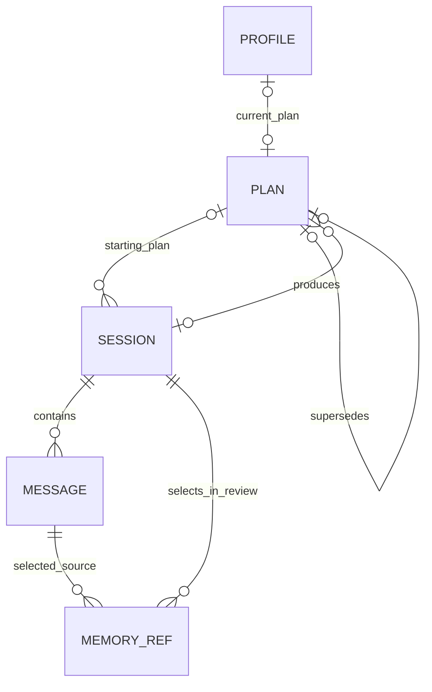

# Data ownership and context

## Persistent model

Use relational rows for identity, ordering, references, work status, and transactions. Use small Pydantic-validated JSON documents for interpretation and strategy. Normalizing every clinical-style sentence would add joins without establishing its truth. An undifferentiated memory document would hide provenance.



Five tables are sufficient. Review is a session-owned document, not another table. A session's pending review is real product workflow state, not an audit event.

| Owner | Represents / creator | Source or derived | Mutability and reason to exist |
|---|---|---|---|
| `profile` | Singleton nullable method/default language; valid method required and fixed at Finish Intake; current-plan pointer set by application | Language default or explicit user choice plus application pointer | Default language editable while idle; method selectable/changeable only during intake |
| `sessions` | Session identity, type, starting plan, session language, lifecycle and review | Application metadata; review is derived | Intake language editable until closure; therapy language frozen at creation; completed review immutable; binds a review to its source conversation |
| `messages` | Actual patient input and completed assistant response, ordered in session | Patient source or model utterance; role stays explicit | Append-only; sole durable exact-wording owner; unanswered patient input remains valid history |
| `plans` | Applied therapeutic strategy produced by accepted review | Derived strategy, never patient fact | Immutable revisions; historical sessions remain linked to their starting strategy |
| `memory_refs` | Selection of a patient message by a completed review | Source link plus derived selection judgment | Append-only relationships; no copied wording or purpose-based ranking |

### Required fields and invariants

This is a schema specification to implement, not executable DDL for the current schema.

**Profile:** `singleton_id=1`, `current_language` initialized to English, nullable `method` initialized to null, current plan ID, created/updated timestamps. Initialize profile and intake atomically, with no SETUP flag or selection requirement before chatting. English is a product default, not evidence of explicit choice. The current pointer is application-authored; model-generated biography never enters the profile. The profile is the sole durable method owner. During open intake, method is null or a packaged ID; user selection/change is validated against the existing catalog (`jung`, `cbt`, `freud`) before persistence. Finish Intake requires a nonblank patient contribution and a valid non-null method, checked before closing/queuing review atomically. After closure method is non-null and immutable, including failed initial review/retry; derive that restriction from closure without another flag. Default language remains editable. During open intake, language edits atomically update profile and intake language; later edits only change the profile default for future therapy sessions.

The target profile/domain/API representation preserves null as “not selected,” never a sentinel string or implicit fallback. Catalog membership is application-validated using packaged assets, not LLM-authored or a new method table. Unknown persisted IDs, missing assets, or a closed intake with null method fail explicitly. No review or plan is created from an unselected method.

**Session:** ID, kind (`intake|therapy`), starting plan ID (null only for initial intake), scalar `language`, start/end timestamps; review status (`none|pending|running|complete|failed`), monotonic attempt count, safe last error code, review start/completion timestamps, nullable review JSON. Language starts from `profile.current_language`: intake allows edits until closure, therapy freezes it at creation. Reviews/retries always use this session language plus immutable `profile.method`; there is no session method copy or `preferences_json`. No `capacity_json` or session-frozen runtime profile: every admitted review endpoint must fit the same product envelope. A failed attempt has no committed review or plan changes. A complete review has a document. An open session has review status `none`. At most one open session and at most one closed unfinished review globally. Store acceptance prevents these two states coexisting. Review work needs no worker identity, lease, or attempt-history table.

**Message at R2:** ID, session ID, sequence, role, text, client message ID, created timestamp, nullable generation metadata. Unique `(session_id,sequence)` and `(session_id,client_message_id,role)`. The store requires an assistant completion to match the latest unanswered user. Generation metadata belongs only on generated assistant messages and is application-authored. No speculative input-metadata column or typed self-report fields.

**Conditional R6a recall extension:** only if R6 demonstrates a material gap that explicit source selection remedies, add nullable `input_metadata_json` for validated user-selected recall IDs on patient messages, with an absent/empty list treated identically and nonempty IDs sorted by message ID. These IDs participate in chat idempotency; changed selections under the same client message ID conflict. Add the field, DTO/console flow, context serialization, and tests together. If selected, this requires another schema-version bump and disposable-database reset; the baseline reserves no column and requires no second reset. No migration framework or incidental erasure of the user's historical database. Typed self-report remains deferred independently.

**Plan:** ID, monotonic version, source review session ID (unique), supersedes plan ID (unique when non-null), bounded `content_json`, created timestamp. Foreign keys bind its origin and predecessor. All plans use the same immutable profile method; there is no stored or derived plan-method property. Content is immutable; application code checks that the predecessor is the current starting plan. Initial review creates version 1. An identical replacement creates no revision.

**Memory reference:** selecting review session ID and source message ID; composite primary key `(review_session_id,message_id)`, with both foreign keys. The store requires a completed/committing review and a patient-role source from that review's session. Historical handoff anchors do not create new archive occurrences. Query distinct message IDs for candidates. There is no purpose column or model-authored priority; chronology comes from joined session/message rows.

Memory selection output is ephemeral. After validation, `memory_refs` is its sole durable owner; do **not** also store an identical selections list inside `review_json`. Review-note citations and handoff references may point to the same message for different reasons. Repeating a reference is not copying a fact or duplicating ownership of the underlying wording.

### Compact document shapes

All generated strings/lists have explicit limits. R0a freezes this minimal candidate for R0b admission on the corrected R1 boundary. Add fields only for demonstrated consumers. The limits are engineering candidates, not a clinical ontology; source chronology is backend-owned.

```text
ReviewDraft (LLM output; no IDs, status, model name, or timestamps):
  note:
    summary: short text (up to 1,200 characters)
    observations: up to 5 {text, kind, source_handles[]}
      kind = observation | hypothesis | uncertainty
    boundary_notes: up to 3 {text, source_handles[]}
  handoff:
    opening_focus: short text
    carry_forward: up to 3 short questions/directions
    source_handles: up to 2 complete patient messages for next session
  remember: up to 5 distinct patient_source_handles
  replacement_plan: PlanContent | null
  plan_change_reason: short text | null

PlanContent:
  focus: short text
  goals: 1–3 proposed therapeutic goals
  approach: 1–3 concrete methods/actions
  cautions: up to 3 restrictions or provisional assumptions
```

Each observation/boundary item is at most 400 characters and has at most 3 source handles. Handoff and plan items are at most 400 characters; a whole-document output budget also applies. Put unresolved uncertainty in observations and actionable next-session questions/restrictions in `carry_forward`. Enduring restrictions belong in `PlanContent.cautions`. There are no separate unresolved-question or avoid lists. Progress belongs in the dated note; carry-forward instructions are prospective actions.

| Field | Consumer / reason to retain |
|---|---|
| Note summary and observations | History inspection; `kind` distinguishes claims, hypotheses, and uncertainty; old notes are not prompt context initially |
| Boundary notes | Inspection of safety/boundary interpretation; optional, with no completeness gate |
| Handoff | Next conversation's opening, questions, restrictions, and mandatory exact-source anchors |
| Remember | Inserts current-session patient references as future context candidates; not a duplicate durable note field |
| Replacement plan and change reason | Applied strategy and inspectable explanation of its revision |

This consumer inventory is part of R0a; R0b tests whether the smaller shape suffices. Restore a field only for a demonstrated missing consumer or admission failure, not to create validator branches. Safety interpretation may remain uncertain; field population is not proof of assessment.

A full replacement must preserve still-relevant content unrelated to the justified change. R0 development and withheld confirmation cases test a small approach change with multiple existing goals and an important caution that must survive. Human review checks semantic preservation; normalization/schema validation cannot establish it. Repeated failures reopen the replacement decision before cutover rather than immediately adding patches or silent backend merging.

Goals in the plan are **proposed strategy**. If the patient requested or accepted a goal, its source wording is linked from the review and available as a patient source. Do not add a model-controlled `patient_confirmed=true`. A future explicit goal-acceptance UI would be a user-authored input, not another inferred status.

After validation, the application constructs `SessionReview` with:

- the note and handoff, resolving handles to message IDs;
- the applied plan-change reason, or null when unchanged; no persisted resulting-plan ID;
- generation metadata: origin (`model|deterministic`), model ID and endpoint role for generated reviews, prompt version, schema version, application revision, and completion timestamp;
- a simple coverage declaration authored by Jung: full source session used, or deterministic no-conversation handling.

Plan content is stored only in `plans`. The accepted replacement is consumed by the transaction and removed from stored review JSON. To inspect a review's result, query the unique `plans.source_review_session_id`; if no plan was produced, the starting plan remains applicable (possibly null for an uncompleted initial review). API/history may expose that derived relationship without persisting a reverse link. Plan generation provenance comes from its source review.

Assistant messages carry smaller provenance: model ID, prompt version, endpoint role, and application revision. This tells the user what generated an utterance without storing full prompts in the clinical record. Review provenance may likewise name the configured endpoint role/model; neither artifact needs a capacity fingerprint or persisted configuration registry. Exact call input/configuration is an opt-in diagnostic or test-evidence concern.

### Source handles and trust

Prompts identify visible sources with short request-local handles such as `C7` (current-session message) or `H2` (historical message), plus role and date. A context object holds `handle → message ID, session ID, sequence, scope`. Models can select these handles; they do not author durable identifiers.

Validation rejects unknown/omitted handles, invalid roles, duplicate selections, and historical sources used for current-session-only archive selections. Note items may cite current and historical sources together; the backend resolves and labels each source's actual session/date. There is no model-authored scope to validate. Observations and hypotheses require cited support; explicit uncertainty/questions may have no source. Hypotheses remain hypotheses even with a valid citation. Prose is derived and is not deterministically checked for entailment or correct temporal interpretation; targeted model cases cover those limitations. The UI must say “model interpretation with cited source,” not “verified fact.”

No quote substring extraction is needed. Fetch the complete authoritative message for display or prompt inclusion. Exact text is stored without normalization; whitespace normalization can be used for deduplication/search comparisons but never overwrites source text. Source handles are transport conveniences, not durable identity.

### Atomic review commit

```text
BEGIN IMMEDIATE
  require session is closed, running, and attempt matches worker
  require current plan still equals the expected starting plan
  validate resolved source IDs/roles/session scopes again
  insert optional changed plan; update profile current-plan pointer
  insert selected source relationships
  write review document and applied change reason (no reverse plan link)
  set review status complete and clear error metadata
COMMIT
```

The first plan has no predecessor; later revisions do. Initial model review requires a plan; later reviews may return null to leave strategy unchanged. There is no method-transition replacement rule. Deterministic no-conversation reviews remain no-change. A changed plan requires a nonblank reason. An unchanged normalized replacement creates neither revision nor applied-change reason. Any invalid reference/document, duplicate origin, or write failure rolls back all artifacts. Foreign keys and conditional updates complement semantic validation.

No migration framework, summarized-history table, vector store, diagnosis entity, intervention-effectiveness status, or psychological ontology is needed. Completed source text remains available regardless of prompt packing or how many reviews exist.

## Context construction

There are only two prompt families. Intake and therapy are modes of conversation; initial and later review are modes of review. Their data access rules are explicit rather than dynamically registered.

| Interaction | Included | Deliberately excluded |
|---|---|---|
| Intake conversation | Intake language, common conversation/orientation/safety policy, packaged method instructions only if selected, recent complete exchanges, current text | A fabricated default method; plans for imagined styles; extracted slot JSON; other phase internals |
| Therapy conversation | Fixed method/session language, complete current plan, latest useful handoff, mandatory source anchors, recent exchanges, selected dated history, current input | Old full reviews; all historical transcripts; model analysis as system authority; ranking scores |
| Initial review | Entire intake transcript, profile method and intake language frozen at Finish Intake, orientation task | Other style plans/scores; unsupported demographic inference |
| Later review | Entire completed session, starting plan, immutable profile method and frozen session language, latest useful handoff, selected historical patient sources | Earlier review notes; unseen sources as citation candidates; full historical replay |

Static behavioral instructions go in the system message; packaged method instructions join them only when a valid method is selected. Unselected intake uses the common policy without a catalog lookup for null or a hidden default. Explicit method/language settings, patient text, prior generated plans, and reviews are contextual data, with explicit source type/scope labels. Use ordinary alternating user/assistant roles for the selected recent exchange sequence; preceding context is a clearly delimited data message, not a promotion of old model output into system instructions. The current patient message appears once, at the end. If an admitted model handles a single structured context message better, changing serialization is a measured prompt decision, not a new context owner.

The method is fixed at Finish Intake, so both conversation and review receive the complete applicable plan/handoff without method-based projection. Method-specific guidance remains generated interpretation, not patient fact. Do not introduce mismatch detection or transition-specific context for a deferred switching feature.

### Bounded selection algorithm

1. Before a new message is accepted, read plan, latest useful handoff, recent message range, source-byte count, and source candidates through one store read operation/transaction. Check mandatory conversation context and the fixed session-source limit while mutation/generation ownership prevents conflicting changes. Resolve duplicate/retry input first so an already accepted patient message is not counted twice. Stop loading and sorting every full `SessionReview` for each patient turn.
2. Establish the **whole-request budget** for the selected runtime/task: instructions + contextual metadata + transcript + schema when applicable + correction margin + output/reasoning reserve + template margin.
3. Include the interaction's mandatory core: intake uses session language, common policy, selected method instructions if any, and current input; therapy also requires its fixed method, complete compact plan/handoff, active handoff sources, and the preceding session's unanswered patient input. If optional R6a is justified and implemented, include explicit recall sources too. Deduplicate by message ID; no priority rule silently drops a mandatory source to fit another.
4. Allocate remaining live context to the newest **contiguous complete exchanges**. Never create an apparent immediate response by joining across an omitted middle exchange. Include an omission marker at the start. Do not truncate a patient message mid-negation.
5. Reserve historical-evidence space before recent dialogue: up to two active handoff sources and two optional recent selections, plus preceding unanswered input and optional R6a explicit recall only if implemented. Optional caps never displace mandatory sources or require filling every slot.
6. After mandatory sources, retrieve up to 30 distinct recent `memory_refs`. Order by selecting session's `ended_at` descending, source message sequence descending, and message ID ascending for stable ties. Do not let delayed completion/retry make an old session appear newly reported. There are no purpose labels, term extraction, lexical matching, or model-generated queries.
7. Fetch full source messages for selected candidates; include dates, roles, and session identity. At roughly five selections per review, a 100-session fixture has about 500 references. Measure the baseline's recall and query costs before a separately justified lexical follow-up; FTS and embeddings remain further deferred.
8. Pack whole optional items until they fit. If an optional source does not fit, omit it with a reason. Mandatory sources that do not fit cause a context-capacity error; do not silently remove a promised handoff anchor. Validate handoff-source capacity when accepting the review to avoid creating an unusable next session.

`context.py` returns messages plus a small debug manifest (source IDs, counts, estimated/observed costs, omissions). That manifest is not another durable prompt-context table. DEBUG logs may contain its IDs and counts; full prompt capture is separately enabled.

Recency cannot automatically retrieve arbitrary old relevant events. R2 provides basic history/source inspection. R6 measures the baseline's unanchored misses separately from mandatory-source correctness. Only a demonstrated material gap that source selection remedies justifies optional R6a: paginated browsing/selection and up to two distinct patient-message IDs in `source_message_ids`, with the durable metadata contract above. If implemented, validate existence/role in this database and reject oversized mandatory selections before acceptance while preserving the draft. Resolve IDs server-side; user selection never turns old wording into a current report.

Denials remain dated patient wording, not permanent safety status. Preserve conflicting older/newer sources without overwriting history or inferring unaddressed dimensions. No typed self-report serialization is required.

### Context-window accounting

There is no portable exact tokenizer behind the OpenAI-compatible protocol. Do not use a tokenizer for an unrelated model and call the result exact.

Use one small byte-budget helper for conversation packing. Review has a fixed product envelope: canonical serialized session sources plus bounded non-session input, template/correction allowance, and output/reasoning reserve. R0b freezes limits using R1's boundary and multilingual, long-message, and many-short-message fixtures on the designated runtime. Additional endpoints must fit the same envelope when separately admitted. Use server settings and observed usage/tokenization for admission; bytes are not an exact tokenizer theorem.

There is no per-runtime calibrated production envelope or per-session fingerprint. Startup checks that the configured review context/output limits meet the admitted fixed envelope; a changed endpoint requires renewed admission. Do not add tokenization calls to every patient turn. A larger review context may be useful before a larger review model. Usage absent from a provider is “unknown,” not zero.

Generated plan/handoff fields are bounded at creation, so packing need not search hundreds of progressively truncated variants. Count complete documents, then append whole items. A provider rejecting an already accepted message despite the estimate leaves a retryable unanswered message and an actionable capacity error. It never causes transcript deletion or automatic provider switching.

### Full-session review and capacity

The review must see every completed-session message, including trailing unanswered input, and have room for bounded output. Handoff anchors and preceding unanswered input are mandatory; explicit recall joins that set only if optional R6a is implemented. Further historical extras are optional.

Before accepting each new patient message, enforce:

```text
current_session_source_bytes
  + candidate_patient_source_bytes
  + max_assistant_source_bytes
  <= MAX_SESSION_SOURCE_BYTES
```

`serialize_review_session_source` is the single owner of complete source wording, role/date/sequence labels, escaping, and delimiters. Capacity counts the UTF-8 bytes of that exact serialization; prompt construction inserts the same source block verbatim. Candidate input and maximum assistant source use the same rendering rules, including framing, rather than a separate metadata estimator. Optional R6a must extend this owner and revalidate the envelope if recall metadata is introduced. Many short turns and multibyte/escaped text must be covered. Compute from authoritative messages, without a persisted capacity projection or hypothetical full-review reconstruction; retries count accepted patient input once.

Admission reserves bounded instructions, schema, plan, handoff, mandatory historical sources (including a preceding unanswered patient message), correction feedback, and output outside this source allowance. Optional historical extras use only remaining space. Validate mandatory handoff-source fit before accepting a review; a reference to an oversized source cannot promise an unusable next context. Retain pre-acceptance checks for mandatory conversation context as well.

Warn at 80% of the source limit. Reject overflow before persistence, retain the console draft, and offer explicit end/review followed by submission to the next session with a new message ID. Do not automatically close the session or call a model at the warning threshold. An input too large even for an empty session must be shortened by the user; do not loop across empty sessions or truncate it silently.

Any endpoint used later, including for retry, must fit the same product envelope. No original runtime must stay frozen on the session. If the server nevertheless rejects actual capacity, preserve failed work and require adequate configuration/admission; never silently review a tail, chunk automatically, or delete history.

## Several sessions in practice

The following is synthetic and illustrates ownership, not recommended treatment.

### Intake and session 1

The user begins in English with no method selected and writes: “I avoid team meetings because I expect to embarrass myself. I want to speak once without leaving early.” Message `m1` stores the exact wording; the reply uses the common intake policy. A later ordinary message says, “I am not thinking about harming myself or anyone else.” The whole denial survives; medical urgency is not inferred. Before finishing intake, the user selects CBT (`cbt`) from the packaged catalog. Finish attempted before selection would leave intake open with an actionable error. The valid profile method and intake language frozen at successful Finish Intake govern initial planning; past replies remain unchanged.

The user finishes intake. Initial review interprets fear of evaluation as a **hypothesis**, cites `m1`, and creates plan `p1`: explore a small participation goal with the user. The handoff asks what feels manageable and references `m1`. `memory_refs` links `m1` to the intake review. No “social anxiety diagnosis” is created.

During session 1, the user says in `m12`: “I did stay for the whole meeting, but I didn't speak. I wasn't refusing; I froze.” Therapy receives the active plan and intake source, responds to the current statement, and stores its completed response normally.

At close, review sees the full session, records progress/uncertainty, cites `m12`, and selects the **whole** statement. No purpose label is stored. It proposes a smaller rehearsal step in plan `p2`. Review, `memory_refs(m12)`, `p2`, and completion commit together. Plan `p2` links to this review session; history derives the reverse relationship. “I wasn't refusing” cannot be lost through substring selection.

### Session 2

Context includes `p2`, the latest handoff, dated source `m12`, any other active anchor, and the user's current text. It excludes the whole intake assessment, all earlier model analyses, and unused plans. The therapist can ask how freezing felt without saying the user was resistant.

If the user now says “Actually, that wasn't the issue; I was exhausted,” `m21` becomes a new source. A review may revise its hypothesis, citing both `m12` and `m21` with their dates. It cannot overwrite `m12` or insert its revised interpretation into the profile. A shorter new statement does not lose to a longer old one through confidence-based merging.

### Session 5

The plan/handoff remain compact. The latest relevant correction is an anchor; unrelated material stays in SQLite. Returning to “the team meeting” includes `m12` only if it is still an anchor/recent selection, or through explicit recall if optional R6a is later justified and implemented. Mentioning the phrase alone does not promise retrieval. Included older wording and corrections retain their dates.

The user can open the source message from a review interpretation or plan origin. If a semantic inference was poor, the source comparison makes that apparent. Future interpretation can change while the history remains intact.

### Session 100 and an interrupted review

Ordinary requests still load a bounded transcript range, latest handoff, one plan, and a small candidate set. The database may contain all 100 transcripts and plan/review history. There is no cumulative summary silently replacing them.

Suppose session 100's review times out. The session stays closed with review status failed; `p99` and its handoff remain the last successful state, visibly so. The user fixes the model configuration and retries the same session. Successful atomic completion creates at most one new plan. Session 101 begins only after that outcome is resolved.

If an old event is relevant but neither active anchors nor recent selections includes it, the system may miss it. It must not invent continuity. History inspection remains available. R6 measures such misses and may justify explicit recall as optional R6a; only remaining demonstrated gaps justify lexical retrieval in R6b. FTS and semantic retrieval require further evidence.

## Source inspection and editing boundaries

R2 extends history responses with typed review/source links and derived plan relationships, sufficient for basic console source inspection. R6 validates bounded reads and continuity. Paginated browsing, selection, and explicit inclusion in the next turn belong to optional R6a, delivered together only if measured need justifies them. No audit dashboard or speculative recall DTO/storage fields are needed in the baseline.

Allow correction through new patient messages, not silent alteration of old source history. Completed reviews/plans remain immutable in the initial target. If editing historical derived documents becomes a product requirement, give that change its own explicit revision semantics; do not hide it in a generic JSON editor.
