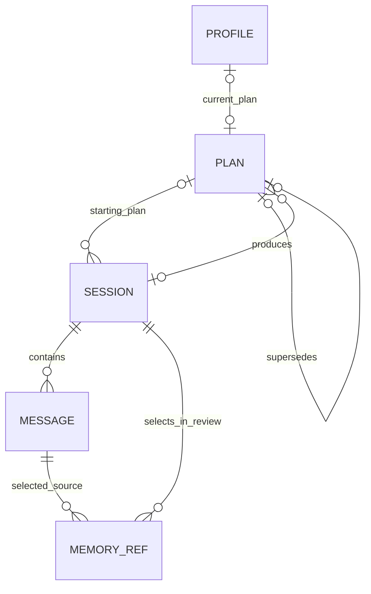

# Data ownership and context

## Persistent model

Use relational rows for identity, ordering, references, work status, and transactions. Use small Pydantic-validated JSON documents for interpretation and strategy. Normalizing every clinical-style sentence would add joins without establishing its truth. An undifferentiated memory document would hide provenance.



Five tables are sufficient. Review is a session-owned document, not another table. A session's pending review is real product workflow state, not an audit event.

| Owner | Represents / creator | Source or derived | Mutability and reason to exist |
|---|---|---|---|
| `profile` | Singleton identity/preferences explicitly entered by user; current-plan pointer set by application | User input plus application pointer | Editable while idle; the one owner of current preferences |
| `sessions` | Session identity, type, starting plan, frozen session preferences, lifecycle and review | Application metadata; review is derived | Opening/ending and work status change; completed review immutable; binds a review to its source conversation |
| `messages` | Actual patient input and completed assistant response, ordered in session | Patient source or model utterance; role stays explicit | Append-only; sole durable exact-wording owner; unanswered patient input remains valid history |
| `plans` | Applied therapeutic strategy produced by accepted review | Derived strategy, never patient fact | Immutable revisions; historical sessions remain linked to their starting strategy |
| `memory_refs` | Selection of a patient message by a completed review, with a selection-purpose label | Source link plus derived selection judgment | Append-only selection relationships; makes old source material retrievable without duplicating text |

### Required fields and invariants

This is a schema specification to implement, not executable DDL for the current schema.

**Profile:** `singleton_id=1`, optional display name, primary language and preferred style (unset until setup submission), current plan ID, created/updated timestamps. The current pointer is application-authored. Identity/preferences do not become the destination for model-generated biography. Preserve session-specific preference snapshots so later edits do not change the interpretation of old work.

**Session:** ID, kind (`intake|therapy`), starting plan ID (null only for initial intake), preferences JSON, start/end timestamps; review status (`none|pending|running|complete|failed`), monotonic attempt count, safe last error code, review start/completion timestamps, nullable review JSON. Store a small application-authored `capacity_json` containing the admitted review input-byte envelope, assistant response-byte ceiling, and runtime profile identifier used for admission, without credentials or full configuration. A failed attempt has no committed review or plan changes. A complete review has a document. An open session has review status `none`. At most one open session and at most one closed unfinished review globally. Store acceptance prevents these two states coexisting.

**Message:** ID, session ID, sequence, role, text, client message ID, created timestamp, nullable `input_metadata_json`, nullable generation metadata. Input metadata contains only explicitly submitted self-report choices and validated user-selected recall message IDs; both participate in idempotency equality. Unique `(session_id,sequence)` and `(session_id,client_message_id,role)`. The store enforces that an assistant completion matches the latest unanswered user. Input metadata is allowed only on a patient message and only from explicit API input. Generation metadata is allowed only on generated assistant messages. Neither is model-authored provenance.

**Plan:** ID, monotonic version, source review session ID (unique), supersedes plan ID (unique when non-null), chosen method, bounded `content_json`, created timestamp. Foreign keys bind its origin and predecessor. Its content is immutable; application code checks that the predecessor is the current starting plan. Initial review creates version 1. An identical replacement creates no revision. A required method change counts as a change even if goals happen to match.

**Memory reference:** selecting review session ID, source message ID, purpose (`continuity|goal|safety|correction|unanswered`); composite primary key `(review_session_id,message_id)`. Both IDs have foreign keys. The store requires a completed/committing review and a patient-role message; automatic new archive selections are from that review's current session. Re-selection of historical evidence for the next handoff uses handoff references rather than inventing a new occurrence. Query `DISTINCT message_id` when building the source candidate pool. A purpose such as `safety` means selected for relevance, not an assessed clinical risk level.

Memory selection output is ephemeral. After validation, `memory_refs` is its sole durable owner; do **not** also store an identical selections list inside `review_json`. Review-note citations and handoff references may point to the same message for different reasons. Repeating a reference is not copying a fact or duplicating ownership of the underlying wording.

### Compact document shapes

All generated strings and lists have explicit size limits. Start with a small shape; add a field only if a consumer uses it. Example limits below are implementation defaults to test, not a clinical ontology.

```text
ReviewDraft (LLM output; no IDs, status, model name, or timestamps):
  note:
    summary: short text (up to 1,200 characters)
    observations: up to 5 {text, kind, scope, source_handles[]}
      kind = observation | hypothesis | uncertainty
      scope = current_session | longitudinal
    unresolved_questions: up to 3 {text, scope, source_handles[]}
    boundary_notes: up to 3 {text, scope, source_handles[]}
  handoff:
    opening_focus: short text
    carry_forward: up to 3 short questions/directions
    avoid: up to 3 short directions
    source_handles: up to 2 complete patient messages for next session
  remember: up to 5 {patient_source_handle, purpose}
  replacement_plan: PlanContent | null
  plan_change_reason: short text | null

PlanContent:
  focus: short text
  goals: 1–3 proposed therapeutic goals
  approach: 1–3 concrete methods/actions
  cautions: up to 3 restrictions or provisional assumptions
```

Each observation/question/boundary item is at most 400 characters and has at most 3 source handles. Handoff text/items and plan fields/items are at most 400 characters. A whole-document output budget also applies. These limits avoid the current proliferation of themes, affects, insights, progress lists, recommendations, and repeated unresolved-topic fields. Progress belongs in the dated review note. A handoff's carry-forward instruction is a prospective action, not a second summary of that progress.

Goals in the plan are **proposed strategy**. If the patient requested or accepted a goal, its source wording is linked from the review and available as a patient source. Do not add a model-controlled `patient_confirmed=true`. A future explicit goal-acceptance UI would be a user-authored input, not another inferred status.

After validation, the application constructs `SessionReview` with:

- the note and handoff, resolving handles to message IDs;
- the plan-change reason and resulting plan ID, or null when unchanged;
- generation metadata: origin (`model|deterministic`), model ID/runtime profile identifier, prompt version, schema version, application revision, and completion timestamp;
- a simple coverage declaration authored by Jung: full source session used, or deterministic no-conversation handling.

Plan content is stored only in `plans`. The accepted draft's replacement plan is consumed by the transaction and removed from the stored review. The review's resulting plan link makes the relationship inspectable. Plan generation provenance comes from its source review; do not duplicate the same generation block on every linked object.

Assistant messages carry smaller provenance: model ID, prompt version, runtime profile fingerprint, and application revision. This tells the user what generated an utterance without storing full prompts in the clinical record. Exact call input is a diagnostic capture concern.

### Source handles and trust

Prompts identify visible sources with short request-local handles such as `C7` (current-session message) or `H2` (historical message), plus role and date. A context object holds `handle → message ID, session ID, sequence, scope`. Models can select these handles; they do not author durable identifiers.

Validation rejects unknown/omitted handles, invalid roles, duplicate selections, and historical handles on items labeled `current_session`. A `longitudinal` item may cite current and historical sources together. Scope is a model-authored description of its interpretation, not trusted event provenance. An observation must have support, or be explicitly an uncertainty/question; hypotheses remain hypotheses even with a valid citation. Summary prose is derived and is not deterministically checked for entailment. The UI must say “model interpretation with cited source,” not “verified fact.”

No quote substring extraction is needed. Fetch the complete authoritative message for display or prompt inclusion. Exact text is stored without normalization; whitespace normalization can be used for deduplication/search comparisons but never overwrites source text. Source handles are transport conveniences, not durable identity.

### Atomic review commit

```text
BEGIN IMMEDIATE
  require session is closed, running, and attempt matches worker
  require current plan still equals the expected starting plan
  validate resolved source IDs/roles/session scopes again
  insert optional changed plan; update profile current-plan pointer
  insert selected source relationships
  write review document referencing the resulting plan
  set review status complete and clear error metadata
COMMIT
```

The first plan has no predecessor; later revisions do. Initial review or a changed session method requires a replacement plan; otherwise null is valid. A changed plan requires a nonblank change reason. If a supplied replacement normalizes to the unchanged plan/method, store no revision and no applied-change reason. Any invalid reference, malformed document, duplicate origin, or write failure rolls back all of this. Foreign keys and conditional updates complement application checks; they do not replace the semantic validator.

No migration framework, summarized-history table, vector store, diagnosis entity, intervention-effectiveness status, or psychological ontology is needed. Completed source text remains available regardless of prompt packing or how many reviews exist.

## Context construction

There are only two prompt families. Intake and therapy are modes of conversation; initial and later review are modes of review. Their data access rules are explicit rather than dynamically registered.

| Interaction | Included | Deliberately excluded |
|---|---|---|
| Intake conversation | Session language, short orientation instruction, recent complete exchanges, current input/self-report | Plans for imagined styles; extracted slot JSON; other phase internals |
| Therapy conversation | Session method/language, current plan, latest useful handoff, mandatory source anchors, recent exchanges, selected dated history, current input | Old full reviews; all historical transcripts; model analysis as system authority; ranking scores |
| Initial review | Entire intake transcript and explicit self-reports, chosen method, orientation task | Other style catalog plans/scores; unsupported demographic inference |
| Later review | Entire completed session, starting plan, latest useful handoff, selected historical patient messages, at most two compact earlier review notes if space remains | Unseen sources as citation candidates; unlimited previous reviews; full historical replay |

Static behavioral and method instructions go in the system message. Patient preferences, text, prior generated plans, and reviews are contextual data, with explicit source type/scope labels. Use ordinary alternating user/assistant roles for the selected recent exchange sequence; preceding context is a clearly delimited data message, not a promotion of old model output into system instructions. The current patient message appears once, at the end. If an admitted model handles a single structured context message better, changing serialization is a measured prompt decision, not a new context owner.

### Bounded selection algorithm

1. Before a new message is accepted, read plan, latest useful handoff, recent message range, and source candidates through one store read operation/transaction. Check mandatory conversation context as well as prospective review capacity while mutation/generation ownership prevents conflicting changes. Stop loading and sorting every full `SessionReview` for each patient turn.
2. Establish the **whole-request budget** for the selected runtime/task: instructions + contextual metadata + transcript + schema when applicable + correction margin + output/reasoning reserve + template margin.
3. Include mandatory core: method/language, complete compact plan and handoff, current patient input, source messages referenced by active handoff, and the immediately preceding session's unresponded patient message when applicable. Deduplicate by message ID.
4. Allocate remaining live context to the newest **contiguous complete exchanges**. Never create an apparent immediate response by joining across an omitted middle exchange. Include an omission marker at the start. Do not truncate a patient message mid-negation.
5. Reserve a small historical-evidence allocation before filling recent dialogue, so memory is not perpetually starved. Initial defaults: up to two active handoff sources plus two retrieved sources; recent conversation gets most remaining space. These are caps, not requirements to fill every slot.
6. Historical candidates are selected with a simple priority tuple: explicit user-selected recall IDs; active handoff references; textual matches to the current message/focus; recent selected sources. Use bounded plain-text query terms and parameterized SQL. Do not execute model-generated SQL or FTS expressions.
7. Retrieve at most 30 candidates per query. Rank with deterministic term overlap and recency; deduplicate. Fetch full source messages only for selected candidates. Dates/roles/session identity accompany every source. At hundreds of sessions an indexed reference join plus modest text search is acceptable; measure before adding FTS.
8. Pack whole optional items until they fit. If an optional source does not fit, omit it with a reason. Mandatory sources that do not fit cause a context-capacity error; do not silently remove a promised handoff anchor. Validate handoff-source capacity when accepting the review to avoid creating an unusable next session.

`context.py` returns messages plus a small debug manifest (source IDs, counts, estimated/observed costs, omissions). That manifest is not another durable prompt-context table. DEBUG logs may contain its IDs and counts; full prompt capture is separately enabled.

This is deliberately not semantic search. Word overlap will miss some related concepts, and it is weaker across languages. The user can search session history and explicitly include up to two sources in the next message using `source_message_ids`. Those IDs are validated against this database; their metadata is part of chat idempotency and resolved by the backend. If these mandatory sources do not fit, reject before acceptance and explain the capacity issue. Local source inspection is authorized by the single user's normal application access, not by model instructions.

Self-report choice metadata travels beside the complete patient wording, with its date and label “explicit patient input.” A historical denial is never represented as a current safety status. If new text conflicts, preserve both sources and tell the model the newer wording is a new report, not proof the older record was false.

### Context-window accounting

There is no portable exact tokenizer behind the OpenAI-compatible protocol. Do not use a tokenizer for an unrelated model and call the result exact.

Implement one small deterministic budget estimator over UTF-8 request bytes, including serialized context/schema and overhead. The initial conservative mode charges roughly one token per byte plus a template margin; label this an estimate, not a tokenizer theorem. Allow a larger calibrated byte allowance only for an admitted runtime profile with observed prompt-token measurements. Keep actual provider context errors as explicit failures. Runtime-specific tokenization may be used by `check-model` to calibrate/verify a profile; adding it to every production request is unnecessary initially.

The illustrative 32k-token profile in the runtime document therefore admits a conservative input envelope, not a promise to use all 32k tokens. A larger review context may be useful before a larger review model. Admission uses representative multilingual and long-message fixtures, not English character ratios alone. Usage absent from a provider is “unknown,” not zero.

Generated plan/handoff fields are bounded at creation, so packing need not search hundreds of progressively truncated variants. Count complete documents, then append whole items. A provider rejecting an already accepted message despite the estimate leaves a retryable unanswered message and an actionable capacity error. It never causes transcript deletion or automatic provider switching.

### Full-session review and capacity

The review must see every completed-session message, including a trailing unanswered user, and must be able to emit its bounded output. Historical extras are optional; the current session is not.

Before accepting each new patient message, calculate a prospective review request with the complete session, candidate input, and the maximum allowed assistant-output reserve. Freeze the review runtime profile for that active session's capacity accounting. Include maximum bounded plan/handoff/header cost, so a later optional section cannot invalidate the guarantee. If the known envelope cannot fit, reject before persistence, keep the draft in the console, and offer to end/review the current session and submit that draft to the next session with a new message ID.

Warn around 80% of the session envelope. Do not automatically call a model at the warning threshold. A newly configured smaller review context does not silently take over active work: finish with the admitted profile or explicitly fix configuration and retry. The actual server may still disagree with the estimate; show the error and require adequate capacity. The target has no automatic chunking or tail-only “complete” review.

## Several sessions in practice

The following is synthetic and illustrates ownership, not recommended treatment.

### Intake and session 1

The user chooses English and a CBT preference. In intake they write: “I avoid team meetings because I expect to embarrass myself. I want to speak once without leaving early.” Message `m1` stores that exact wording. A separate explicit self-report denies self-harm thoughts and leaves medical urgency unspecified; only the supplied dimension is recorded.

The user finishes intake. Initial review interprets fear of evaluation as a **hypothesis**, cites `m1`, and creates plan `p1`: explore a small participation goal with the user. The handoff asks what feels manageable and references `m1`. `memory_refs` links `m1` to the intake review. No “social anxiety diagnosis” is created.

During session 1, the user says in `m12`: “I did stay for the whole meeting, but I didn't speak. I wasn't refusing; I froze.” Therapy receives the active plan and intake source, responds to the current statement, and stores its completed response normally.

At close, review sees the full session. It records progress and uncertainty, cites `m12`, and selects the **whole** statement with correction/continuity purpose. It proposes a smaller rehearsal step in plan `p2`. Review, `memory_refs(m12)`, `p2`, and completion commit together. The phrase “I wasn't refusing” cannot be lost through substring selection.

### Session 2

Context includes `p2`, the latest handoff, dated source `m12`, any other active anchor, and the user's current text. It excludes the whole intake assessment, all earlier model analyses, and unused plans. The therapist can ask how freezing felt without saying the user was resistant.

If the user now says “Actually, that wasn't the issue; I was exhausted,” `m21` becomes a new source. A review may revise its hypothesis, citing both `m12` and `m21` with their dates. It cannot overwrite `m12` or insert its revised interpretation into the profile. A shorter new statement does not lose to a longer old one through confidence-based merging.

### Session 5

The plan and latest handoff remain compact. The latest relevant correction is an active source; unrelated intervening material stays in the database. If the user returns to “the team meeting,” lexical selection or explicit recall can bring `m12` back with its date and link. Historical wording is presented as something reported then, alongside the correction, not as a fresh event.

The user can open the source message from a review interpretation or plan origin. If a semantic inference was poor, the source comparison makes that apparent. Future interpretation can change while the history remains intact.

### Session 100 and an interrupted review

Ordinary requests still load a bounded transcript range, latest handoff, one plan, and a small candidate set. The database may contain all 100 transcripts and plan/review history. There is no cumulative summary silently replacing them.

Suppose session 100's review times out. The session stays closed with review status failed; `p99` and its handoff remain the last successful state, visibly so. The user fixes the model configuration and retries the same session. Successful atomic completion creates at most one new plan. Session 101 begins only after that outcome is resolved.

If an old event is relevant but neither lexical selection nor active anchors finds it, the system may miss it. It must not invent continuity. Source search/explicit recall is the immediate remedy; measured misses determine whether FTS or semantic retrieval should be added later.

## Source inspection and editing boundaries

Extend existing session-history responses to expose the full typed review and its source links, current plan origin, and selected patient sources. This is enough for a console `history/source` inspection command; no audit dashboard is required. Page session lists with a simple cursor or limit when needed, and fetch messages for one selected session.

Allow correction through new patient messages, not silent alteration of old source history. Completed reviews/plans remain immutable in the initial target. If editing historical derived documents becomes a product requirement, give that change its own explicit revision semantics; do not hide it in a generic JSON editor.
