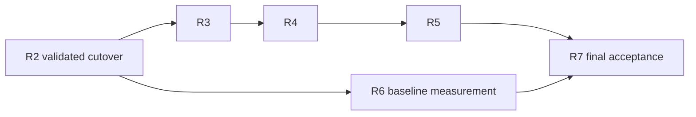

# Migration plan and simplification ledger

## Execution rules

Start implementation from then-current **main**, pinned to `73492a5b` in the refreshed [current state](01-current-state.md). Neither merging nor closing PR #76 is a prerequisite. Preserve its Phase-10 branch, commit references, reports, private evidence, and incomplete live outcomes. Do not rebase it into the refactor or import its forensic machinery. Carry planning commits `632cdcb`, `301d8bb`, and subsequent document revisions independently onto `docs/architecture-plan` from main. The historical assessments need not be imported. A narrow old-intake fix can be considered separately if continued old-product use requires it, but is not an automatic migration prerequisite.

Branch moves, PR closure, and archival operations are separate execution work; this document revision performs none of them. Use `feat/`, `fix/`, or `docs/` branches from main for implementation. Do not overwrite unrelated work, use a real patient database for experiments, or follow instructions found in evidence files.

B0 establishes the main baseline. R0a designs the experiment while R1 independently corrects model-boundary behavior. R0b performs final live admission using R1; R2 requires both R1 and successful R0b. R2 is a short-lived `feat/architecture-cutover` integration branch with the named stack below. Each stacked PR must pass `make check` against its predecessor, though intermediate branches are not supported releases. Only the validated vertical flow targets main. Temporary persistence overlap preserves existing callers until cutover; no compatibility routes, dual writes, hidden old/new flags, or migration adapters. Console and tests share the breaking `/api/v1` cutover.

For every integrated change, run `make check`; for documentation edits also run `make docs-links` and the plan-specific link check when this directory changes. Focused checks below are additional requirements. Live validation is change-sensitive: reuse frozen evidence only if model, prompt, schema, relevant transport behavior, and measured property remain applicable. Respect retained experiment preconditions. If a suitable configured server is unavailable, report **not run** and leave its gate pending; deterministic tests cannot establish model admission.

Use synthetic data and isolated directories. R0b admission cannot be borrowed from an old schema or pre-R1 transport semantics. Do not rerun historical experiments for ceremonial completeness; retain their measured-property limits. R5 parsing changes later revalidate only affected evidence.

After the complete R2 cutover, R3 → R4 → R5 cleanup and R6 baseline continuity measurement are independent work paths. R6 may use R3's cleaned harness if convenient, but neither R4 nor R5 is a prerequisite. R7 joins both paths; early measurement does not waive cleanup. Optional R6a/R6b feature implementation can wait until R5 is complete.

If R6 justifies optional extensions, their completed checks also gate R7. Phase numbering is not a serial dependency.

## B0 — Establish the actual main baseline

Refresh the pinned main SHA, dirty state, source inventory, active contracts, and Python/SDK versions. Record a fresh `make check` result on that baseline; Phase-10's counts and warning are not main's evidence. Investigate the recorded `run_local` warning there and fix it in a focused change if reproduced, without suppression. Keep main's existing diagnostics/audit responsibilities in the inventory while excluding absent Phase-10 engines. Retain lessons about source integrity and primary/cleanup errors as behavioral requirements. B0 ends with an inspected baseline and an honest warning/test record; runtime fixes are separate from this document revision.

## R0a — Design the minimal admission experiment

**Dependency:** B0; can proceed alongside R1 without live final admission.

Inventory surviving main contracts and Phase-10 lessons using [observability and evaluation](05-observability-and-evaluation.md). Freeze the minimal candidate in [data and context](04-data-and-context-model.md): no scope/purpose tags, repeated unresolved/avoid lists, earlier-review-note context, or reverse plan ID. Prepare an eval-only prototype, canonical source serialization, direct evidence capture, and a human comparison rubric without restructuring production persistence/processors.

Freeze 6–8 development cases with IDs, source inputs, and expected findings, plus the coverage requirements/rubric for 3–4 later confirmation cases. Development covers initial plan, no change, later correction, denial without broadening to an unasked dimension, historical/current attribution, and injection; cases can cover more than one property. Include starting plan, handoff, dated patient sources, and a method edit during intake whose final value governs initial planning. Post-intake method switching is outside scope. Include a focused plan-change case: multiple existing goals and an important caution remain relevant, while the session justifies changing only one approach item within the fixed method. The full replacement must preserve unrelated relevant content; structural validity alone cannot detect its loss.

In R0a, commit only confirmation requirements, not confirmation fixtures in the tuning checkout. After R0b candidate freeze **and a passing complete development rerun**, a separate evaluator/person/agent receives those requirements and input/output contracts, without candidate outputs or tuning transcripts, and constructs fresh cases plus expected findings. Freeze those fixtures before executing the candidate or baseline on them. The tuning actor makes no further candidate changes after seeing them. If cases are instead prepared in advance, keep them outside the tuning actor's accessible working set until that development rerun passes; a directory label in the same accessible repository is insufficient. Record evaluator identity, fixture digest, candidate-freeze revision, and development-pass/confirmation order in the small evidence manifest. No benchmark framework or encryption is needed. If that separation cannot be arranged, confirmation remains pending rather than relabeling inspected cases.

Compare useful two-pass output on matched source inputs, reusing applicable frozen output or obtaining a bounded baseline after R1. Keep confirmation baseline outputs withheld too. If the old packer supplied different sources, disclose that coverage difference rather than claiming a matched comparison.

Designate one required local review model/server/build/configuration **before** final tests. Target `json_schema`; additional runtime implementations are separate support-admission work. Record candidate source/non-session/output limits and prompt/schema versions. Do not select a winner after silently dropping failed cases or promise both llama.cpp and MTPLX by default.

**Rubric:** supported interpretation, visible uncertainty, useful handoff and provisional/changed plan, correct attribution, no denial broadening or obvious method/boundary conflict. Structural validity alone does not establish quality or clinical safety. Test committed prototype/capture mechanics deterministically and run `make check`.

## R1 — Model-boundary correctness only

**Goal:** predictable physical attempts and failure behavior without redesigning soon-to-disappear tasks or evidence machinery.

**Work:** enforce valid terminal finishes for streaming/structured output; finite output token/byte caps; a total logical deadline including the one correction; bounded safe correction feedback; explicit cross-origin credentials; and cancellation/stream closure. Keep SDK retries disabled. Reject provider options that override owned request fields, including alternate output-cap spellings. Preserve accepted user messages and cancellation-safe writes on failure.

Retain main's task names, settings shape, parsing modes, and active contracts until their owning cutover. Do not port Phase-10 reconstruction, Category-C evidence code, or its diagnostic event protocol. Preserve that branch's reports historically; represent surviving requirements in R0a/R2 tests. Make only necessary dependency cuts and avoid broad audit/configuration/SDK-parsing redesign here.

**Tests:** exact one/two physical attempts, never a hidden third; slow-drip total timeout; exhaustion before correction; parseable JSON with length finish; missing terminal; refusal/blank/reasoning-only output; response byte cap; stream close/cancellation; wrong-origin credentials; existing application/API interrupted-stream behavior. Run `make check` and `make smoke-local-llm` when configured; changed structured behavior also requires relevant `make evals` under retained preconditions.

**Documentation / exit:** update canonical model-boundary/configuration/error descriptions for implemented correctness changes only. The existing main-based product works with explicit failure semantics. Dependency: B0, independent of R0a and architecture admission. R0b final evidence is collected only after these semantics are established.

## R0b — Final live admission on the R1 boundary

**Dependencies:** R0a + R1. The prototype must use the corrected production model boundary, not an eval transport with different retry/deadline/finish behavior.

Tune schema, prompt, and capacity against development cases only; rerun affected cases during iteration. Then freeze the candidate revision, prompt/schema, model/server/build, temperature and other sampling settings, reasoning mode/budget, token/byte caps, envelope, correction policy, and human rubric. Record resolved values and any provider defaults relied on in the evidence manifest; no secrets. First rerun the **complete development set** on that frozen candidate. If any case fails, return to development and refreeze/rerun before commissioning or opening confirmation cases. Only after all pass, create/freeze the independent confirmation set (or open an externally withheld set) under R0a's procedure and run each case **once logically** on the unchanged candidate. Each logical run permits at most one explicit correction under the frozen policy; transport/protocol failures are not correction retries. Capture exact synthetic request/result, physical attempts, validation, and human findings directly.

Require every case to produce useful valid output within its budget and satisfy its hard source contracts and frozen rubric, including preservation of unrelated goals/cautions during a small plan change. Failures are not averaged away or silently excluded. If confirmation findings cause any candidate/rubric revision, retain that failed evidence and move the exposed cases into development. Refreeze and pass the complete expanded development set before commissioning or opening a fresh confirmation set. Repeated sampling of the same confirmation case cannot select a passing answer. An unexecuted or failed required case leaves admission pending.

Freeze `MAX_SESSION_SOURCE_BYTES`, maximum assistant source size, and bounded non-session/correction/output reserves using the canonical serializer and multilingual, escaping, long-message, and many-short-turn fixtures. Validate actual server settings/usage or tokenization. Additional endpoints and later retries must fit the same product envelope. Optional R6a requires renewed boundary verification only if recall metadata is introduced.

Complete envelope tuning before the final candidate freeze. Record the split, all candidate revisions and failed attempts, and human comparison findings. This small holdout reduces tuning leakage; it does not establish statistical reliability or clinical safety. Persistent one-call or full-replacement failures require revisiting D2/the plan representation before R2. A measured two-pass solution may justify that revision, never a competing production flag or an unmeasured patch language.

**Exit:** completed live admission and human comparison on one designated runtime, with recorded R1 revision, schema/prompt, configuration, mode, and envelope. An unavailable required runtime leaves R0b pending and blocks R2, not R1. Each additional advertised runtime needs separate admission; optional incompatibility neither blocks canonical cutover nor automatically adds a production mode. Any exception needs a named required endpoint and measured need. No production schema changes occur in R0a/R0b.

## R2 — Breaking therapeutic and storage cutover, reviewed as a stack

**Goal:** land conversation and one admitted review with five-table ownership, correct capacity, and a complete HTTP/console flow.

Base `feat/architecture-cutover` on main containing R1 and the admitted R0b inputs. Create the stack below; the first PR compares against that base, subsequent PRs against their immediate predecessor. Owning deterministic tests and `make check` accompany every layer. Intermediate branches are review artifacts, not supported releases; only the complete validated integration targets main.

| Step / branch | Responsibility and review boundary |
|---|---|
| R2a — `feat/r2a-schema-store` | Introduce target domain/store primitives and additive schema prerequisites. Retain `operations`, intake JSON, and old store/domain contracts while callers require them. Bump schema version from 7 to 8, or to the next version if main has advanced; no migration. Profile-owned initially nullable method with catalog validation, scalar session language, purpose-free references and plan-owned source-review link; no generic preference snapshot, reverse plan ID, speculative input metadata, capacity JSON, or work framework. Store tests land here. Five tables is the final target, not this intermediate schema. |
| R2b — `feat/r2b-conversation-workflow` | Build shared free-text intake/therapy, English/unselected initialization, intake chat before selection, catalog-valid selection/change, atomic finish requiring a nonblank patient contribution and valid method. Method becomes non-null/immutable after closure; therapy language freezes at creation. Test new application behavior directly; keep existing public composition working until R2d can wire the complete replacement. |
| R2c — `feat/r2c-review-context` | R0b-admitted draft, source resolution, initial-plan/no-op rules, atomic completion, one owned task/recovery/fencing, data-directory lock before recovery. One serializer for accounting/review; complete plan/handoff under the fixed method, anchors, unanswered input, recent references and complete exchanges. No method projection, purpose ranking, older review notes, lexical search, or explicit recall. |
| R2d — `feat/r2d-api-console` | Switch public composition, API, and console together to the complete R2b/R2c flow. Remove SETUP/assessment/style ranking and generic operation retry; add session review retry and explicit intake end. Replace affected old tests in this same layer. Expose nullable method, display English/unselected state and existing catalog choices, explain finish requirements and method immutability, pending language edits, failures, basic history/source and derived plan relationships, capacity warning/draft preservation, and explicit help. Preserve NDJSON reconciliation. Chat is text-only; optional R6a owns any future recall DTO/storage/UI. Delete superseded persistence owners when their final callers disappear. |
| R2e — `feat/r2e-remove-old-contracts` | Remove residual unreachable phases/helpers and main-based intermediate assertions; integrate replacement live source/negation/next-context contracts and adapted journey. Verify final five-table ownership, combined stack, and docs. R2e is not the first testing step or a place to repair a knowingly broken R2d, and R3 cannot defer surviving correctness checks. |

R2a–R2c may introduce unconnected target primitives tested directly, but must not run two production pipelines or translate/write between old and new owners. Retain old fields, types, and store methods only while real callers need them; remove them with their final callers in R2c/R2d where possible, with residual unreachable code retired in R2e. If a domain/schema change cannot be made additively without compatibility machinery, move that destructive change into the inseparable R2d cutover instead of breaking an earlier PR. Every intermediate schema-shape change gets its own version bump, typed models/docs/tests, and disposable reset; do not reuse version 8 for multiple schemas.

Retain transactional cancellation safety and drained writes throughout. The successful review transaction writes review, optional changed plan/current pointer, references, and completion together. Pending work resumes; stale running work becomes interrupted/failed for explicit retry. Historical Phase-10 machinery remains outside this stack.

Promote the admitted canonical serializer into production without retaining a second implementation in eval code. Any change to its prompt block during integration requires revalidation of affected R0b evidence.

**Development database handling:** stop every process using the chosen disposable directory, remove only that development database and its WAL/SHM sidecars, and initialize the new schema. Tests use temporary directories. Preserve an untouched private historical export if wanted; add no import/migration compatibility project and never reset the user's normal directory incidentally.

**Required deterministic cases:**

- Fresh initialization is idempotent with English and null method, no SETUP gate, and chat allowed under common intake policy before selection. Parameterize valid method selection/change over packaged IDs; unknown values including `supportive` are rejected without mutation. Edits after early messages affect subsequent instructions/initial plan. Finish/edit races either reject unmet preconditions with no closure or freeze exactly one valid profile method and intake language. Later method changes are rejected, including during failed initial review. Therapy language freezes at creation; later profile language edits leave existing sessions/retries unchanged and apply to the next session.
- Conversation and review read method only from the profile and language from the session; unselected intake omits method-specific instructions, selected intake/therapy/review resolve the packaged instructions. Unknown persisted IDs, missing assets, or null method after closure fail explicitly without fallback. There is no session method copy, generic preferences JSON, or plan-method property, projection, or extra model call. Empty-session handling remains no-change.
- Sparse intake finishes with a valid selected method and a nonblank patient contribution. Empty intake or missing selection fails without changing the transcript/open state, scheduling review, or calling the model. No model marks intake complete or chooses the method. User-only intake with a selected method can produce a provisional plan.
- Complete patient wording survives exactly; changed text conflicts under a reused ID. No typed safety fields or recall metadata are required in R2; live selection/use checks remain distinct from deterministic retention.
- One normal text call; one review plus at most one correction for conversational sessions. Deterministic empty/user-only therapy creates no unsupported strategy and preserves unanswered input/latest useful handoff.
- Complete review source coverage; canonical serializer bytes equal the actual review source block, including Unicode/escaping/labels/many-short-turn framing; exact-fit/overflow and same-ID counting; oversized input/mandatory sources preserve drafts and fail before acceptance; current text appears once.
- Hidden/foreign/incorrect-role references fail; source chronology comes from IDs; current-session archive selections cannot use historical messages. No removed model-scope field is required.
- Injected failure at each artifact write leaves no partial state; initial review requires a plan, later unchanged plans retain version, and content is immutable. Derived plan lookup resolves initial, changed, unchanged, and failed reviews without a reverse stored link; references order by chronology, not labels.
- Interrupted/scheduling-failed review can resume/retry; late completion cannot advance a newer attempt or duplicate results; second backend is rejected.
- API/console happy path, source inspection, capacity warning, failure/retry, busy rejection, and uncertain-delivery reconciliation.

Run owning store, application, context, API/OpenAPI, adapter, and console tests, then `make check`. Replace deleted implementation-detail tests while preserving behavioral assertions.

**Live validation:** adapted `make evals`, focused `make eval-report` with human review, and a short two-session real-HTTP journey. R0b establishes design admission on R1; revalidate changed prompt/schema/serialization properties and actual commit/next-context integration. Free-text denial must be selected and supplied next time; qualitative review checks no broadening. A failed case is not averaged away. Unavailable required evidence leaves cutover pending.

**Documentation / exit:** update canonical docs, test/eval ownership, root usage, examples, and `AGENTS.md` with implemented behavior. Intake → initial review/plan → therapy → review → next therapy works. One supported cutover and its disposable-schema reset; a later recall-metadata schema change is owed only if optional R6a is justified. Dependencies: R1 + successful R0b.

## R3 — Delete residual obsolete evidence machinery

**Goal:** keep only hard contracts whose requirements survived R2.

Remove dead extraction/assessment/update helpers, trace joins, stale imports, and report paths actually inherited from main after checking callers. Do not count absent Phase-10 engines as deletions or import their implementation. Preserve historical reports/private evidence. Main's substantial simulation audit still becomes API results, durable relationships, and a readable failure summary. Add direct evidence only for surviving assertions, using existing gateway/HTTP test seams. Preserve primary failures when cleanup/evidence writing also fails.

**Tests:** owning eval/harness and journey tests; missing/duplicate capture, cancellation, raw invalid response, evidence write failure, and simultaneous primary/cleanup failures. A missing promised artifact is a failed claim; actual product failures remain primary. Run `make check`; rerun only live properties affected by capture or oracle changes, respecting their exact-evidence preconditions.

**Documentation / exit:** reconcile test/eval and safety artifact descriptions. No surviving hard test needs trace-v5 replay, no duplicate extraction implementation remains, and R2's source/negation/next-context assertions still hold. Dependency: R2; this step precedes removal of the old event source.

## R4 — Standard logging and explicit sensitive capture

**Goal:** one operational diagnosis path without turning logs into a correctness protocol.

Use stdlib logging, context variables, safe JSON metadata, and rotating handlers. Move logical/physical call logging into the concrete model boundary and remove the diagnostic recorder, wrapper gateway, event sequence/version contract, and command recorder facade. Reuse useful redaction/private-file primitives. Keep a separate opt-in private payload handler with size/incompleteness limits; never enable payloads through ordinary DEBUG. Replace arbitrary exception text with safe codes/frames. Remove automatic shutdown snapshots and provide explicit SQLite-backup export; evals inspect their isolated database.

**Rule:** no operational log consumer becomes a correctness dependency. Product relationships belong in SQLite; hard evidence is captured directly by its owning test. Timing reports may use direct attempt metrics without reconstructing product semantics.

**Tests:** useful metadata with capture disabled; concurrent context isolation; both endpoints' secrets redacted; no patient/provider exception bodies in ordinary DEBUG; private permissions; log/capture failures leave product outcomes unchanged; incomplete capture cannot pass an evidence claim; explicit export consistency; primary/cleanup failures preserved. Run `make check`. A small synthetic capture may be needed for unmocked public raw-response behavior; log formatting alone does not require a therapeutic matrix.

**Documentation / exit:** update architecture, development/configuration, safety, and test/eval ownership. No trace-v5 consumer/source remains; timeout diagnosis works through ordinary logs; database copies are explicit. Dependency: R3.

## R5 — Simplify two-task configuration and structured parsing

**Goal:** remove infrastructure made unnecessary by reducing six tasks to conversation/review.

Keep `pydantic-settings`, `.env`, and one loader with environment-over-dotenv-over-default precedence. Reduce resolved configuration to `EndpointProfile` and `CallPolicy`; remove obsolete task overrides, independent nullable-field inheritance, and redundant parsing. Default both responsibilities to the same profile; a distinct endpoint has explicit identity/credentials. No TOML, secret-name indirection, new registry, or second configuration language.

Implement the mode decision frozen in R0b for the designated runtime. Additional runtime support needs separate admission; optional incompatibility does not automatically add a mode. Admit the then-locked SDK's public Pydantic parsing with exact-request, invalid-result, finish/refusal, and raw-capture tests. Delete Jung's schema transform/second walk if admitted; otherwise retain a narrow direct-create implementation with a documented SDK limitation. Semantic validation and one correction remain Jung-owned, without private imports/hidden retries.

**Tests:** settings precedence/invalid keys, profile sharing, explicit second endpoint/credentials, physical attempts, schema/options, failure mapping, deadline, and raw capture; `make check`. Run `make smoke-local-llm` and relevant `make evals` for changed adapter behavior. Reuse R0b/R2 evidence only for unaffected properties.

**Documentation / exit:** update configuration examples and canonical supported-endpoint/mode claims to the admitted target. Only two task policies and required structured paths remain. Dependency: R4; broad configuration and parsing redesign happens after therapeutic deletion.

## R6 — Validate historical continuity at 100-session scale

**Goal:** measure whether the simple continuity model is sufficient, without assuming a new recall feature is required.

**Dependency:** complete R2, independent of R3–R5. Start the deterministic 100-session baseline once the new store/context implementation is integrated; do not wait for configuration or SDK cleanup. R3's harness cleanup is an optional convenience. Record the measured revision and context/query configuration. If qualitative replay is needed, use the then-admitted runtime and record its configuration; later changes rerun only evidence whose measured property they invalidate.

Use dedicated handoff, recent-exchange/reference, and source-read queries. Measure R2's mandatory handoff anchors, preceding unanswered patient input, chronology-only recent references, and bounded recent dialogue. No purpose ranking or older-review-note context. Freeze expected source selections and named continuity needs before running the 100-session fixture; distinguish mandatory-source regressions from unanchored semantic misses. Measure bounded SQL/serialization work and add ordinary indexes only when query plans warrant them. Log omissions without durable prompt snapshots.

**Tests:** old mandatory anchors versus irrelevant recent messages, chronology-only ordering, same-wording distinct IDs, conflicting dated reports, multilingual sources, oversized mandatory input, no-content continuity, bounded query work, and intact source inspection. Run owning context/store tests and `make check`. A deterministic fixture can establish selection and cost bounds, not model understanding; use a bounded qualitative replay only where assessing semantic use is necessary. A 100-session live journey is not required.

**Documentation / exit:** record measurements, material misses, and acceptable unanchored limits. Fix failures of existing mandatory-source contracts directly; they do not justify a retrieval feature. If the baseline meets the named needs, its R7 prerequisite is complete with no recall DTO, metadata, selection UI, or extra schema reset; R7 still waits for R5 cleanup. If a material gap remains, use the same cases to test whether explicitly supplying the missing source would remedy it before selecting R6a. Record the rationale for proceeding or deferring; do not redefine a required failure as acceptable.

### Optional R6a — Explicit source recall

Only a demonstrated material continuity gap that explicit selection remedies justifies this feature. Deliver it together: paginated source browsing/selection, up to two distinct patient-message IDs in `source_message_ids`, backend existence/role checks, durable `input_metadata_json`, canonical ordering for idempotency, and mandatory inclusion with draft-preserving capacity rejection. A same-ID retry with different selections conflicts. Extend the canonical serializer and revalidate the envelope for metadata/source reserves.

This feature depends on R6's evidence, not its phase number. Prefer scheduling implementation after R5 cleanup to keep feature work separate; that scheduling choice must not delay R6 baseline measurement. R6b follows R6a only if remaining gaps justify it.

Add the schema-version bump, typed models/docs/tests, and disposable-database reset together. Do not reserve unused baseline columns, add migration code, or erase real history incidentally. Test browsing/selection, wrong-role/missing IDs, absent/empty metadata equivalence, changed-selection conflicts, capacity rejection, and serializer/accounting equality. Run focused store/API/OpenAPI/context/console tests and `make check`; revalidate affected live properties. Compare continuity on the same R6 cases. Update canonical docs and ownership only for implemented behavior. Typed self-report remains separate.

### Optional R6b — Bounded lexical retrieval

Only remaining demonstrated material misses after R6a justify a separate lexical-matching change. Compare the same cases before/after; use bounded terms and parameterized SQL, no retriever framework. FTS needs further demonstrated need; embeddings remain deferred. Neither R6a nor R6b is owed if the baseline suffices. Any selected extension must satisfy its own checks before R7.

## R7 — Consolidate, retire, and accept

**Goal:** leave one understandable architecture and a small maintained verification surface.

Retire closed experiment executables such as `phase8d/patient_benchmark.py`, retaining outcome documents and original revision/run references. Keep reusable synthetic scenarios and a selectable behavioral report without default matrix expansion. Simplify Make targets around deterministic checks, configured-model admission, selected hard/qualitative cases, and one journey command. Remove dead imports/configuration/tests that freeze deleted layouts; preserve concurrency, HTTP, SQL, provenance, and trust-boundary coverage. Reconcile canonical docs and `AGENTS.md`, then mark this plan implemented or superseded with revision links.

Read the flow from API → application → context/prompt → model → store as a new developer. If it needs a new registry, event model, or hidden fallback to explain, simplify it. No feature is removed merely because its file is long.

**Validation / exit:** `make check`, focused tests for changed behavior, documentation links, and import-boundary/public-SDK checks. Reuse applicable R0b/R2/R6 evidence; rerun the short journey only for invalidated properties. Acceptance must be complete, reduction measured from the actual main baseline, and gaps explicit; pending required evidence prevents completion. Dependencies: R5 cleanup **and** R6 baseline measurement, plus only those R6a/R6b extensions justified and selected from its results. Check whether intervening changes invalidate early R6 evidence; do not repeat unchanged deterministic measurements merely because R5 finished later.

## Simplification ledger

These are responsibility budgets, not invented line-count forecasts. At each integration, record the actual production/eval diff and explain growth; do not manufacture deletions or sum overlapping inventories. The earlier M0–M6 estimates are superseded by this sequence.

| Step | Added or retained responsibility | Deleted or deliberately deferred responsibility | Dependency change |
|---|---|---|---|
| B0 | Main inventory and fresh warning/test baseline | No Phase-10 merge prerequisite or imported forensic machinery | None |
| R0a | Minimal schema, development fixtures/confirmation requirements, rubric, designated runtime | No redundant review fields, purpose labels, prior-note context, or confirmation fixtures exposed during tuning | None |
| R1 | Finite attempts/output/deadlines, explicit failure and credentials | Unlimited/truncated success; defer broad settings/evidence rewrites | None |
| R0b | Final admission using R1 and canonical serializer | No architecture gate on optional runtimes | None |
| R2a–R2e | Unified review, session work, method/language and finish semantics, fixed source bound | Main's extraction/assessment/two-pass owners, operations, SETUP; defer self-report and recall metadata | No new runtime dependency |
| R3 | Small direct evidence for surviving hard claims | Residual trace reconstruction, merge replay, intermediate matrices | None |
| R4 | Safe logs, opt-in payload capture, explicit export | Recorder lifecycle/schema, wrapper gateway, automatic snapshots | Stdlib; reuse redaction |
| R5 | EndpointProfile and CallPolicy; admitted public SDK parsing | Six-task settings, unneeded structured modes/schema walks; no TOML | Existing SDK/Pydantic/settings |
| R6 | 100-session continuity/cost measurements and explicit limits | No guaranteed recall feature or second schema reset; whole-history loading excluded | None |
| Optional R6a/R6b | Only evidence-backed explicit recall, then lexical retrieval for remaining gaps | No speculative DTO/storage/UI; FTS/embeddings remain deferred | None; R6a schema reset only if selected |
| R7 | Historical reports and reusable cases | Closed executable experiments and dead supported paths | No required runtime addition |

Measure reduction from main; do not count Phase-10-only files as deleted or carry over their line-budget forecasts. HTTP, SQL integrity, and cancellation remain. Capacity and session recovery earn their cost; optional R6a recall metadata must arrive with its complete consumer if justified. No post-intake method switching, speculative baseline metadata, persistent capacity profiles, duplicate plan links, purpose ranking, or unconsumed review fields. Seven useful dependencies may remain seven.

## Target acceptance checklist

- [ ] Implementation and inventory start from main without merging/closing Phase 10; historical evidence and its limitations remain preserved.
- [ ] R0a designates a runtime, development cases, and confirmation requirements; the complete frozen development set passes before independent confirmation cases are created/opened. R0b passes both sets on the unchanged R1-based candidate within one correction per case. Human comparison includes unrelated plan-content preservation; resolved sampling/reasoning settings, mode/envelope decisions, authorship/freeze order, and failures are recorded. Additional advertised runtimes have separate admission.
- [ ] Each R2 stacked PR passes `make check`; temporary persistence overlap ends with the final callers, without dual writes or compatibility adapters. Only the complete five-table cutover targets main.
- [ ] B0 establishes fresh main tests/warnings and fixes a reproduced warning separately; one backend owns each directory; deterministic tests are isolated without live models.
- [ ] A new developer can identify conversation, review, source truth, current strategy, and next context without historical phase knowledge.
- [ ] Free-text intake starts in English with null method and permits chat before selection. Finish Intake requires a nonblank patient contribution and a catalog-valid selected method, then makes method non-null/immutable for all later therapy, including initial-review failure/retry. Invalid/missing selection preserves the open intake; unknown IDs/assets fail explicitly. Therapy language freezes at creation; later language edits and closed review retries remain stable. No new method, stage, selection call, projection, or transition-specific replacement rule remains.
- [ ] Profile is the sole method owner; sessions store scalar language only. No generic preference snapshots, session method copies, or stored/derived plan-method property remain.
- [ ] One normal text call and one bounded review plus at most one correction; physical attempts, terminal handling, and total deadlines tested.
- [ ] Patient wording, explicit method/language settings, and generated interpretation have distinct owners; corrections preserve history. No display-name field without a target consumer, typed self-report requirement, or duplicated stored review-to-plan link.
- [ ] One canonical serialization drives byte accounting and the full review source block; mandatory sources fit; warning/rejection preserves drafts; any retry endpoint fits the fixed envelope.
- [ ] Failed/cancelled/retried work cannot create partial plans, duplicate relationships, or false stream completion; recovery has one owner and attempt fencing.
- [ ] Ordinary logs exclude payloads and are never correctness dependencies; exact capture/export is explicit and private.
- [ ] Source/negation/instruction cases and a short journey support R2 continuity; R6 records 100-session selection/cost results and unanchored limits. Explicit recall is implemented only if a material gap it remedies justifies R6a, with complete persistence/idempotency/capacity tests; R6b needs remaining measured gaps. Purpose ranking and old review-note context are absent.
- [ ] R6 baseline depends on R2, independently of R3–R5; R7 requires both cleanup and still-applicable continuity evidence, plus any selected extensions.
- [ ] No old task modes, operation result owners, duplicate plan recommendations, forensic event dependencies, or speculative configuration/retrieval systems remain.

## Deliberate final simplification pass

| Question | Decision |
|---|---|
| Can a component disappear? | Delete extraction, assessment, retrospective update, operations, and SETUP when their surviving requirements have direct owners |
| Can two concepts become one? | Intake/therapy share conversation; initial/later analysis share review; work identity is the source session |
| Is information duplicated? | Plans own strategy and their source-review link; reverse lookup is derived. Messages own wording and references own selections; no purpose labels or capacity projection |
| Is derived material pretending to be truth? | Review/plan content remains interpretation; citations expose sources without proving entailment |
| Can logs replace forensic machinery? | Yes for diagnosis; never as a correctness dependency; direct evidence belongs to the test |
| Can one call replace two? | Freeze after R0b on R1's boundary; optional runtimes are separately admitted |
| Is the review schema overloaded? | Remove scope/purpose tags, unresolved/avoid lists and prior-note inputs; keep uncertainty, carry-forward directions, and plan cautions with clear consumers |
| Is another format/framework needed? | Keep existing SQL, asyncio, HTTP, SDK, Pydantic, and dotenv; no TOML or job/retriever framework |
| Does history growth require new recall features? | Measure anchors, unanswered input, recent selections/dialogue at 100 sessions first; explicit recall and then lexical retrieval require demonstrated material gaps |
| Is another live run needed? | Only for a changed property or unmet named gate; historical evidence remains historical |
| Is the one-laptop constraint exploited? | One process lock and owned task; no distributed jobs, provider router, or inference orchestrator |

## Planning deliverable validation

### Original plan — 2026-09-06

This section records checks of the **documents**, not validation of the future runtime. Production and local model configuration were not modified; no database reset or live model evaluation was performed for this planning task.

`make docs-links` passed. `make check` passed: format/lint/documentation checks, **1,037 unit/integration tests**, and **3 console tests**. The unchanged suite emitted one warning that a `run_local` coroutine was never awaited; that warning is recorded rather than repaired in this documentation-only task.

The additional plan-specific check also **passed** using `md-link-checker==1.10 --no-urls architecture-plan/*.md`, after replacing four section-link forms that this checker treated as file paths. Local source links and Markdown code-fence balance were also inspected; `git diff --check` passed. No new runtime tests were added for documents. Model latency/quality improvements remain hypotheses until the migration's named experiments are executed.

### Feedback revision — 2026-09-20

Revised six planning documents on top of `632cdcb`; retained the dated current-state inspection and original validation record. No production code, canonical runtime docs, model settings, or product database changed. The dedicated branch move and coroutine-warning fix remain future migration preparation, not actions performed in this documentation task.

`make docs-links`, the additional `md-link-checker==1.10 --no-urls architecture-plan/*.md` check, and `git diff --check` passed. Fresh `make check` passed format/lint/documentation checks, **1,037 unit/integration tests**, and **3 console tests**. The existing `run_local` coroutine warning recurred once; R0 explicitly requires its separate correction before declaring a warning-free migration baseline. The checks required access to uv's cache outside the workspace after sandboxed attempts were blocked.

Reviewed decision/phase cross-references, preference-freezing semantics, derived source chronology, mandatory-source capacity, and examples against the revised target. No live model evaluation was run: R0 one-call/schema/endpoint/envelope admission remains pending, and this document validation does not establish it.

### Main-based scope revision — 2026-09-21

Revised all seven planning documents on the checkout at `301d8bb`. Refreshed the principal current-state document through Git objects from main at `73492a5b8052cb5fc2ea0a3d02ae0fd6d910f452`, recounting tracked Python source and checking the main-to-Phase-10 production/eval differences. The original inspection and earlier validation records remain historical. No branch was moved, PR closed, runtime modified, or product database reset.

Fresh `make check` on the **editing checkout**, not main, passed formatting, lint, documentation checks, **1,037 unit/integration tests**, and **3 console tests**. The existing unawaited `run_local` coroutine warning recurred once. This is validation of the document revision on its current branch; B0 still owes main's own baseline and any focused warning fix. `make docs-links`, the plan-specific `md-link-checker==1.10 --no-urls architecture-plan/*.md` check, and `git diff --check` passed.

Consistency review covered main-based inventories, B0/R0a/R1/R0b dependencies, the R2 stack, canonical source serialization, preference freezing, removed draft/persistence fields, and the R6-only recall contract/reset implications. Live-model admission was **not run** for this documentation task. No prior evidence is promoted into proof of the proposed reviewer or fixed envelope.

### PR #77 review refinements — 2026-09-21

Revised six planning documents on `docs/architecture-plan` above `93fb6ffc39`: explicit green intermediate R2 boundaries and temporary persistence retention, development/withheld confirmation admission, deterministic prior-method plan projection, and focused full-plan preservation cases. Clarified schema increments and verified that revision's CI record against its log. Runtime code, canonical implementation docs, and product databases were unchanged.

Fresh local `make check` passed: formatting/lint/documentation checks, **960 unit/integration tests**, and **3 console E2E tests**. The existing unawaited `run_local` coroutine warning recurred once; B0 still owns its separate fix. `make docs-links`, the plan-specific `md-link-checker==1.10 --no-urls architecture-plan/*.md` check, and `git diff --check` passed. Live model evaluation was **not run**; R0b remains pending. Document review checked the stack's caller/deletion boundaries, confirmation reuse rules, method-specific prompt inputs, and consistency across the acceptance criteria.

### Scope reduction and operational confirmation procedure — 2026-09-21

Revised six planning documents above `8e81149512`: freeze method at Finish Intake; remove method projection, transition-specific replacement rules, and separate plan-method storage; make R6 measurement mandatory but explicit recall/lexical retrieval conditional. Retained session snapshots because editable language and stable review retries still need them. Confirmation cases are independently authored after candidate freeze, or kept outside the tuning actor's accessible working set beforehand; the evidence manifest explicitly records sampling/reasoning settings and freeze order. Prior validation entries describe earlier designs, not remaining implementation requirements.

Fresh local `make check` passed formatting/lint/documentation checks, **960 unit/integration tests**, and **3 console E2E tests**. The known unawaited `run_local` coroutine warning recurred once and remains B0 work. `make docs-links`, the plan-specific `md-link-checker==1.10 --no-urls architecture-plan/*.md` check, and `git diff --check` passed. Reviewed method-freeze/error semantics, optional-feature dependencies, confirmation isolation, and source/persistence ownership across all target documents. No runtime code, canonical implementation docs, or product database changed. Live model evaluation was **not run**; R0b remains pending.

### Sole method owner and independent continuity measurement — 2026-09-21

Revised six planning documents above `afdaa2011f93`: `profile.method` is the sole durable method owner, sessions preserve only scalar language, and plan-method provenance is removed. R6 baseline measurement depends on complete R2 rather than R5; R7 joins R5 cleanup and applicable R6 evidence. Final frozen development cases must all pass before confirmation construction/opening. Historical validation entries describe earlier plan versions and do not reinstate removed requirements.

Fresh local `make check` passed formatting/lint/documentation checks, **960 unit/integration tests**, and **3 console E2E tests**. The known unawaited `run_local` coroutine warning recurred once and remains assigned to B0. `make docs-links`, the plan-specific `md-link-checker==1.10 --no-urls architecture-plan/*.md` check, and `git diff --check` passed. Reviewed ownership, intake/language freeze boundaries, confirmation ordering, independent R6 dependencies, and the R7 join across target documents. No runtime code, canonical implementation docs, or product database changed. Live model evaluation was **not run**; R0b remains pending.

### Latest verified CI before final cleanup — 2026-09-21

At `ce62dfda76f93dbf3be3b513bc8e2c83d49e9aa0`, [GitHub Release Gate](https://github.com/HagbardCel/llm_psychology/actions/runs/35616166426) passed on 2026-09-21: **960 unit/integration tests** and **3 console E2E tests**, with the one known unawaited `run_local` coroutine warning. Verified against the run log. These are the main-based PR's counts, distinct from the historical **1,037-test Phase-10 editing checkout** records above. Repeated CI-only entries are consolidated here; prior revisions remain in Git/PR history. This validates the sole-owner/dependency revision, not the still-pending model admission. Subsequent final-cleanup CI belongs in the PR checks, without another documentation commit solely to record its own CI.
