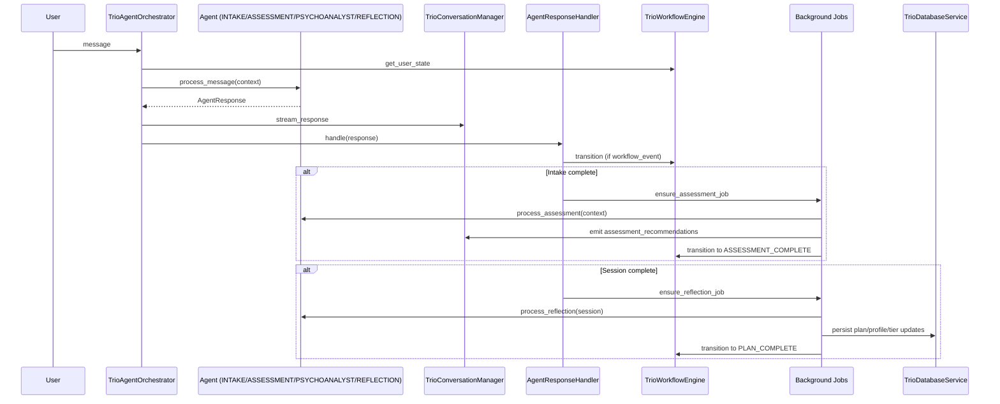

# Agent Documentation

This section documents each agent's contract, triggers, and responsibilities.
It is intended to be the authoritative reference for how agent logic fits into
workflow orchestration and persistence.

## Where Agents Run in the Workflow

Workflow state to agent routing is defined in
`src/psychoanalyst_app/orchestration/trio_workflow_engine.py`.
The orchestrator uses this mapping to pick the agent on each user message.

| Workflow state | Agent type | Primary agent class |
| --- | --- | --- |
| NEW | INTAKE | `TrioIntakeAgent` |
| INTAKE_IN_PROGRESS | INTAKE | `TrioIntakeAgent` |
| INTAKE_COMPLETE | ASSESSMENT | `TrioAssessmentAgent` |
| ASSESSMENT_IN_PROGRESS | ASSESSMENT | `TrioAssessmentAgent` |
| ASSESSMENT_COMPLETE | PSYCHOANALYST | `TrioPsychoanalystAgent` |
| THERAPY_IN_PROGRESS | PSYCHOANALYST | `TrioPsychoanalystAgent` |
| REFLECTION_IN_PROGRESS | REFLECTION | `TrioReflectionAgent` |
| PLAN_COMPLETE | PSYCHOANALYST | `TrioPsychoanalystAgent` |

## Execution Pipeline (High Level)

1. `TrioAgentOrchestrator.process_message` resolves the current state and
   retrieves the agent instance.
2. The agent returns an `AgentResponse` (content + next_action + metadata).
3. The orchestrator streams content via `TrioConversationManager`.
   If `metadata.is_direct_response` is true, the response bypasses the LLM.
4. `finalize_agent_response` and `AgentResponseHandler.handle` persist outputs
   and perform workflow transitions.

References:
- `src/psychoanalyst_app/orchestration/trio_agent_orchestrator.py`
- `src/psychoanalyst_app/orchestration/process_messages.py`
- `src/psychoanalyst_app/orchestration/orchestrator_helpers.py`

## Workflow Sequence Diagram (Foreground + Background Jobs)

## Background Jobs (Non-Interactive)

Some agents are triggered by workflow events rather than a direct user message:

- Assessment recommendations are produced by a background job started when
  intake completes: `AgentResponseHandler.ensure_assessment_job`.
- Reflection runs after a therapy session completes and can update plans,
  Tier 2 enrichment, and Tier 3 analysis: `AgentResponseHandler.ensure_reflection_job`.

## Structured Outputs and Persistence

- User profile updates are normalized by `build_user_profile_output` and saved
  in `finalize_agent_response`.
- Therapy plan outputs are built by planning/reflection and persisted after
  reflection completes.
- Tier 2 and Tier 3 updates are persisted in the reflection job handler.

References:
- `src/psychoanalyst_app/orchestration/agent_output_validators.py`
- `src/psychoanalyst_app/orchestration/process_messages.py`
- `src/psychoanalyst_app/orchestration/orchestrator_helpers.py`

## Per-Agent Docs

- [TrioIntakeAgent](trio_intake_agent.md)
- [TrioAssessmentAgent](trio_assessment_agent.md)
- [TrioPsychoanalystAgent](trio_psychoanalyst_agent.md)
- [TrioReflectionAgent](trio_reflection_agent.md)
- [TrioPlanningAgent](trio_planning_agent.md)
- [TrioMemoryAgent](trio_memory_agent.md)
