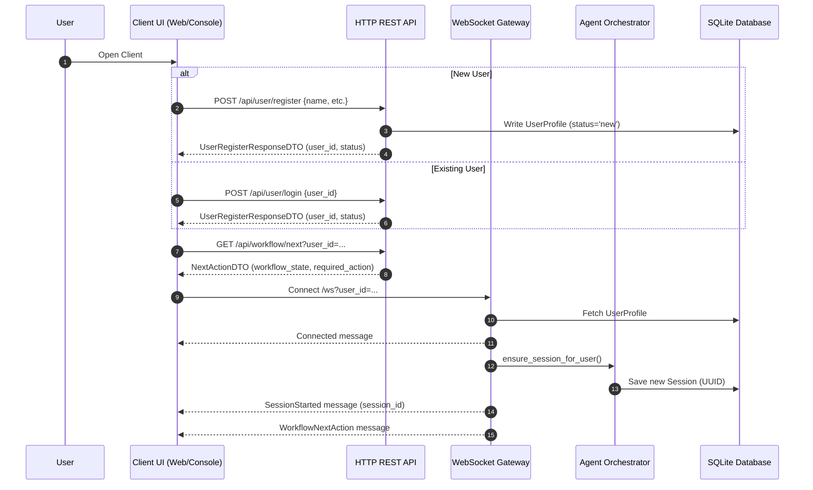
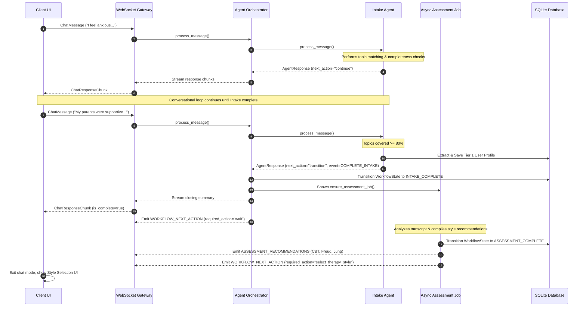
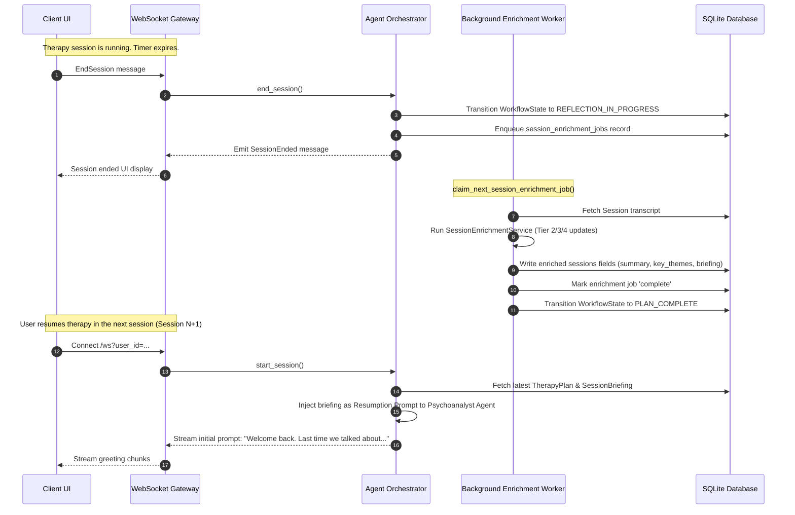

# Virtual LLM-Driven Psychoanalyst: Project Architecture & Flow Analysis

This report provides a detailed, comprehensive analysis of the project's aims, codebase structure, user journeys, agentic state-machine orchestration, database models, technical vulnerabilities, and architectural recommendations.

---

## 1. Project Aims & Objectives

The **Virtual LLM-Driven Psychoanalyst** is a clinical-simulation application designed to orchestrate a structured, multi-stage therapeutic relationship between an LLM agent and a user. The system aims to model professional psychotherapeutic stages:

1. **Intake (Onboarding):** A structured onboarding process that collects user details and interviews the user on core topics to extract biographical data.
2. **Clinical Assessment:** An asynchronous diagnostic process that maps the user's intake responses to appropriate therapeutic styles (CBT, Freudian, Jungian) and makes structured recommendations.
3. **Style Selection:** A patient-facing selection step where the user actively selects the therapy framework they prefer.
4. **Therapeutic Engagement:** A sequence of style-specific therapy sessions governed by a strict timer and optional time extensions.
5. **Post-Session Reflection:** An asynchronous background process that runs after each therapy session, analyzing the transcript to update the patient's long-term therapy plan, extract psychological progress, and generate session briefings.
6. **Continuity Loop:** Using session briefings to construct personalized resumption prompts at the start of subsequent sessions, ensuring clinical continuity.

---

## 2. Codebase Structure

The project follows a clean, modular structure. Below is a mapping of the primary folders and their contents:

* **`src/`:** The backend source code (Python), running exclusively within a Trio async runtime.
  * `psychoanalyst_app/trio_server.py`: The entry point for the server, setting up HTTP routing and WebSocket handshakes.
  * `psychoanalyst_app/api/`: Handles REST routes (`user_routes.py`, `session_routes.py`, `workflow_routes.py`, etc.) and the WebSocket handler (`ws_handler.py`).
  * `psychoanalyst_app/orchestration/`: The workflow engine, containing state machine logic (`trio_workflow_engine.py`), conversation and streaming management (`trio_conversation_manager.py`), and the orchestrator router (`trio_agent_orchestrator.py`).
  * `psychoanalyst_app/agents/`: Individual, pure-logic LLM agents for intake, assessment, planning, psychoanalysis, and reflection.
  * `psychoanalyst_app/services/`: Database client (`trio_db_service.py`), SQLite repositories (`db/repos/`), LLM API handler (`llm_service.py`), style management (`style_service.py`), and background workers (`session_enrichment_worker.py`).
  * `psychoanalyst_app/container/`: Dependency injection composition root (`service_container.py`).
* **`frontend/`:** The React + TypeScript user interface built with Material-UI (MUI), Vite, and Playwright for E2E validation.
* **`console-ui/`:** A terminal-based python WebSocket client used to run the application directly from the CLI.
* **`data/`:** Stores the SQLite databases and style packs (CBT, Freud, Jung style guidelines and knowledge).
* **`docs/`:** Holds architectural plans, data models, protocols, API documentation, and governance files.
* **`tests/`:** Pytest unit and integration test suites.

---

## 3. User Journeys & Control Flows

The user journey is divided into discrete chronological phases governed by a backend-driven state machine. Below are the key flows.

### 3.1. Handshake & Onboarding Sequence
When a client launches, it registers the user or logs in an existing profile via HTTP, obtains a session ID, and then connects to the WebSocket endpoint `/ws` to start chatting.



---

### 3.2. Intake & Assessment Workflow
The user enters the intake chat session. The `TrioIntakeAgent` guides the interview. Once objectives are met, the workflow automatically transitions to assessment.



---

### 3.3. Session Reflection & Resumption Loop
Once active therapy begins, sessions are timed. When the session duration expires, the session is finalized and a background worker analyzes the transcript (Tier 2 enrichment, Tier 3 clinical formulation, Tier 4 plans).



---

## 4. Agentic State Machine & Orchestration Contracts

The backend orchestrator uses a strict state machine to prevent unauthorized state transitions. Clients do not advance states directly; they emit actions or parameters (such as a profile update or style selection) which the orchestrator validates and executes.

### 4.1. Workflow States (`WorkflowState` Enum)
The workflow follows a linear setup with a feedback loop at the end:

| State | Purpose | Transition Trigger |
| --- | --- | --- |
| `NEW` | Brand new user without biographical details. | Handled automatically upon profile completion. |
| `INTAKE_IN_PROGRESS` | Conducting the intake interview. | Triggers when the user provides their name/basic profile. |
| `INTAKE_COMPLETE` | The intake objectives are met. | Topics covered threshold $\ge 80\%$ or minimum session duration met. |
| `ASSESSMENT_IN_PROGRESS` | Background LLM job is running. | Automatically triggered when `INTAKE_COMPLETE` is reached. |
| `ASSESSMENT_COMPLETE` | Recommendations are generated. | Assessment job succeeds. Client shows the style picker. |
| `THERAPY_IN_PROGRESS` | Active style-specific therapy. | Triggered once style selection is posted by the client. |
| `REFLECTION_IN_PROGRESS` | Session reflection is enqueued. | Triggered immediately when a therapy session ends. |
| `PLAN_COMPLETE` | Reflection is complete. | Enrichment worker completes plan update. Loop resets to therapy. |

### 4.2. The Agent Response Contract (`AgentResponse`)
All agents communicate decisions to the orchestrator through a unified response format:

```python
@dataclass
class AgentResponse:
    content: str                          # The prompt or direct message
    next_action: str                      # "continue" | "transition" | "await_selection" | "offer_extension"
    next_state: Optional[WorkflowState]  # Target state (deprecated)
    workflow_event: Optional[WorkflowEvent] # The explicit transition event trigger
    metadata: Dict[str, Any]              # Extracted entities, recommendations, timer values
```

---

## 5. Critical Fragilities & Potential Issues

An audit of the codebase reveals several critical flaws, design gaps, and race conditions that could lead to deadlocks, memory leaks, or database failures under stress.

### 5.1. Orphaned Recommendations Persistence (The Database Schema Omission)
* **Description:** The system defines a file `src/psychoanalyst_app/services/db/repos/assessment_recommendations_repo.py` containing functions (`save_assessment_recommendations` and `get_latest_assessment_recommendations`) to read and write style recommendations to an `assessment_recommendations` SQL table. However:
  1. The table `assessment_recommendations` is never created in migrations (`migration_service.py`).
  2. These persistence functions are never imported or called anywhere in the orchestration or server code.
* **Impact:** Recommendations are strictly stored in an in-memory dictionary cache on the `ResponseHandler` instance.

### 5.2. Reconnection/Restart Deadlock for Recommendations Selection (P0 Bug)
* **Description:** Since recommendations are stored in the volatile `self._assessment_recommendations` dictionary inside `ResponseHandler`, any server restart, crash, or reload wipes them out. 
  When a user who has completed their assessment (`ASSESSMENT_COMPLETE` state) reconnects via WebSocket (due to page refresh, client reconnection, or container restart), the WS handler emits the current state and next action (`select_therapy_style`) and attempts to re-emit recommendations:
  `workflow_transitions.py:68` $\rightarrow$ `await response_handler.emit_assessment_recommendations(...)`.
  Because the server restarted, `self._assessment_recommendations.get(user_id)` returns `None` and returns silently without sending anything.
* **Impact:** The client is left permanently blocked on the style-selection screen. The UI expects the `ASSESSMENT_RECOMMENDATIONS` WebSocket message to populate the list and allow submission, but because it never arrives, the user is deadlocked and cannot proceed.

### 5.3. SQLite Concurrency Locking Risks
* **Description:** The application initializes database connections without configuring Write-Ahead Logging (WAL) mode:
  ```python
  conn = sqlite3.connect(self.db_path, timeout=30.0)
  ```
  SQLite defaults to rollback journal mode. In this mode, writing locks the entire database. 
* **Impact:** Since the project uses background tasks (the session enrichment worker, reflection jobs, assessment jobs) concurrently writing to the database alongside real-time user WebSocket chats, write transactions are highly likely to overlap. This will cause frequent `sqlite3.OperationalError: database is locked` exceptions, crashing background workers or terminating active user sessions.

### 5.4. In-Memory Active Session Registry
* **Description:** Active sessions are tracked in an in-memory dictionary inside `ActiveSessionRegistry` within `SessionLifecycleManager`:
  ```python
  class ActiveSessionRegistry:
      def __init__(self) -> None:
          self._active_sessions: dict[str, str] = {}
  ```
  If the server restarts, all active session registries are cleared.
* **Impact:** 
  1. **Session Resumption Failures:** Reconnecting clients that submit an existing session ID will be rejected by `ensure_session_id()` because their session ID is no longer registered. The server is forced to terminate the old session and create a brand-new session ID, discarding ongoing conversation states.
  2. **Zero Scalability (Horizontal Scaling Bottleneck):** The in-memory registry makes it impossible to scale the backend horizontally (multiple containers). A client connecting to server Instance B cannot access session state created on Instance A, breaking load balancers and clustering.

### 5.5. Naive Substring Topic Matching in Intake Agent
* **Description:** `TrioIntakeAgent` determines whether an intake topic is covered using basic case-insensitive substring checks:
  ```python
  topic_keywords = {
      "Family Background": ["family", "parents", "siblings", "mother", "father"],
      ...
  }
  for topic, keywords in topic_keywords.items():
      if any(keyword in combined_text for keyword in keywords):
          covered.append(topic)
  ```
* **Impact:** This approach fails to handle negations or semantic context. If a user says *"I don't have any family issues, and I don't want to talk about my mother"*, the system registers `Family Background` as covered. This results in inaccurate intake coverage tracking and premature transitions to the assessment state.

### 5.6. Resource Waste in Session Enrichment Worker Polling Loop
* **Description:** The background worker `run_session_enrichment_worker` polls the SQLite database using a 0.5-second loop:
  ```python
  while True:
      job = await db_service.claim_next_session_enrichment_job(...)
      if not job:
          await trio.sleep(poll_interval_seconds)
          continue
  ```
* **Impact:** Continual database polling queries SQLite twice per second indefinitely, wasting CPU cycles and I/O operations even when the server is idle.

---

## 6. Recommendations & Technical Improvements

To stabilize the application and prepare it for production-grade usage, the following improvements are recommended:

### 6.1. Establish Recommendations Database Schema & Persistence
1. **Schema Migration:** Add a migration step (version 3) in `migration_service.py` to create the `assessment_recommendations` table:
   ```sql
   CREATE TABLE IF NOT EXISTS assessment_recommendations (
       user_id TEXT PRIMARY KEY,
       intake_session_block_id TEXT NOT NULL,
       recommendations TEXT NOT NULL,
       created_at TEXT NOT NULL
   );
   ```
2. **Orchestrator Integration:** Update `ResponseHandler` to import and call `save_assessment_recommendations()` from `assessment_recommendations_repo.py` whenever recommendations are generated.
3. **Database Fallback on Reconnect:** Update `emit_assessment_recommendations()` in `ResponseHandler` to query the database using `get_latest_assessment_recommendations()` if the in-memory dictionary cache does not contain the recommendations:
   ```python
   async def emit_assessment_recommendations(self, session_id: str, user_id: str) -> None:
       recommendations = self._assessment_recommendations.get(user_id)
       if not recommendations:
           # Fallback to database lookup
           db_service = self.service_container.get("trio_db_service")
           recommendations = await db_service.get_latest_assessment_recommendations(user_id)
           if recommendations:
               self._assessment_recommendations[user_id] = recommendations
       
       if recommendations:
           await send_assessment_recommendations(...)
   ```

### 6.2. Enable SQLite WAL (Write-Ahead Logging) Mode
Configure WAL mode in `migration_service.py` and `db/executor.py` upon database connection startup. WAL mode permits concurrent reads while a write transaction is executing:
```python
conn.execute("PRAGMA journal_mode = WAL")
conn.execute("PRAGMA synchronous = NORMAL")
```

### 6.3. Push-Based Event Notification for Background Worker
Rather than polling the database every 0.5 seconds, utilize Trio's native `MemoryChannel` to coordinate enqueuing and processing:
1. Initialize a `trio.open_memory_channel(0)` inside `TrioServer` composition root.
2. Pass the sending channel to the REST endpoint controllers (for enqueuing).
3. The background worker blocks on `await receive_channel.receive()` instead of polling, sleeping only when idle and waking instantly when a job is enqueued.

### 6.4. Shift to LLM-Based Intake Goal Verification
Replace naive keyword substring matching in `TrioIntakeAgent` with a minor structured validation LLM call. After every 2–3 user messages, invoke a fast LLM utility that accepts the recent conversation turn and determines if the required intake objectives are fulfilled.

### 6.5. Session Registry Externalization (Shared State)
To support horizontal scalability and resilience to container restarts:
1. Re-implement `ActiveSessionRegistry` to store active session mappings in a shared state store (e.g. Redis or directly in the SQLite `user_profiles` database table).
2. Look up the active session from the database/Redis during the WebSocket handshake, ensuring session resumption is fully supported on any server node.
