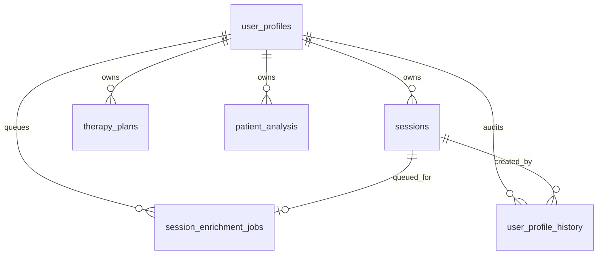

# Data Models

This document summarizes the canonical data models and how they are used.
Pydantic models are the source of truth for persistence, API contracts,
and schema generation.

Related docs:
- Architecture: `docs/ARCHITECTURE.md`
- Type system pipeline: `docs/TYPE_SYSTEM.md`
- HTTP contract: `docs/contracts/HTTP_API_CONTRACT.md`
- WebSocket protocol: `docs/WEBSOCKET_PROTOCOL.md`

## Model Layers

1. Domain and persistence models (Pydantic)
   - `src/psychoanalyst_app/models/data_models.py`
   - Stored by `src/psychoanalyst_app/services/trio_db_service.py`
2. Orchestration models (dataclasses)
   - `src/psychoanalyst_app/orchestration/models.py`
3. API request/response DTOs (Pydantic)
   - `src/psychoanalyst_app/models/http_models.py`
   - `src/psychoanalyst_app/models/api_models.py`
4. Structured LLM outputs and validation (Pydantic)
   - `src/psychoanalyst_app/models/structured_output_models.py`
   - `src/psychoanalyst_app/models/briefing_models.py`
   - `src/psychoanalyst_app/models/version_models.py`

## Core Domain Models

Defined in `src/psychoanalyst_app/models/data_models.py`.

`TherapyPlan` is an immutable revision. `supersedes_plan_id` and
`superseded_by_plan_id` form its lineage, and exactly one revision per user has
no successor. `revision_recommendations` stores reflection recommendations
separately from actionable `planned_interventions`.

`UserProfile.plan_id` points to the current revision. `Session.plan_id` is a
historical pointer to the revision effective when the therapy session started.
Databases created before this model must be reset with
`make reset-foundation-db`.

- `UserStatus`
  - Workflow state persisted in the database.
- `UserProfile`
  - Core user demographics and intake context.
  - Includes `data_of_birth` (note the field name), `status`,
    and therapy preferences (for example `preferred_school`).
- `Message`
  - Single message in a transcript. `role` is typically `user` or `assistant`.
- `Topic`
  - Intake topic tracking with a simple status.
- `Session`
  - Transcript plus Tier 2 enrichment fields (clinical summary, affects, themes).
  - `enriched` indicates if Tier 2 data was added.
- `TherapyPlan`
  - Long running treatment plan with `plan_details` plus extracted summaries.
  - `session_briefing` stores briefing payloads for resumptions.
- `DomainKnowledgeChunk`
  - RAG knowledge chunks used by the vector store.

## Field Reference (Core Models)

### UserProfile

| Field | Type | Notes |
| --- | --- | --- |
| user_id | str | Primary identifier. |
| name | str | Display name. |
| alias | str or null | Optional pseudonym. |
| data_of_birth | datetime or null | Stored as ISO 8601 in SQLite. |
| gender | str or null | Optional. |
| cultural_background | str or null | Optional. |
| primary_language | str | Defaults to `English`. |
| profession | str or null | Optional. |
| status | UserStatus | Workflow state persisted to DB. |
| plan_id | str or null | Latest linked therapy plan. |
| parents | str or null | Tier 1 profile. |
| siblings | str or null | Tier 1 profile. |
| family_atmosphere | str or null | Tier 1 profile. |
| significant_events | str or null | Tier 1 profile. |
| education | str or null | Tier 1 profile. |
| work_history | str or null | Tier 1 profile. |
| relationship_to_work | str or null | Tier 1 profile. |
| relationships | str or null | Tier 1 profile. |
| social_context | str or null | Tier 1 profile. |
| current_situation | str or null | Tier 1 profile. |
| preferred_school | str or null | Preferred therapy style. |
| boundary_notes | str or null | Optional. |
| frame_notes | str or null | Optional. |
| created_at | datetime | ISO 8601 in storage. |
| updated_at | datetime | ISO 8601 in storage. |

### Session

| Field | Type | Notes |
| --- | --- | --- |
| session_id | str | Primary identifier. |
| user_id | str | Foreign key to `user_profiles`. |
| plan_id | str or null | Links session to active therapy plan. |
| timestamp | datetime | Session start time. |
| transcript | list[Message] | JSON array in storage. |
| topics | list[Topic] | JSON array in storage. |
| session_summary | str or null | Reflection summary persisted after session. |
| session_briefing | dict or null | Session briefing JSON for resumption. |
| psychological_summary | str or null | Tier 2 enrichment. |
| dominant_affects | list[str] | JSON array in storage. |
| key_themes | list[str] | JSON array in storage. |
| notable_interactions | str or null | Tier 2 enrichment. |
| interpretations | str or null | Tier 2 enrichment. |
| patient_reactions | str or null | Tier 2 enrichment. |
| enriched | bool | Locks session against updates when true. |

### TherapyPlan

| Field | Type | Notes |
| --- | --- | --- |
| plan_id | str | Primary identifier. |
| user_id | str | Foreign key to `user_profiles`. |
| created_at | datetime | ISO 8601 in storage. |
| updated_at | datetime | ISO 8601 in storage. |
| version | int | Incremented on updates. |
| selected_therapy_style | str or null | `freud`, `jung`, `cbt`, etc. |
| plan_details | dict | Legacy plan structure (JSON). |
| initial_goals | list[str] | Tier 4 fields. |
| current_progress | str | Tier 4 fields. |
| planned_interventions | list[str] | Tier 4 fields. |
| status | str | `active`, `paused`, `completed`. |
| session_briefing | dict or null | Structured briefing JSON. |

## Tiered Clinical Data Model

All tiers live in `src/psychoanalyst_app/models/data_models.py`.

Tier 1 (static background):
- `BasicPatientBackground`
- `FamilyConstellation`
- `EducationalWorkHistory`
- `RelationalLifeContext`
- `AnalyticFrame`

Tier 2 (session history):
- `Session` plus Tier 2 enrichment fields
- `DetailedSession` (alias for the enriched session record)

Tier 3 (dynamic analysis, versioned):
- `PatientAnalysis`
  - `CurrentFocus`, `TransferenceImpressions`, `RecurringNarrative`,
    `DefensiveOrganization`, `AnalyticOrientation`
- `PatientAnalysisVersion`
  - Versioned wrapper with `analysis_id`, `version`, and supersession metadata

## Orchestration Models

Defined in `src/psychoanalyst_app/orchestration/models.py`.

- `WorkflowState` and `WorkflowEvent`
  - Explicit state machine for user progression.
- `AgentResponse`
  - Agent output consumed by orchestration.
- `ConversationContext`
  - Per-session context (profile, plan, history, time budgeting).
- `SessionInfo`
  - Lightweight session metadata for WebSocket responses, including persisted
    `session_type` (`intake` or `therapy`).
- `TherapyStyleRecommendation`
  - Structured recommendation list produced during assessment.

## API DTO Models

Defined in `src/psychoanalyst_app/models/http_models.py`.

Key DTOs:
- `UserProfileDTO`
- `SessionDTO`
- `TherapyPlanDTO`
- `MessageDTO`, `TopicDTO`
- `HealthCheckResponseDTO`
- `CreateUserProfileRequestDTO`, `UpdateUserProfileRequestDTO`, `PatchUserProfileRequestDTO`
- `CreateSessionRequestDTO`, `WorkflowCompleteProfileRequestDTO`, `WorkflowSelectTherapyStyleRequestDTO`, `WorkflowStartTherapyRequestDTO`, `WorkflowRetryPlanUpdateRequestDTO`

Workflow UI guidance:
- `WorkflowNextActionDTO` and `RequiredWorkflowAction` in `src/psychoanalyst_app/models/api_models.py`
- Step-completion requests for profile+style are defined in `src/psychoanalyst_app/models/http_models.py`

Version negotiation:
- `VersionInfo`, `VersionCheckRequest`, `VersionCheckResponse`
  in `src/psychoanalyst_app/models/version_models.py`

## Structured Outputs (LLM Extracts and Patches)

Defined in `src/psychoanalyst_app/models/structured_output_models.py`.

- `Tier2Enrichment`
  - Populates the clinical summary fields on `Session`.
- `Tier1ProfilePatch` plus sub-patches
  - Partial updates for Tier 1 profile sections.
- `Tier4Extract`
  - Extracted plan summaries for the `TherapyPlan`.
- `PatientProfileExtract`
  - Full Tier 1 extract used by intake/assessment workflows.
- `PlanUpdate`
  - Plan updates in a normalized summary shape.
- `SessionAnalysis`
  - Session analysis used by the memory agent.

Briefing data validation:
- `SessionBriefing` and related models in
  `src/psychoanalyst_app/models/briefing_models.py`
  (stored in `TherapyPlan.session_briefing`).

## Persistence Mapping

The database layer stores and retrieves domain models via:
- `src/psychoanalyst_app/services/trio_db_service.py`
- `src/psychoanalyst_app/services/db/repositories.py`
- `src/psychoanalyst_app/services/db_serialization.py`

HTTP handlers convert domain models to DTOs using helpers:
- `user_profile_to_dto`, `session_to_dto`, `therapy_plan_to_dto`
  in `src/psychoanalyst_app/models/http_models.py`

## Database Tables and Storage Mapping

Schema definitions live in `src/psychoanalyst_app/services/migration_service.py`.

- `schema_migrations`
  - Tracks applied migration versions.
- `user_profiles`
  - Stores `UserProfile` in a flattened schema (Tier 1 fields included).
- `user_profile_history`
  - Audit trail of profile changes with JSON snapshots.
- `sessions`
  - Stores `Session` transcripts and Tier 2 enrichment data.
  - `transcript` and `topics` are JSON blobs.
  - `session_briefing` is stored as JSON for session resumption.
  - `dominant_affects` and `key_themes` are JSON arrays.
  - Enriched sessions are immutable (updates blocked once `enriched = 1`).
- `therapy_plans`
  - Stores `TherapyPlan` plus Tier 4 fields.
  - `plan_details`, `initial_goals`, `planned_interventions`,
    and `session_briefing` are JSON blobs.
- `patient_analysis`
  - Stores `PatientAnalysisVersion` data as JSON in `analysis_data`
    with versioning metadata.
  - `superseded_by` is a self-referential pointer to the next analysis version.
- `session_enrichment_jobs`
  - Queue for Tier 2 enrichment workers (status, attempts, errors).

JSON serialization helpers live in
`src/psychoanalyst_app/services/db_serialization.py`.

## Schema and Type Generation

Pydantic models are the source of truth for schema generation:
- JSON schemas: `make generate-schemas` -> `schemas/`
- Frontend types: `frontend/scripts/generate-types.js`
- See `docs/TYPE_SYSTEM.md` for the full pipeline
