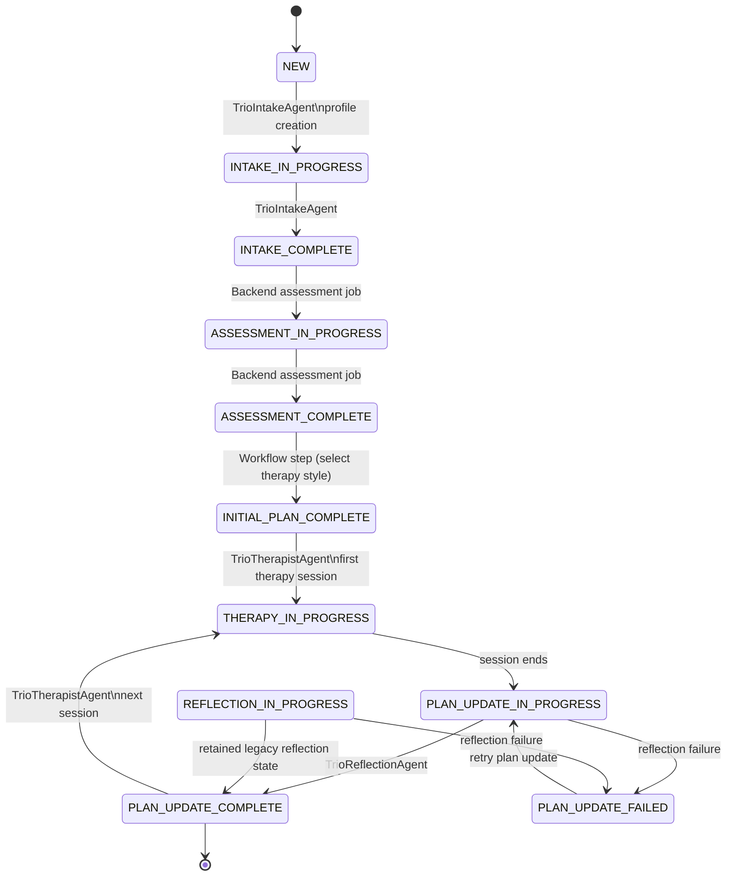
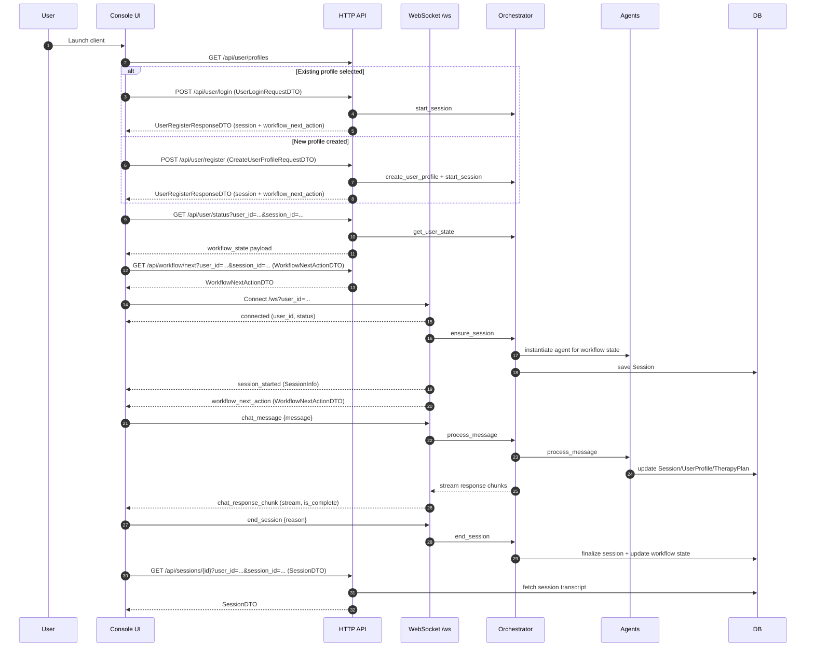

# User Journey Overview

This document provides a detailed overview of the journey a new user takes through the AI Therapy system. It outlines the stages, responsible agents, outputs, and available therapy styles.

## Workflow State and Agent Map

`THERAPIST` is the generic runtime agent role. The selected modality remains
separate as `selected_therapy_style` (`cbt`, `freud`, or `jung`).

## HTTP and WebSocket Event Flow (with DTOs)

Notes:
- HTTP routes use explicit `user_id` parameters; WebSocket connections use `user_id` in the query string.
- The WebSocket handler streams `chat_response_chunk` messages; clients treat `is_complete=true` as end-of-response.

## Supported Client Boundary

The supported client is `console-ui`. Its stable integration boundary is the
HTTP API plus WebSocket protocol. Browser clients have been removed and are out
of scope during foundation stabilization.

For the complete endpoint and event inventories, use:
- `docs/contracts/HTTP_API_CONTRACT.md`
- `docs/WEBSOCKET_PROTOCOL.md`

## Client Responsibilities

- Include `user_id` on HTTP requests (query param for GETs, JSON body for POST/PUT/PATCH).
- Include `session_id` on session-scoped HTTP requests after the first `session_started`. `GET /api/user/status` is user-scoped.
- Create or login via `POST /api/user/register` or `POST /api/user/login` before opening a WebSocket connection.
- Handle `WorkflowNextActionDTO` (and its `required_action`) to decide whether to show onboarding forms or start/resume sessions.
- For WebSocket sessions, wait for `session_started` before sending `chat_message`.
- Reconnect the WebSocket to rebind a session if the client needs a new session.
- Stream `chat_response_chunk` messages and treat `is_complete=true` as end-of-response.
- Use `end_session` to close a session cleanly; the server updates workflow state.
- Console UI can call `GET /api/sessions/{id}/timer` with `session_id` to display session time remaining.

## Journey Stages

The user journey is defined by a series of `WorkflowState` transitions.

### 1. New User / Profile Creation

- **Purpose**: Initialize the user in the system.
- **Workflow State**: `NEW` -> `INTAKE_IN_PROGRESS`
- **Responsible Agent**: `TrioIntakeAgent` (handles initial greeting and name collection).
- **Outputs**:
  - `UserProfile`: Created in `TrioDatabaseService`. Contains `user_id`, `name`, `status`.
  - **Storage**: Database (persisted via `db_service.save_user_profile`).

### 2. Intake Session

- **Purpose**: Gather comprehensive information about the user's background, presenting problems, symptoms, history, and goals.
- **Workflow State**: `INTAKE_IN_PROGRESS` -> `INTAKE_COMPLETE`
- **Responsible Agent**: `TrioIntakeAgent`
- **Key Activities**:
  - Conducts a structured interview covering specific topics (e.g., Presenting Problem, Personal History, Goals).
  - Tracks covered topics to ensure completeness.
- **Outputs**:
  - `Session`: A record of the conversation transcript.
  - `UserProfile`: Status updated to `INTAKE_COMPLETE`.
  - **Storage**: Database (`db_service.save_session`, `db_service.save_user_profile`).

### 3. Assessment & Style Selection

- **Purpose**: Analyze the intake session to recommend suitable therapy styles and allow the user to choose their preferred approach.
- **Workflow State**: `ASSESSMENT_IN_PROGRESS` -> `ASSESSMENT_COMPLETE`
- **Responsible Agent**: Backend assessment job (no interactive assessment session).
- **Key Activities**:
  - Analyzes intake transcript against available therapy styles.
  - Generates `TherapyStyleRecommendation`s with explanations.
  - Emits recommendations via WebSocket while clients show a wait state.
  - Users select a style via `POST /api/workflow/select_therapy_style`.
  - Successful style selection creates the initial plan and advances to `INITIAL_PLAN_COMPLETE`.
- **Outputs**:
  - `TherapyStyleRecommendation`: Presented to user (ephemeral/metadata).
  - `TherapyPlan`: Initial plan created by the planning agent using the intake transcript + selected style.
  - **Storage**: Database (`db_service.save_therapy_plan`).

### 4. Therapy Sessions

- **Purpose**: Conduct therapeutic conversations based on the selected style and established therapy plan.
- **Workflow State**: `INITIAL_PLAN_COMPLETE` -> `THERAPY_IN_PROGRESS`, then recurring `PLAN_UPDATE_COMPLETE` -> `THERAPY_IN_PROGRESS`
- **Responsible Agent**: `TrioTherapistAgent`
- **Key Activities**:
  - Engages in dialogue using style-pack prompts and prompt construction.
  - Uses `NoOpRAGService` by default. `knowledge.md` and retrieval hooks remain
    reserved extension points; deterministic probes and tests may inject
    retrieval fakes.
  - Maintains context via `ConversationContext`.
- **Outputs**:
  - `Session`: Transcript of the therapy session.
  - **Storage**: Database (`db_service.save_session`).

### 5. Reflection & Planning

- **Purpose**: Review the completed session, update the therapy plan, and prepare for the next session.
- **Workflow State**: `PLAN_UPDATE_IN_PROGRESS` -> `PLAN_UPDATE_COMPLETE`, or
  `PLAN_UPDATE_FAILED` until the ended session is retried
- **Responsible Agent**: `TrioReflectionAgent` (coordinates `TrioMemoryAgent` and `TrioPlanningAgent`)
- **Key Activities**:
  - Analyzes session for key themes, emotional state, and insights.
  - Updates `TherapyPlan` based on progress.
  - Generates a `SessionBriefing` for the next session (to support continuity).
- **Outputs**:
  - `TherapyPlan`: New immutable revision with lineage, actionable
    interventions, separate `revision_recommendations`, and `session_briefing`.
  - `SessionBriefing`: JSON object stored within the plan for the next session.
  - **Storage**: Database (`db_service.save_therapy_plan`). `UserProfile.plan_id`
    points to the current revision while completed `Session.plan_id` values
    remain historical.

## Available Therapy Styles

The system supports multiple therapy styles, managed by the `StyleService`.
Each style is defined by a "Style Pack" containing prompts and a reserved
knowledge asset.

### 1. CBT (Cognitive Behavioral Therapy)

- **Characterization**: Focuses on identifying and challenging negative thought patterns and behaviors. Structured and goal-oriented.
- **Components**:
  - `knowledge.md`: CBT principles and techniques.
  - `therapist_prompt.txt`: Instructions for the agent to act as a CBT therapist.

### 2. Freud (Psychoanalysis)

- **Characterization**: Focuses on unconscious conflicts, childhood experiences, and dream analysis. Exploratory and interpretive.
- **Components**:
  - `knowledge.md`: Freudian concepts (id, ego, superego, etc.).
  - `therapist_prompt.txt`: Instructions to adopt a Freudian persona.

### 3. Jung (Analytical Psychology)

- **Characterization**: Focuses on the collective unconscious, archetypes, and individuation. Symbolic and depth-oriented.
- **Components**:
  - `knowledge.md`: Jungian concepts (shadow, anima/animus, self).
  - `therapist_prompt.txt`: Instructions to adopt a Jungian persona.

## Data Storage & Formats

- **Database**: The system uses a `TrioDatabaseService` (likely backed by SQLite or similar) to persist data.
- **Key Entities**:
  - **Users**: `UserProfile` (JSON/Pydantic model).
  - **Sessions**: `Session` (JSON/Pydantic model, contains list of `Message`s).
  - **Plans**: `TherapyPlan` (typed focus/themes/timeline fields plus `session_briefing`).
