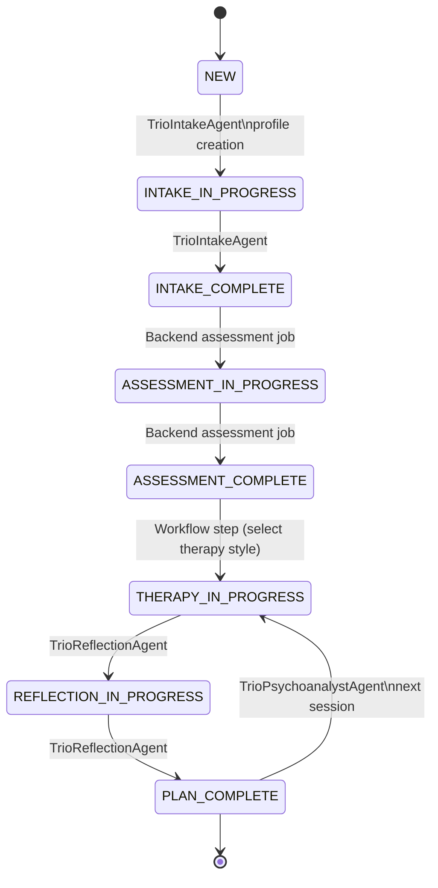
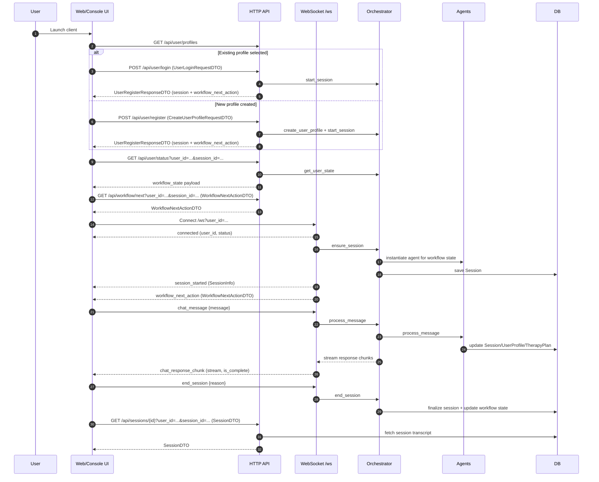

# User Journey Overview

This document provides a detailed overview of the journey a new user takes through the AI Therapy system. It outlines the stages, responsible agents, outputs, and available therapy styles.

## Workflow State and Agent Map

## HTTP and WebSocket Event Flow (with DTOs)

Notes:
- HTTP routes use explicit `user_id` parameters; WebSocket connections use `user_id` in the query string.
- The WebSocket handler streams `chat_response_chunk` messages; clients treat `is_complete=true` as end-of-response.

## Endpoint Usage by Client

| Endpoint or Event | Web UI | Console UI | Notes |
| --- | --- | --- | --- |
| `GET /api/version` | Yes | Yes | Used by version checks. Source: `src/psychoanalyst_app/api/version_routes.py`. |
| `POST /api/version/check` | Yes | Yes | Used by version checks. Source: `src/psychoanalyst_app/api/version_routes.py`. |
| `GET /api/user/status?user_id=...&session_id=...` | Yes | Yes | Workflow state polling (requires `session_id`). Source: `src/psychoanalyst_app/api/user_routes.py`. |
| `GET /api/user/profiles` | No | Yes | Console profile picker (no session required). Source: `src/psychoanalyst_app/api/user_routes.py`. |
| `POST /api/user/register` | Yes | Yes | Explicit profile creation/login step; returns session + workflow action. Source: `src/psychoanalyst_app/api/user_routes.py`. |
| `POST /api/user/login` | No | Yes | Login existing profile; returns session + workflow action. Source: `src/psychoanalyst_app/api/user_routes.py`. |
| `GET /api/user/profile?user_id=...&session_id=...` | Yes | No | Web loads profile for forms (requires `session_id`). Source: `src/psychoanalyst_app/api/user_routes.py`. |
| `PATCH /api/user/profile` | Yes | No | Web updates profile (requires `session_id`). Source: `src/psychoanalyst_app/api/user_routes.py`. |
| `GET /api/workflow/next?user_id=...&session_id=...` | Yes | Yes | Provides the latest `WorkflowNextActionDTO` (requires `session_id`). Source: `src/psychoanalyst_app/api/workflow_routes.py`. |
| `POST /api/workflow/complete_profile` | Yes | Yes | Completes the profile step and returns a new action (requires `session_id`). Source: `src/psychoanalyst_app/api/workflow_routes.py`. |
| `POST /api/workflow/select_therapy_style` | Yes | Yes | Stores the selected style and advances the workflow (requires `session_id`). Source: `src/psychoanalyst_app/api/workflow_routes.py`. |
| `GET /api/sessions?user_id=...&session_id=...` | Yes | No | Web session history (requires `session_id`). Source: `src/psychoanalyst_app/api/session_routes.py`. |
| `GET /api/sessions/{id}?user_id=...&session_id=...` | Yes | No | Web transcript views (requires `session_id`). Source: `src/psychoanalyst_app/api/session_routes.py`. |
| `POST /api/sessions` | Yes | No | Backend derives session type from workflow state. Source: `src/psychoanalyst_app/api/session_routes.py`. |
| `POST /api/sessions/{id}/extend` | Yes | No | Web session extension control (requires `session_id`). Source: `src/psychoanalyst_app/api/session_routes.py`. |
| `GET /api/sessions/{id}/timer` | No | Yes | Console timer command (`/timer`, requires `session_id`). Source: `src/psychoanalyst_app/api/session_routes.py`. |
| `GET /api/therapy/styles?user_id=...&session_id=...` | Yes | No | Web style selection UI (requires `session_id`). Source: `src/psychoanalyst_app/api/therapy_routes.py`. |
| `GET /api/therapy/plan?user_id=...&session_id=...` | Yes | No | Web therapy plan view (requires `session_id`). Source: `src/psychoanalyst_app/api/therapy_routes.py`. |
| `WS /ws?user_id=...` | Yes | Yes | WebSocket connection entry point. Source: `src/psychoanalyst_app/api/ws_handler.py`. |
| `chat_message` | Yes | Yes | User messages over WebSocket. Source: `src/psychoanalyst_app/api/ws_handler.py`. |
| `end_session` | Yes | Yes | Ends session over WebSocket. Source: `src/psychoanalyst_app/api/ws_handler.py`. |
| `connected` | Yes | Yes | Server acknowledgment event. Source: `src/psychoanalyst_app/utils/ws_messages.py`. |
| `session_started` | Yes | Yes | Session metadata event. Source: `src/psychoanalyst_app/utils/ws_messages.py`. |
| `chat_response_chunk` | Yes | Yes | Streaming therapist response. Source: `src/psychoanalyst_app/utils/ws_messages.py`. |

## Client Responsibilities

- Include `user_id` on HTTP requests (query param for GETs, JSON body for POST/PUT/PATCH).
- Include `session_id` on all post user_id HTTP requests after the first `session_started`.
 - Create or login via `POST /api/user/register` or `POST /api/user/login` before opening a WebSocket connection.
- Handle `WorkflowNextActionDTO` (and its `required_action`) to decide whether to show onboarding forms or start/resume sessions.
- For WebSocket sessions, wait for `session_started` before sending `chat_message`.
- Reconnect the WebSocket to rebind a session if the client needs a new session.
- Stream `chat_response_chunk` messages and treat `is_complete=true` as end-of-response.
- Use `end_session` to close a session cleanly; the server updates workflow state.
- Console UI can call `GET /api/sessions/{id}/timer` with `session_id` to display session time remaining.

## Journey Stages

The user journey is defined by a series of `WorkflowState` transitions.

### 1. New User / Profile Creation

- **Purpose**: Initialize the user in the system.
- **Workflow State**: `NEW` -> `INTAKE_IN_PROGRESS`
- **Responsible Agent**: `TrioIntakeAgent` (handles initial greeting and name collection).
- **Outputs**:
  - `UserProfile`: Created in `TrioDatabaseService`. Contains `user_id`, `name`, `status`.
  - **Storage**: Database (persisted via `db_service.save_user_profile`).

### 2. Intake Session

- **Purpose**: Gather comprehensive information about the user's background, presenting problems, symptoms, history, and goals.
- **Workflow State**: `INTAKE_IN_PROGRESS` -> `INTAKE_COMPLETE`
- **Responsible Agent**: `TrioIntakeAgent`
- **Key Activities**:
  - Conducts a structured interview covering specific topics (e.g., Presenting Problem, Personal History, Goals).
  - Tracks covered topics to ensure completeness.
- **Outputs**:
  - `Session`: A record of the conversation transcript.
  - `UserProfile`: Status updated to `INTAKE_COMPLETE`.
  - **Storage**: Database (`db_service.save_session`, `db_service.save_user_profile`).

### 3. Assessment & Style Selection

- **Purpose**: Analyze the intake session to recommend suitable therapy styles and allow the user to choose their preferred approach.
- **Workflow State**: `ASSESSMENT_IN_PROGRESS` -> `ASSESSMENT_COMPLETE`
- **Responsible Agent**: Backend assessment job (no interactive assessment session).
- **Key Activities**:
  - Analyzes intake transcript against available therapy styles.
  - Generates `TherapyStyleRecommendation`s with explanations.
  - Emits recommendations via WebSocket while clients show a wait state.
  - Users select a style via `POST /api/workflow/select_therapy_style`.
- **Outputs**:
  - `TherapyStyleRecommendation`: Presented to user (ephemeral/metadata).
  - `TherapyPlan`: Initial plan created by the planning agent using the intake transcript + selected style.
  - **Storage**: Database (`db_service.save_therapy_plan`).

### 4. Therapy Sessions

- **Purpose**: Conduct therapeutic conversations based on the selected style and established therapy plan.
- **Workflow State**: `THERAPY_IN_PROGRESS`
- **Responsible Agent**: `TrioPsychoanalystAgent`
- **Key Activities**:
  - Engages in dialogue using style-specific prompts and knowledge.
  - Uses RAG (Retrieval Augmented Generation) to access domain knowledge (e.g., Freud's writings).
  - Maintains context via `ConversationContext`.
- **Outputs**:
  - `Session`: Transcript of the therapy session.
  - **Storage**: Database (`db_service.save_session`).

### 5. Reflection & Planning

- **Purpose**: Review the completed session, update the therapy plan, and prepare for the next session.
- **Workflow State**: `REFLECTION_IN_PROGRESS` -> `PLAN_COMPLETE`
- **Responsible Agent**: `TrioReflectionAgent` (coordinates `TrioMemoryAgent` and `TrioPlanningAgent`)
- **Key Activities**:
  - Analyzes session for key themes, emotional state, and insights.
  - Updates `TherapyPlan` based on progress.
  - Generates a `SessionBriefing` for the next session (to support continuity).
- **Outputs**:
  - `TherapyPlan`: Updated version with new insights and `session_briefing`.
  - `SessionBriefing`: JSON object stored within the plan for the next session.
  - **Storage**: Database (`db_service.save_therapy_plan`).

## Available Therapy Styles

The system supports multiple therapy styles, managed by the `StyleService`. Each style is defined by a "Style Pack" containing prompts and knowledge bases.

### 1. CBT (Cognitive Behavioral Therapy)

- **Characterization**: Focuses on identifying and challenging negative thought patterns and behaviors. Structured and goal-oriented.
- **Components**:
  - `knowledge.md`: CBT principles and techniques.
  - `psychoanalyst_prompt.txt`: Instructions for the agent to act as a CBT therapist.

### 2. Freud (Psychoanalysis)

- **Characterization**: Focuses on unconscious conflicts, childhood experiences, and dream analysis. Exploratory and interpretive.
- **Components**:
  - `knowledge.md`: Freudian concepts (id, ego, superego, etc.).
  - `psychoanalyst_prompt.txt`: Instructions to adopt a Freudian persona.

### 3. Jung (Analytical Psychology)

- **Characterization**: Focuses on the collective unconscious, archetypes, and individuation. Symbolic and depth-oriented.
- **Components**:
  - `knowledge.md`: Jungian concepts (shadow, anima/animus, self).
  - `psychoanalyst_prompt.txt`: Instructions to adopt a Jungian persona.

## Data Storage & Formats

- **Database**: The system uses a `TrioDatabaseService` (likely backed by SQLite or similar) to persist data.
- **Key Entities**:
  - **Users**: `UserProfile` (JSON/Pydantic model).
  - **Sessions**: `Session` (JSON/Pydantic model, contains list of `Message`s).
  - **Plans**: `TherapyPlan` (JSON/Pydantic model, contains `plan_details` and `session_briefing`).
